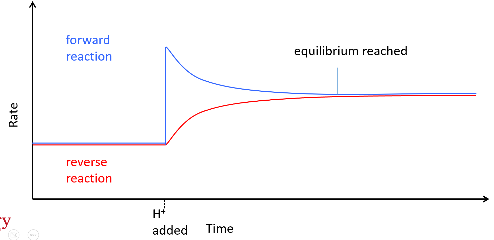
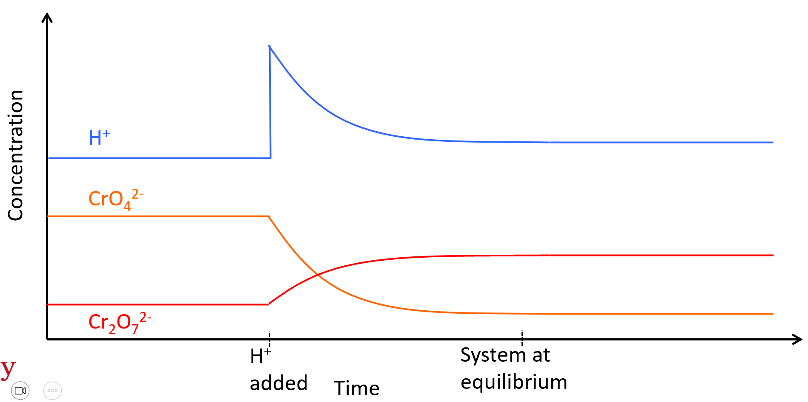
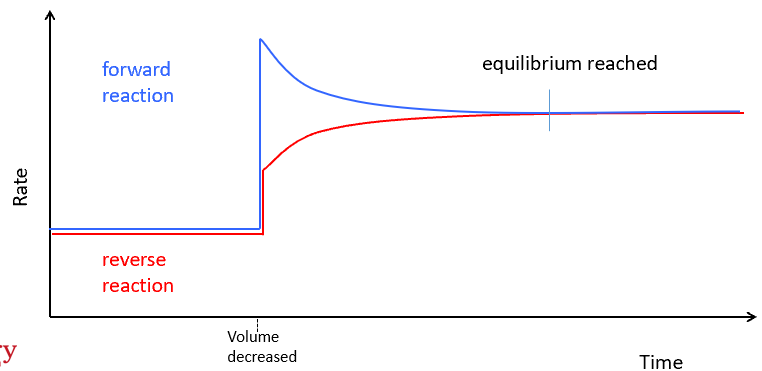
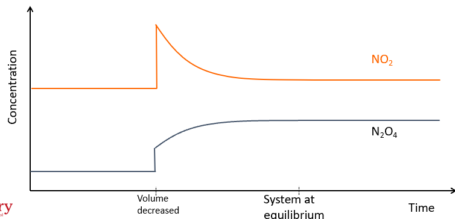
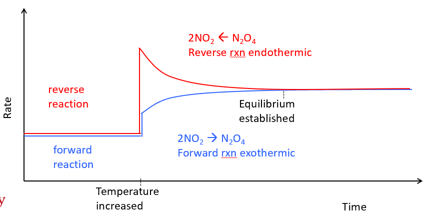
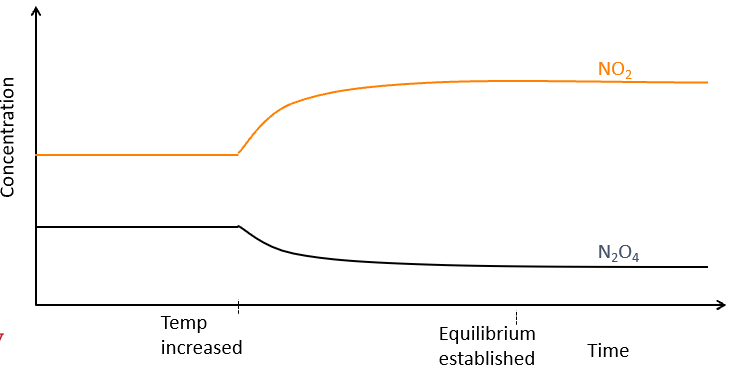
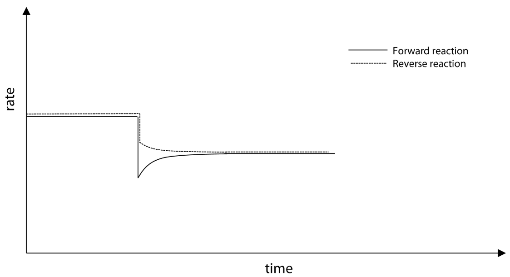

**equilibrium constant:**
- *a*A + *b*B ⇌ *c*C + *d*D
(reactants) (products)
- for any reaction, such as the one above, at equilibrium constant at a certain temperature is given by:
  

**le châtelier's principle:**
- "if a system at equilibrium is subjected to a change in conditions, the system will adjust to re-establish equilibrium in such a way as to partially counteract the imposed change"
- *change in concentration:*
  - *e.g. *2CrO~4~^2-^~(aq)~ + 2H^+^~(aq) ~n Cr~2~O~7~^2-^~(aq)~ + H~2~O~(l)~ , increasing \[H^+^\]
    - *rate vs time:*
      - an increase in \[H^+^\] causes collisions to occur more frequently between the reactants than the products
      - this causes the initial rate of the forwards reaction to increase while the reverse rate is initially unaffected
      - this increases the concentration of the products as more are being produced than consumed, thus allowing the rate of the reverse reaction to begin to increase until equilibrium is re-established at a higher rate
      - 
    - *concentration vs time:*
      - 
- *change in pressure/volume:*
  - *e.g. *2NO~2 (g) ~n N~2~O~4 (g)~ , increased pressure
    - *rate vs time:*
      - an increase in pressure is equivalent to a decrease in volume, and as concentration is inversely proportional to volume while the amount of all substances remains constant, all concentrations are increased
      - thus when the pressure is increased, the rate of both forward and reverse reactions increases immediately; however, the rate of the forwards reaction will increase by a greater extent as there are more participating moles of gas
      - this will cause the concentration of N~2~O~4~ to decrease more rapidly than it is replaced until equilibrium is re-established at a higher rate
      - 
    - *concentration vs time:*
      - 
  - 
- *change in temperature:*
  - *e.g.* 2NO~2 (g) ~⇌ N~2~O~4 (g)~ , ΔH = - 57kJ* or* 2NO~2 (g) ~⇌ N~2~O~4 (g)~ + 57kJ
    - 
    - *rate vs time:*
      - an increase in temperature causes an increase in both the frequency of collisions and the proportion of collisions with energy greater than the activation energy, resulting in an increase in the rates of both the forward and reverse reactions
      - the endothermic rate of reaction is affected to a greater extent due to its higher activation energy, and so the rate of the reverse reaction is increased more than that of the forwards reaction
      - thus the products are consumed more rapidly than they are produced, meaning \[N~2~O~4~\] decreases while \[NO~2~\] increases, which continues until equilibrium is re-established at a higher rate
      - 
    - *concentration vs time:*
      - 
- *addition of catalysts:*
  - catalysts are agents that provide an alternative reaction pathway with a lower activation energy and are not permanently consumed in the reaction.
  - as there is no change to the proportions of either reactants or products the system is still in equilibrium
  - the rates of forward and reverse reactions increase by the same amount
- *addition of inert gas:*
  - *e.g.* 2NO~2 (g) ~⇌ N~2~O~4 (g)~
    - *at constant volume:*
      - no effect as partial pressures remain constant
    - *at constant pressure:*
      - the addition of an inert gas causes a decrease in the partial pressures of both gases, resulting in a decrease in their concentrations; however, as there are more participating reactant particles than product particles, the rate of the forward reaction will decrease by a greater extent than the reverse reaction
      - thus the reactants are consumed more rapidly than they are produced, meaning \[N~2~O~4~\] increases while \[NO~2~\] decreases, which continues until equilibrium is re-established at a lower rate
      - 

**partial pressure:**
- 2NO~2 (g) ~⇌ N~2~O~4 (g)~
- a part of the total pressure is generated by each of the gases in the equation
  - this is proportionate to their concentration
- partial pressure is the contribution of the substance to the total pressure
  - 
  - equivalent to concentration in explanations
-----
-----
