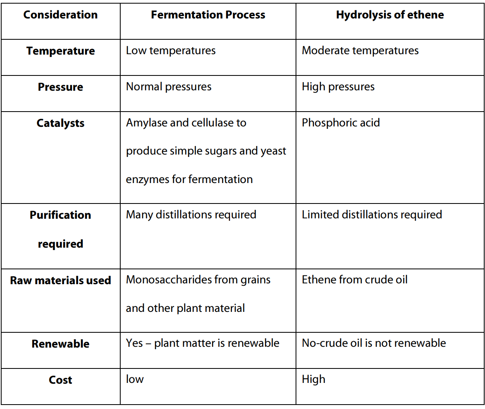

# industrial processes

***

* economics and safety are also contributing factors to the optimisation process but always discuss chemistry factors first  
**haber process** _(for ammonia):_
* the reaction is $$N_2 (g) + 3H_2 (g) \rightleftharpoons 2NH_3 (g)$$ $$\Delta H = -92\text{ kJ}$$
* _for a high rate:_
  * ↑ temperature
  * ↑ pressure
  * add a catalyst
* _for a high yield:_
  * ↓ temperature
  * ↑ pressure
  * no effect from catalyst
* _typical conditions:_
  * ratio of 1:3 for $$N_2 : H_2$$
  * temperature of 350 - 550 °C
  * pressure of 10 - 25 MPa
  * porous catalyst based on $$Fe_3O_4$$
* _flowchart:_
  * 
* to obtain hydrogen for the haber process, two methods are used in succession  
  1. _steam reforming_  
     $$CH_4 (g) + H_2O (g) \rightleftharpoons CO (g) + 3H_2 (g)$$ $$\Delta H = +206\text{ kJ}$$
     * _for a high rate:_
       * ↑ temperature
       * ↑ pressure
       * add a catalyst
     * _for a high yield:_
       * ↑ temperature
       * ↓ pressure
       * no effect from catalyst
     * as pressure contradicts between rate and yield, a compromise must be made
     * _typical conditions:_
       * temperature of 700 - 1000 °C (predicted by LCP)
       * pressure of 1 - 2 MPa (**not** predicted by LCP)
       * nickel catalyst is used  
  2. _the 'shift' reaction_  
     $$CO (g) + H_2O (g) \rightleftharpoons H_2 (g) + CO_2 (g)$$ $$\Delta H = -41\text{ kJ}$$
     * _for a high rate:_
       * ↑ temperature
       * ↑ pressure
       * add a catalyst
     * _for a high yield:_
       * ↓ temperature
       * no effect from pressure
       * no effect from catalyst
     * _typical conditions:_
       * temperature of 200 - 500 °C
       * pressure of 1 - 2 MPa
       * mixture of $$Fe_2O_4$$ / $$Cr_2O_3$$ / CuO / ZnO

**contact process** _(for sulfuric acid):_

1. _oxidation of $$SO_2$$ to $$SO_3$$_

   $$2SO_2 (g) + O_2 (g) \rightleftharpoons 2SO_3 (g)$$ $$\Delta H = -196\text{ kJ}$$  
   * sulfur dioxide can be obtained as a waste product from nickel refining
   * _for a high rate:_
     * ↑ temperature
     * ↑ pressure
     * add a catalyst
   * _for a high yield:_
     * ↓ temperature
     * ↑ pressure
     * no effect from catalyst
   * _typical conditions:_
     * temperature of 400 - 500 °C
     * pressure just above 1 atm (101.3 kPa)
     * vanadium pentoxide ($$V_2O_5$$) catalyst used in three different beds
   * the oxidation is exothermic so cooling takes place between catalyst beds using heat exchangers
   * after the third catalyst bed there is a high percentage of $$SO_3$$ present

2. _conversion to $$H_2SO_4$$_

   * the $$SO_3$$ is passed into an absorption tower where it meets a counter-flow of 98% sulfuric acid
   * any $$SO_2$$ present will not dissolve in the sulfuric acid, but the $$SO_3$$ present will until the sulfuric acid is 100%
   * some of this 100% is diluted back to 98% and re-used
   * water is not used because dilution of $$SO_3$$ is highly exothermic
   * flow chart:
     * 

**ethanol production:**

* _fermentation (~93% of industrial ethanol production):_
  * amylase enzymes are used to catalyse the breakdown of the polysaccharide starch to glucose
  * then the fermentation process uses other enzymes from yeast organisms to convert small sugar molecules, such as glucose and fructose, into ethanol and carbon dioxide  
    $$C_6H_{12}O_6 (aq) \rightarrow 2CH_3CH_2OH (aq) + 2CO_2 (g)$$
* _hydration of ethene (~7%):_
  * ethene can be obtained from the catalytic cracking of larger hydrocarbon molecules in crude oil
    * this ethene is then reacted with steam to produce ethanol according to this addition reaction:  
      $$H_2C=CH_2 (aq) + H_2O (l) \rightarrow CH_3CH_2OH (aq)$$
* 
* the reduced temperatures and pressures for fermentation result in a significant saving in costs, compared to the hydration of ethene
  * the advantage of producing ethanol from the hydration of ethene is that the reaction has __no byproducts__, so the products are only ethanol and water
  * in the fermentation process, many different organic molecules are produced or present in small quantities due to the many different enzymes in yeast and the different compounds present in the starting mixture
  * fermentation is usually the preferred method for production due to the renewable nature of the process and lower cost of the ethanol produced

**biodiesel production:**

* biodiesel can be made through a number of different methods:
  * 
  * _base catalysed transesterification:_
    * have to heat up
    * catalyst must be neutralised to recover glycerol
    * worse for the environment as salt waste is produced and external heat energy is required
    * the production of biodiesel is an equilibrium process and therefore LCP can be applied to increase yield
      * to increase yield for the base catalysed reaction, addition of double the stoichiometric amount of methanol is enough to give almost 100% yield of biodiesel
  * _lipase catalysed transesterification_
    * enzyme dependent
    * recent discoveries have made it almost as economically viable as base catalysis

**principles of green chemistry:**

* created as a checklist of ways to reduce the environmental impact and potential negative health effects of chemicals and the chemical synthesis process
* _principles:_
  1. waste prevention
  2. atom economy
  3. less hazardous chemicals
  4. designing safer chemicals
  5. safer solvents and auxiliaries
  6. energy efficiency
  7. renewable feedstocks
  8. reduce derivatives
  9. catalysis
  10. design for degradation
  11. real-time pollution prevention
  12. safer procedures for accident prevention
* _atom economy:_
  * atom economy is a way to measure the atoms wasted when producing a chemical
  * the higher the atom economy, the 'greener' the process
  *

***
