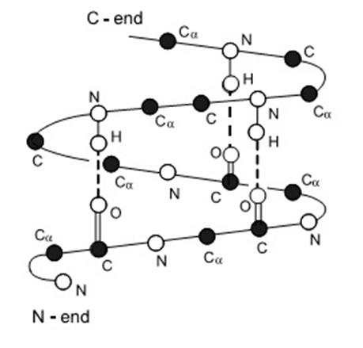
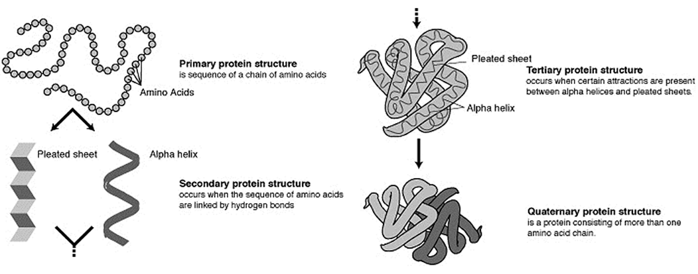

**hydrocarbons:**
- *alkanes:*
  - contain only single C-C bonds (saturated)
  - always demonstrate the formula C~n~H~2n+2~
  - *substitution reactions:*
    - slow
    - require UV light for halogens
- *alkenes:*
  - contain at least one double C=C bond (unsaturated)
  - demonstrate the formula C~n~H~2n~
  - *addition reactions:*
    - substances such as halogens, hydrogen, hydrogen halides will readily add across the double bond
    - fast
    - once the reaction has completed, substitution can occur if exposed to UV light
- *aromatic compounds:*
  - aromatic compounds are composed of a benzene ring with atoms/groups bonded to it

**functional groups:**
- *alcohols (-OH):*
  - *types of alcohols:*
    - primary alcohols have 1 carbon atom attached to the carbon atom that the -OH group is bonded to
    - secondary alcohols have 2, and tertiary alcohols have 3
  - *physical properties:*
    - boiling point is higher than that of the parent alcohol
    - solubility in water decreases with increasing chain length
      - this is due to an increased number of electrons, causing an increase in the strength of dispersion forces
  - alcohols also combust in excess air to form CO~2~ and H~2~O
- *carboxylic acid (-COOH):*
  - *physical properties:*
    - boiling points are higher than similar alcohols as the carbonyl group acts as another location for hydrogen bonding
    - soluble in water
    - weak acids, with strength decreasing as the chain length increases
- *esters (-COO-):*
  - esters are formed from the esterification reaction of a carboxylic acid with an alcohol in the presence of a concentrated acid catalyst (*e.g.* concentrated H~2~SO~4~)
    - 
    ethanoic acid ethanol ethanoate (ethyl)
  - *hydrolysis of esters:*
    - hydrolysis is a means of conversion of the ester to the original alcohol and either the carboxylic acid or the salt of the acid
    - either H~3~O^+^ or OH^\-^ acts as a catalyst
      - *warming with acid (H**~3~**O**^+^**):*
        - R-COO-R' → RCOOH + R'OH
        - H~3~COCOH + H~2~O → HCOOH + CH~3~OH
      - *warming with base (OH**^\-^**) :*
        - R-COO-R' → RCOO^\-^ + R'OH
  - *physical properties:*
    - fruity odour
- *amines (-NH**~2~**):*
  - *physical properties:*
    - boiling point is relatively low as the hydrogen bonding between amines is weaker because the difference in electronegativity between N and H is less than that between O and H
    - soluble in water through hydrogen bonding
    - pungent odour like ammonia
    - weak bases and form basic solutions when hydrolysed
- *amides (=O, -NH**~2~**):*
  - formed similarly to esters with an amine reacting with a carboxylic acid
    - 
    - primary amides are prepared by reaction of (NH~4~)~2~CO~3~ with a corresponding carboxylic acid:
      - *e.g.* 2CH~3~COOH~ (aq)~ + (NH~4~)~2~CO~3 (aq)~ → 2CH~3~COONH~4 (aq)~ + CO~2 (g)~ + H~2~O~ (l)~
  - *types of amides:*
    - 
    primary secondary tertiary
  - *hydrolysis of amides:*
    - R-CO-NH~2~ + H~2~O + H^\+ ^⟶ R-COOH + NH~4~^+^
    - R-CO-NH~2~ + NaOH ⟶ R-COONa + NH~3~
  - *physical properties:*
    - boiling points are higher than similar amines as there are two locations for hydrogen bonding
- *aldehydes (=O at terminal):*
  - *physical properties:*
    - boiling point is lower than that of the parent alcohol
    - solubility in water is decreases with increasing chain length
- *ketones (=O mid-chain):*
  - *physical properties:*
    - not able to be easily oxidised
- *α-amino acids (-COOH, -NH**~2~**)*
  - the α indicates that both the amine and carboxyl groups are attached to the same terminal carbon atom
  - behave as amphoteric molecules as they can form zwitterions (molecules with both + and - ions)
    - in basic conditions the carboxylic acid group can donate an H^+^ ion
    - in acidic conditions the amine functional group accepts an H^+^ ion
  - *physical properties:*
    - at room temperature, amino acids are all solids with relatively high melting/boiling points
    - soluble in water
    - typically exist in their ionic forms in the solid and aqueous state

**redox of organic molecules:**
- there are two oxidants that are typically used. these are either:
  - acidified dichromate (Cr~2~O~7~^2-^/H^+^)
    - orange
    - reduced to Cr^3+^ (green)
  - acidified permanganate (MnO~4~^\-^/H^+^)
    - purple
    - reduced to Mn^2+^ (pale pink, virtually colourless)
- 
**polymers:**
- polymers are large molecules formed by the reaction of small molecules called monomers
**proteins:**
- proteins are macromolecules consisting of amino acid monomers joined together by peptide linkages
  - 
- sequences of less than 50 amino acids are typically called peptides
- *protein structure:*
  - *primary structure:*
    - the primary structure of a protein is given by the amino acids sequence of the protein
  - *secondary structure:*
    - within the long protein chains there are regions in which the chains are organised into regular structures
    - *alpha helix:*
      - 
    - *beta pleated sheets:*
      - 
  - *tertiary structure:*
    - the tertiary structure of a protein is a description of the way the whole chain (including the secondary structures) folds itself into its final 3-dimensional shape
    - this shape determines the function of the protein
    - *forces involved:*
      - ionic interactions
      - H-bonds in side chains
      - dispersion forces
      - disulfide bridges
  - *quaternary structure:*
    - the quaternary structure is the arrangement of proteins with more than one amino acid chain and how these fold and arrange themselves in 3D
  - 

**soaps and detergents:**
- *fats and oils:*
  - soaps are derived from natural fats and oils (esters referred to as triglycerides) and are formed from the same alcohol precursor (glycerol / triol)
    - 
  - glycerol requires a carboxylic acid (normally referred to as a fatty acid) to form a triester fat
    - they have long unbranched chains, between C~10~ and C~20~ and contain no other functional groups
    - 
  - *properties:*
    - the long hydrocarbon chains of the fat (triglyceride) is non-polar meaning dispersion forces over most molecules are predominant
    - animal fats are usually saturated (*i.e.* single C-C bond) whereas plant oils are often unsaturated (*i.e.* containing at least one C=C bond)
- *hydrolysis of triglycerides:*
  - triglycerides may be hydrolysed using a strong base such as NaOH or KOH to produce glycerol and the salt of the long chain fatty acid in a process known as saponification
  - the salt of the fatty acid precipitates and is removed by filtration
  - 
- *soaps:*
  - soap is used as a cleaning agent due to its emulsifying properties
    - an emulsifying agent (*i.e.* a surfactant) helps two immiscible substances to remain mixed
  - water with soap is slightly basic
  - *structure:*
    - soap is the salt of a long chain fatty acid
    - 
    - 
    - the polar head of the molecule hydrogen bonds to water molecules around it while the non-polar tail dissolves in the oil forming a micelle
- *detergents:*
  - when soap is mixed with water containing Ca^2+^ or Mg^2+^ ions, an insoluble 'scum' is produced (calcium or magnesium stearate)
    - this deposits on clothes and is difficult to remove, so detergents were developed which don't produce scum
  - by replacing the carboxylate, COO^\-^, with a sulfonate group, SO~3~^\-^, an effective surfactant that does not produce scum is made
    - this is achieved as shown below:
    - 

**biodiesel:**
- *transesterification:*
  - a triester (vegetable oil) has its three fatty acids removed
  - the fatty acids react with a small alcohol molecule to produce three esters
  - 
  - where R^1^ represents the hydrocarbon chains for the fatty acid and R^2^ is an alkyl group (typically methyl or ethyl)
  - the low purity glycerol formed is immiscible with the biodiesel so it forms a separate layer
    - if good separation is not achieved then this can lead to poor fuel quality and engine damage
-----
