# organic

***

## **hydrocarbons**

#### _alkanes_
  * contain only single $$\mathrm{C-C}$$ bonds (saturated)
  * always demonstrate the formula $$\mathrm{C_nH_{2n+2}}$$
  * _substitution reactions:_
    * slow
    * require UV light for halogens
#### _alkenes_
  * contain at least one double $$\mathrm{C=C}$$ bond (unsaturated)
  * demonstrate the formula $$\mathrm{C_nH_{2n}}$$
  * _addition reactions:_
    * substances such as halogens, hydrogen, hydrogen halides will readily add across the double bond
    * fast
    * once the reaction has completed, substitution can occur if exposed to UV light
#### _aromatic compounds_
  * aromatic compounds are composed of a benzene ring with atoms/groups bonded to it
  * all the carbon-carbon bonds in benzene are equivalent, meaning they are neither single nor double bonds; they are all te same length somewhere between the length of a single and double carbon-carbon bond

## **functional groups**

#### _alcohols ($$-\mathrm{OH}$$):_
  * _types of alcohols:_
    * primary alcohols have 1 carbon atom attached to the carbon atom that the $$\mathrm{OH}$$ group is bonded to
    * secondary alcohols have 2, and tertiary alcohols have 3
  * _physical properties:_
    * boiling point is higher than that of the parent alcohol
    * solubility in water decreases with increasing chain length
      * this is due to an increased number of electrons, causing an increase in the strength of dispersion forces
  * alcohols also combust in excess air to form $$\mathrm{CO_2}$$ and $$\mathrm{H_2O}$$
#### _carboxylic acid ($$-\mathrm{COOH}$$):_
  * _physical properties:_
    * boiling points are higher than similar alcohols as the carbonyl group acts as another location for hydrogen bonding
    * soluble in water
    * weak acids, with strength decreasing as the chain length increases
#### _esters ($$-\mathrm{COO}-$$):_
  * esters are formed from the esterification reaction of a carboxylic acid with an alcohol in the presence of a concentrated acid catalyst (_e.g._ concentrated $$\mathrm{H_2SO_4}$$)
    * 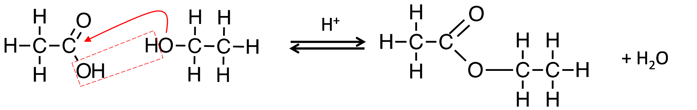
    ethanoic acid ethanol ethanoate (ethyl)
  * _hydrolysis of esters:_
    * hydrolysis is a means of conversion of the ester to the original alcohol and either the carboxylic acid or the salt of the acid
    * either $$\mathrm{H_3O^+}$$ or $$\mathrm{OH^-}$$ acts as a catalyst
      * _warming with acid ($\mathrm{H_3O^+}$):_
        * $$\mathrm{R-COO-R' \rightarrow RCOOH + R'OH}$$
        * $$\mathrm{H_3COCOH + H_2O \rightarrow HCOOH + CH_3OH}$$
      * _warming with base ($\mathrm{OH^-}$):_
        * $$\mathrm{R-COO-R' \rightarrow RCOO^- + R'OH}$$
  * _physical properties:_
    * fruity odour
#### _amines ($$-\mathrm{NH}_2$$):_
  * _physical properties:_
    * boiling point is relatively low as the hydrogen bonding between amines is weaker because the difference in electronegativity between $$-\mathrm{N}$$ and $$-\mathrm{H}$$ is less than that between $$-\mathrm{O}$$ and $$-\mathrm{H}$$
    * soluble in water through hydrogen bonding
    * pungent odour like ammonia
    * weak bases and form basic solutions when hydrolysed
#### _amides ($$=\mathrm{O}$$, $$-\mathrm{NH}_2$$):_
  * formed similarly to esters with an amine reacting with a carboxylic acid
    * 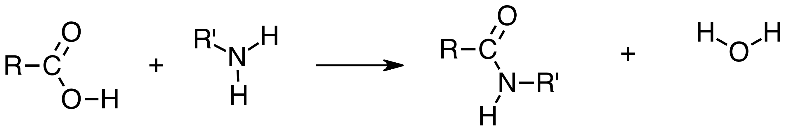
    * primary amides are prepared by reaction of $$(\mathrm{NH_4})_2\mathrm{CO_3}$$ with a corresponding carboxylic acid:
      * _e.g._ $$\mathrm{2CH_3COOH (aq) + (NH_4)_2CO_3 (aq) \rightarrow 2CH_3COONH_4 (aq) + CO_2 (g) + H_2O (l)}$$
  * _types of amides:_
    * 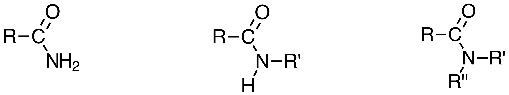
    primary secondary tertiary
  * _hydrolysis of amides:_
    * $$\mathrm{R-CO-NH_2 + H_2O + H^+ \rightarrow R-COOH + NH_4^+}$$
    * $$\mathrm{R-CO-NH_2 + NaOH \rightarrow R-COONa + NH_3}$$
  * _physical properties:_
    * boiling points are higher than similar amines as there are two locations for hydrogen bonding
#### _aldehydes ($$=\mathrm{O}$$ at terminal):_
  * _physical properties:_
    * boiling point is lower than that of the parent alcohol
    * solubility in water decreases with increasing chain length
#### _ketones ($$=\mathrm{O}$$ mid-chain):_
  * _physical properties:_
    * not able to be easily oxidised
#### _α-amino acids ($$-\mathrm{COOH}$$, $$-\mathrm{NH}_2$$):_
  * the α indicates that both the amine and carboxyl groups are attached to the same terminal carbon atom
  * behave as amphoteric molecules as they can form zwitterions (molecules with both + and - ions)
    * in basic conditions the carboxylic acid group can donate an $$\mathrm{H^+}$$ ion
    * in acidic conditions the amine functional group accepts an $$\mathrm{H^+}$$ ion
  * _physical properties:_
    * at room temperature, amino acids are all solids with relatively high melting/boiling points
    * soluble in water
    * typically exist in their ionic forms in the solid and aqueous state

## **redox of organic molecules**

* there are two oxidants that are typically used. these are either:
  * acidified dichromate ($$\mathrm{Cr_2O_7^{2-}/H^+}$$)
    * orange
    * reduced to $$\mathrm{Cr^{3+}}$$ (green)
  * acidified permanganate ($$\mathrm{MnO_4^- / H^+}$$)
    * purple
    * reduced to $$\mathrm{Mn^{2+}}$$ (pale pink, virtually colourless)
* 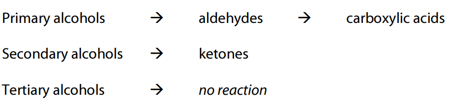

## **polymers:**
* polymers are large molecules formed by the reaction of small molecules called monomers **proteins:**
* proteins are macromolecules consisting of amino acid monomers joined together by peptide linkages
  * 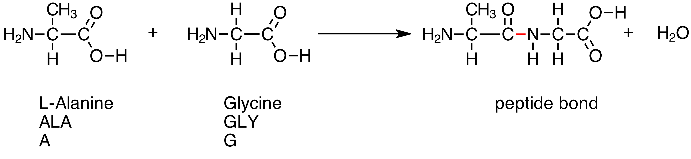
* sequences of less than 50 amino acids are typically called peptides
#### _protein structure_
  * _primary structure:_
    * the primary structure of a protein is given by the amino acids sequence of the protein
  * _secondary structure:_
    * within the long protein chains there are regions in which the chains are organised into regular structures
    * _alpha helix:_
      * 
    * _beta pleated sheets:_
      * 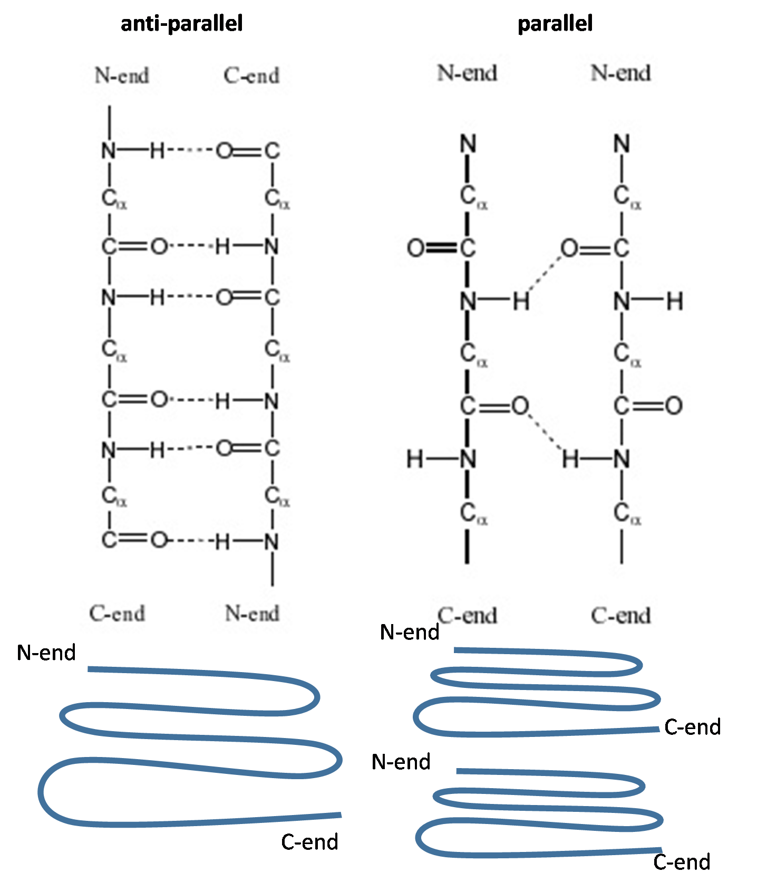
  * _tertiary structure:_
    * the tertiary structure of a protein is a description of the way the whole chain (including the secondary structures) folds itself into its final 3-dimensional shape
    * this shape determines the function of the protein
    * _forces involved:_
      * ionic interactions
      * H-bonds in side chains
      * dispersion forces
      * disulfide bridges
  * _quaternary structure:_
    * the quaternary structure is the arrangement of proteins with more than one amino acid chain and how these fold and arrange themselves in 3D
  * 

## **soaps and detergents**

#### _fats and oils_
  * soaps are derived from natural fats and oils (esters referred to as triglycerides) and are formed from the same alcohol precursor (glycerol / triol)
    * 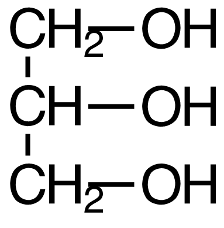
  * glycerol requires a carboxylic acid (normally referred to as a fatty acid) to form a triester fat
    * they have long unbranched chains, between $$\mathrm{C_{10}}$$ and $$\mathrm{C_{20}}$$ and contain no other functional groups
    * 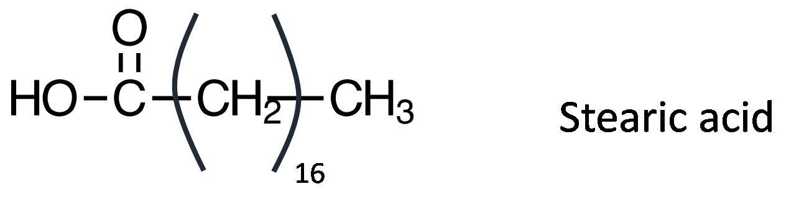
  * _properties:_
    * the long hydrocarbon chains of the fat (triglyceride) is non-polar meaning dispersion forces over most molecules are predominant
    * animal fats are usually saturated (_i.e._ single $$\mathrm{C-C}$$ bond) whereas plant oils are often unsaturated (_i.e._ containing at least one $$\mathrm{C=C}$$ bond)
#### _hydrolysis of triglycerides_
  * triglycerides may be hydrolysed using a strong base such as $$\mathrm{NaOH}$$ or $$\mathrm{KOH}$$ to produce glycerol and the salt of the long chain fatty acid in a process known as saponification
  * the salt of the fatty acid precipitates and is removed by filtration
  * 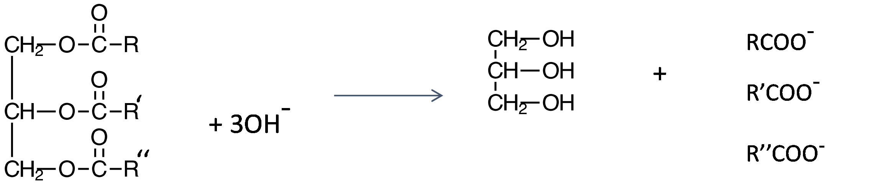
* _soaps:_
  * soap is used as a cleaning agent due to its emulsifying properties
    * an emulsifying agent (_i.e._ a surfactant) helps two immiscible substances to remain mixed
  * water with soap is slightly basic
  * _structure:_
    * soap is the salt of a long chain fatty acid
    * 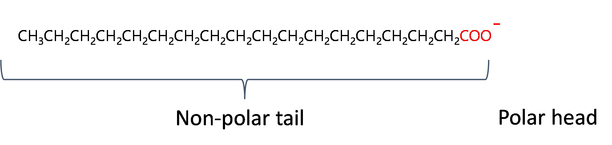
    * 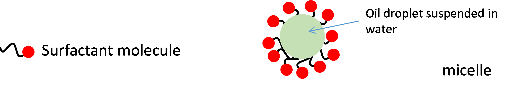
    * the polar head of the molecule hydrogen bonds to water molecules around it while the non-polar tail dissolves in the oil forming a micelle
* _detergents:_
  * when soap is mixed with water containing $$\mathrm{Ca^{2+}}$$ or $$\mathrm{Mg^{2+}}$$ ions, an insoluble 'scum' is produced (calcium or magnesium stearate)
    * this deposits on clothes and is difficult to remove, so detergents were developed which don't produce scum
  * by replacing the carboxylate, $$\mathrm{COO^-}$$, with a sulfonate group, $$\mathrm{SO_3^-}$$, an effective surfactant that does not produce scum is made
    * this is achieved as shown below:
    * 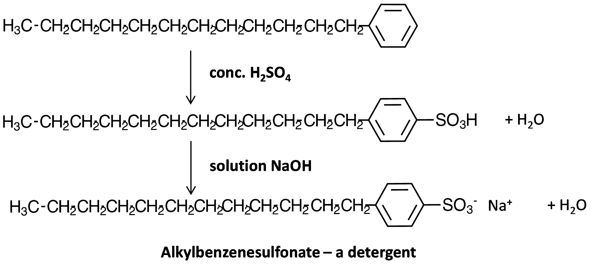

## **biodiesel**

#### _transesterification_
  * a triester (vegetable oil) has its three fatty acids removed
  * the fatty acids react with a small alcohol molecule to produce three esters
  * 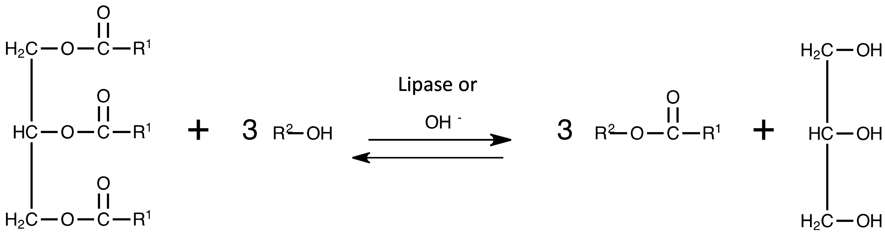
  * where $$\mathrm{R^1}$$ represents the hydrocarbon chains for the fatty acid and $$\mathrm{R^2}$$ is an alkyl group (typically methyl or ethyl)
  * the low purity glycerol formed is immiscible with the biodiesel so it forms a separate layer
    * if good separation is not achieved then this can lead to poor fuel quality and engine damage