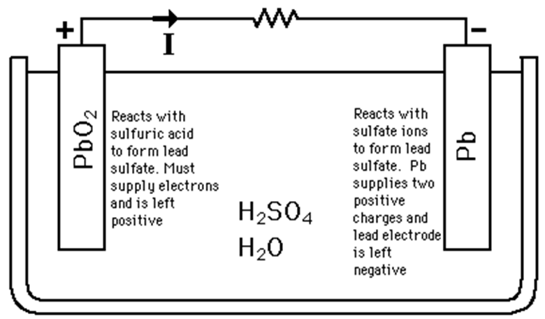

**oxidation and reduction:**
- oxidation is the loss of electrons or gain of H^+^
- reduction is the gain of electrons or loss of H^+^
**redox rules:**
- *rule 1:*
  - substances in the elemental state __but not in a compound__ have an oxidation number of 0
    - *e.g.* Cl~2~ = 0, C = 0, P~4~ = 0
- *rule 2:*
  - monoatomic ions have an oxidation number equal to the charge of the ion
    - *e.g.* Na^+^ = +1, Cl^\-^ = -1, Al^3+^ = +3
- *rule 3:*
  - oxygen in compounds has an oxidation number of -2 __except__ in peroxides
    - *e.g.* in H~2~O~2~, H is +1 so O must be -1
- *rule 4:*
  - hydrogen has an oxidation number of +1 __except__ in metal hydrides
    - *e.g.* in NaH, Na is +1 so H must be -1
- *rule 5:*
  - the oxidation number of all atoms in a neutral molecule must sum to make the charge present on the ion 0
  - atoms that don't appear in the rules can have different oxidation number in different compounds

**making equations:**
- *in neutral conditions:*
  1. write down the oxidant/reductant and what product it forms
    - I~2~ → I^\-^
  2. balance the atoms undergoing reduction/oxidation
    - I~2~ → 2I^\-^
  3. balance charges by adding e^\-^ where required
    - I~2~ + 2e^\-^ → 2I^\-^
  4. add state symbols to the half equation
    - I~2 (s)~ + 2e^\-^ → 2I^\-^~(aq)~
- *in acidic conditions:*
  1. balance the atoms given first
    - Cr~2~O~7~^2-^ → 2Cr^3+^
  2. add in water molecules to balance the number of oxygen atoms missing
    - Cr~2~O~7~^2-^ → 2Cr^3+^ + 7H~2~O
    - HNO~2~ + H~2~O → HNO~3~^\-^
  3. add in H^+^ to balance the number of hydrogen atoms
    - Cr~2~O~7~^2-^ + 14H^+^ → 2Cr^3+^ + 7H~2~O
    - HNO~2~ + H~2~O → NO~3~^\-^ + 3H^+^
  4. balance charges by adding electrons to the most positive side of each half equation
    - Cr~2~O~7~^2-^ + 14H^+^ + 6e^\-^ → 2Cr^3+^ + 7H~2~O +
    - HNO~2~ + H~2~O → NO~3~^\-^ + 3H^+^ + 2e^\-^
  5. to make an overall equation, multiply by a factor to make the number of electrons equal and combine
    - Cr~2~O~7~^2-^ + 14H^+^ + 6e^\-^ → 2Cr^3+^ + 7H~2~O
    - 3HNO~2~ + 3H~2~O → 3NO~3~^\-^ + 9H^+^ + 6e^\-^
    - ∴ Cr~2~O~7~^2-^ + 5H^+^ + 3HNO~2~ → 2Cr^3+^ + 4H~2~O + 3NO~3~^\-^
  6. to check, ensure oxidation numbers are equal on both sides

**electrochemical cells:**
- *galvanic cells:*
  - 
  - through the salt bridge:
    - anions move into oxidation half-cell
    - cations move into reduction half-cell
  - electrons move through the wire from the anode to the cathode
    - the oxidation half-cell is the anode (-, an ox)
    - the reduction half-cell is the cathode (+, red cat)
  - impacts on cell potential:
    - cell potential will vary depending on the chemistry of the half cells being used, the concentration of dissolved substances, pressure, and temperature
    - under standard conditions of 1 molL-1, 101.3 kPa (1 atm) and 25°C, the cell potential becomes E°
- *standard hydrogen electrode:*
  - 
  - at STP, the standard reduction potential for the reduction of hydrogen ions is zero volts
    - 2H^+^~(aq)~ + 2e^\-^ → H~2 (g)~
  - this 'reference' electrode enables standard reduction potentials to be determined for a range of substances

**electrolysis:**
- *electrorefining:*
  - unlike electrolysis, electrorefining involves the oxidation of the anode itself
  - in electrolysis, the anode is inert, but in this process it is involved in the reaction
    - the anode in electrorefining is made out of the material that is intended to be refined and the cathode can be made out of any highly-conductive substance like graphite and gold
  - 
- *electroplating:*
  - involves depositing a thin layer of one metal over another
  - thin metal layer may act as protection for underlying metal or look better
  - 

**commercial cells:**
- a primary cell can only be discharged once and can never be recharged with electricity
  - they are easy and cheap to manufacture and use, and an example would be a zinc-carbon cell
- a secondary cell can be discharged and recharged repeatedly using electricity
  - an example would be a lead-acid cell
  - secondary cells are easily reusable as they can be recharged with electricity
- a tertiary cell or fuel cell requires a continuous source of fuel and oxygen in order to sustain a chemical reaction to produce electricity
  - an example would be a hydrogen fuel cell
  - tertiary cells can produce electricity continuously as long as fuel and oxygen are supplied
- *lead-acid batteries:*
  - the lead-acid battery consists of numerous banks of lead and lead dioxide plates in a sulfuric acid electrolyte
  - they are the oldest example of a rechargeable battery (secondary cells)
  - as they are rechargeable, there are two states:
    - *discharging (producing voltage)*
      - 
      - *at the anode:* Pb~ (aq)~ + SO~4~^2-^~(aq)~ → PbSO~4 (s)~ + 2e^\-^
      - *at the cathode:* PbO~2~ + 4H^+^ + SO~4~^2-^ + 2e^\-^ → PbSO~4~ + 2H~2~O
      - *overall:* Pb~(aq)~ + PbO~2~
- *hydrogen fuel cells:*
  - the hydrogen fuel cell is an electrochemical cell that can operate perpetually because the reactants required for the redox reaction can be constantly replaced
  - the reactions can take place in either an acidic or alkaline electrolyte
  - *in acid electrolyte:*
    - H~2~ → 2H^+^ + 2e^\-^ E~0~ = 0.00V
    - O~2~ + 4H^+^ + 4e^\-^ → 2H~2~O E~0~ = +1.23V
  - *in alkaline electrolyte:*
    - H~2~ + 2OH^\-^ → 2H~2~O + 2e^\-^ E~0~ = -0.83V
    - O~2~ + 2H~2~O + 4e^\-^ → 4OH^\-^ E~0~ = +0.40
