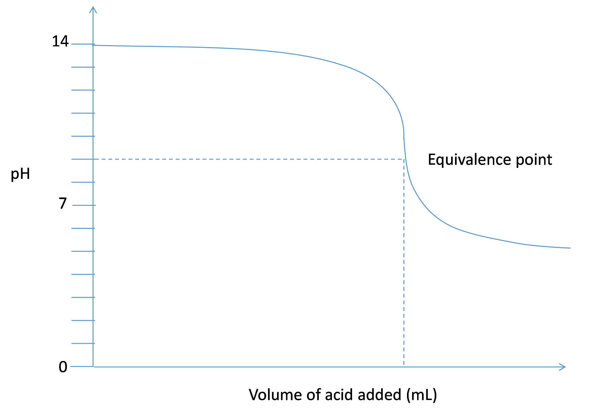
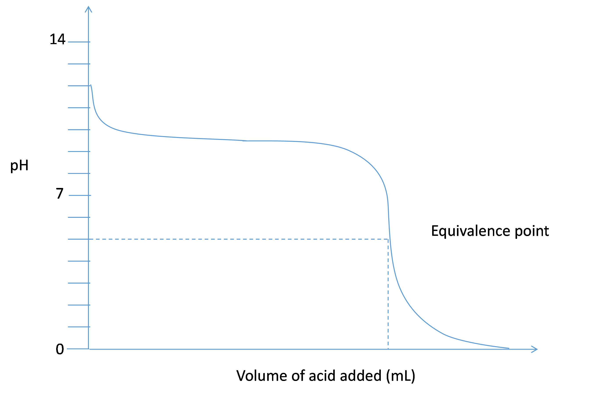

# volumetric analysis

**the standard solution:**

* a standard solution has an accurately known concentration
* a primary standard is a substance that
  * can be obtained in a very pure form (known purity)
  * is chemically stable
  * has a relatively high molar mass
* two common substances that meet these criteria are anhydrous sodium carbonate, potassium hydrogen phthalate, and oxalic acid
* _preparing a standard solution:_
  * to prepare a primary standard solution of $$\mathrm{Na_2CO_3}$$
    1. weigh out a mass of sodium carbonate and dissolve in a small amount of distilled water
    2. transfer to a volumetric flask and make up to the line with distilled water (a volumetric flask has a known and precise volume)

**equipment for titration:**

* burette
  * the purpose of a burette is to deliver a controlled and accurately measurable volume of reagent to a conical flask
  * the solution in the burette is referred to as the titrant
* conical flask
  * the conical flask contains the second solution
* pipette
  * the volume of this second solution is measured accurately using the pipette
  * the solution in the pipette is called the aliquot
* indicator
  * alizarin yellow ($$\mathrm{pH_{end}}\approx 11$$)
  * methyl orange ($$\mathrm{pH_{end}}\approx 3.7$$)
  * bromothymol blue ($$\mathrm{pH_{end}}\approx 7$$)
  * phenolphthalein ($$\mathrm{pH_{end}}\approx 9.3$$)

**equivalence point:**

* at some point, the reagent being added from the burette is sufficient to react with all of the reagent in the conical flask
  * the reaction between the acid and base is complete
  * in other words, stoichiometric amounts of each are present
* it is not possible to see the equivalence point with colourless solution so an indicator must be chosen that is suitable **end point:**
* as it is not possible to see the equivalence point, a suitable indicator is used that undergoes a colour change, called the end point, when the equivalence point is reached
* in practice the end point is usually not the same as the equivalence point, but it is a close approximation to it **pH and equivalence point:**
* as acid and base are being mixed, it might be anticipated that the pH at the equivalence point would be 7
  * for a strong acid and base this is indeed the case
* for other combinations of weak acids and bases the salts produced in the reaction do not form solutions with a pH of 7 due to hydrolysis
* because of this, an indicator must be chosen with an end point that matches the pH of the solution at the equivalence point **pH changes in acid-base titrations:**
* when an acid is added to a base solution, the pH does not change in a linear way
  $$\mathrm{pH} = -\log_{10} [\mathrm{H_3O^+}]$$
* if an acid is polyprotic, then there will be multiple equivalence points along the way
* _strong acid added to a strong base:_
  * the salt will be approximately neutral at equivalence, indicator must change anywhere within the almost vertical region of the graph
  * 
* _weak acid added to strong base:_
  * the conjugate base of the weak acid is relatively strong; thus the salt will be slightly basic at equivalence, indicator must change above 7
  * 
* _strong acid added to weak base:_
  * the salt will be slightly acidic at equivalence, indicator must change below 7
  * 
* _weak acid added to weak base:_
  * you cannot effectively titrate a weak acid and weak base as the end point is not easily discernible

**choosing the right indicator:**

* choice of indicator
* at equivalence, there is no acid or base remaining, only salt and water
  * give equation
* the salt contains:
  * cation
    * neutral/acidic/basic
    * conjugate acid of a weak base therefore relatively strong
  * anion
    * do the same thing
* if it hydrolyses, explain why
  * give equation
  * produces either $$\mathrm{H_3O^+}$$ or $$\mathrm{OH^-}$$
  * acidic if $$[\mathrm{H_3O^+}] > [\mathrm{OH^-}]$$, basic if $$[\mathrm{H_3O^+}] < [\mathrm{OH^-}]$$ at equilibrium
  * therefore as the indicator must change in this range, the end point is sufficiently close to equivalence and this indicator should be used
