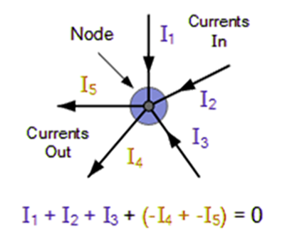

# basic circuits

***

## charge

#### _overview_

* charge refers to the imbalance of electrons and protons in an object
* charge exists in discrete amounts
* units of coulombs (C)
* it is defined as the amount of charge transferred by 1A of current in one second
* the charge of a proton or electron is approximately $$1.602 \times 10^{−19} C$$

#### _direction of charge_

* historically we assumed that charges moving from positive to negative terminals. in circuit diagrams and electrical calculations, the convention is to show current flow in this direction (conventional current). this is what will be used in engineering studies
* however, it is important to understand this was established before the discovery of electrons. we have since realised the flow of current is due to electrons moving from the negative terminal to the positive terminal (electron flow)

#### _supply of charge_

* **cells:** cells are individual electrochemical devices that produce electrical energy through chemical reactions. they have two terminals, positive and negative, and are commonly used in small electronic devices like watches, calculators, and remote controls
* **batteries:** batteries are collections of multiple cells connected in series to increase voltage, or in parallel to increase current capacity. they store chemical energy and convert it into electrical energy. batteries are used in a wide range of applications, from portable electronics to automotive and industrial systems
* **DC power supplies:** direct current power supplies are devices that convert AC voltage from a wall outlet or another source into steady DC voltage. they provide a constant voltage output, which is essential for many electronic devices that require a stable power source
* **AC power supplies:** alternating current power supplies are devices that provide AC voltage output. they are commonly used in household and industrial applications to supply power to devices that operate on AC, such as appliances, lighting systems, and motors

## attributes of electricity:

* **voltage:** voltage is the charge differential between two points in a circuit
  * voltage is measured in volts (V), in which one volt is equal to joules per coulomb $$JC^{-1}$$
* **current:** current is the rate at which charge flows through a circuit
  * the unit of current is the ampere (A), which is defined as the rate of flow of coulomb per second $$Cs^{-1}$$
* **resistance:** resistance is a material’s tendency to resist the flow of charge
  * resistance is measured in ohms (Ω), where 1 ohm is defined as the resistance between two points in a conductor when a constant potential difference of one volt produces a current of one amp
  * some components do not obey ohm's law. this is because their resistance is not constant and changes with voltage or current. non-ohmic devices include:
    * thermistors
    * light-dependent resistors
    * diodes
    * transistors
* **power:** power can be defined as the rate at which energy is converted from the electrical energy of the moving charges to some other form of energy (like mechanical energy or thermal energy)

## circuits

#### _series_

* a circuit is said to be connected in series when there is only one route for current to flow.
* 

#### _parallel_

* a circuit is said to be connected in parallel when current has multiple different pathways to flow through
* 

## kirchhoff's laws

#### _terminology_

* **node:** any point where two or more circuit elements are connected. a node is sometimes referred to as a junction
* **pathway:** any element connected between two nodes, represents single circuit elements. a pathway is sometimes referred to as a branch
* **mesh:** any closed path around a circuit. to trace a loop, you start at any node, and trace a path through connected elements until you get back to the starting point with no repeated components. a mesh is sometimes referred to as a loop

#### _kirchhoff's current law (KCL)_

* this law states that the total current entering a node must be equal to the total current leaving that node
* put differently, the algebraic sum of every current entering and leaving the node must be equal to zero
* this property is due to the conservation of charge
* 
* some components have such a high resistance that they only induce a negligible current and should be ignored in KCL calculations:
  * voltmeters
  * ohmmeters
  * microcontroller I/O pins

#### _kirchhoff's voltage law (KVL)_

* according to this law, the sum of the voltages around a closed loop is equal to zero ()
* this property is due to conservation of energy
*

    
* entering a negative terminal indicates a rise, positive means drop
* some components have such a low resistance that they drop an insignificant amount of voltage and should be ignored in KVL calculations
* _exceptions:_
  * ammeters
  * switches
  * buttons
  * fuses
*   _method:_

    1. pick a starting node.
    2. pick a direction to travel around the loop (clockwise or counter-clockwise).
    3. walk around the loop. include element voltages in a growing sum according to these rules: when you encounter a new element, look at the voltage sign as you enter the element.

    if the sign is (+) plus, then there will be a voltage drop going through the element. Subtract the element voltage.

    if the sign is (−) minus, then there will be a voltage rise going through the element. Add the element voltage.

    4. continue around the loop until you reach the starting point, including element voltages all the way around.

## test equipment

* **multimeter:** a multimeter is an electronic measuring instrument which can measure voltage, current, and resistance. It combines the functionalities of a voltmeter, ammeter, and ohmmeter into a single device.
  * the red probe should be placed on the positive side of a component, and the black probe should be placed on the negative side of a component.
* **voltmeter:** used to measure the voltage (potential difference / EMF) between two points in a circuit. the voltmeter must be connected in parallel to measure voltage.
* **ammeter:** used to measure the current at a point in the circuit. the ammeter must be connected in series to measure current.
* **ohmmeter:** used to measure the resistance between two points in a circuit. the ohmmeter must be connected in parallel to measure resistance.
