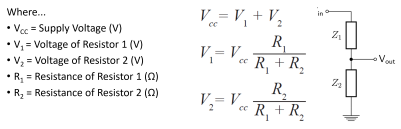
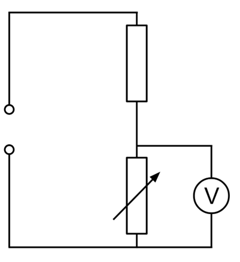
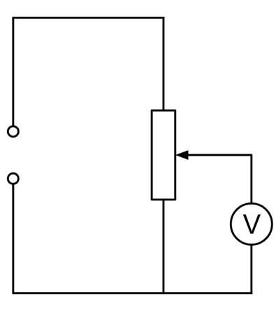
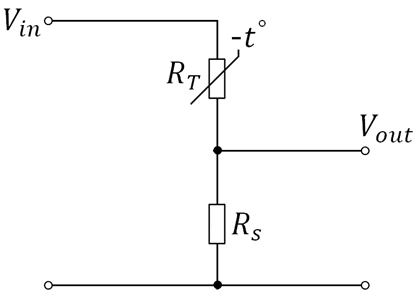
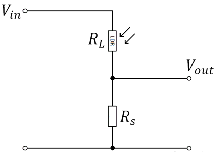
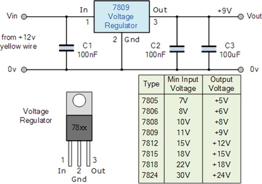

# voltage dividers and regulators

***

## voltage dividers

#### _overview_

- a voltage divider is a circuit that is used to turn a large voltage into two smaller ones
- a voltage divider contains a power supply and two resistors (various types of resistors can be used for the two resistors)
- the resistors are used to create an output voltage that is a certain fraction of the input voltage

#### _applications of voltage dividers_

- **w/ variable resistor:** as you adjust the variable resistor, you change the ratio of resistance in the circuit, hence changing the output voltage.
  - 

- **w/ potentiometer:** as you adjust the potentiometer, you change the resistance between the middle and the outer terminals, hence changing the output voltage
  - 

- **w/ thermistor:** one resistor is a fixed value, and the other is the negative temperature coefficient (NTC) thermistor, meaning <!--[if mathML]><mml:math xmlns:mml="http://www.w3.org/1998/Math/MathML"><mml:mo>∆</mml:mo><mml:mi>T</mml:mi><mml:mo>∝</mml:mo><mml:mrow><mml:mn>1</mml:mn><mml:mo>/</mml:mo><mml:mi>R</mml:mi></mml:mrow></mml:math><![endif]-->
  - when it’s a higher temperature, the thermistor's resistance decreases, hence inducing a higher output voltage. vice versa for lower temperature.
  - 

- **w/ photoresistor:** one resistor is a fixed value, and the other is the photoresistor, meaning <!--[if mathML]><mml:math xmlns:mml="http://www.w3.org/1998/Math/MathML"><mml:mo>∆</mml:mo><mml:mi mathvariant="normal">I</mml:mi><mml:mo>∝</mml:mo><mml:mrow><mml:mn>1</mml:mn><mml:mo>/</mml:mo><mml:mi>R</mml:mi></mml:mrow></mml:math><![endif]-->.
  - when the light intensity is greater, the photoresistor's resistance decreases. hence inducing a higher output voltage. vice versa for lower light intensity.
  - 

## voltage regulators

#### _overview_

- voltage regulators are a type of integrated circuit designed to maintain a constant voltage.
- they convert varying input voltages into fixed output voltages.
- a voltage regulator has two main functions:
  - to take a higher input voltage and release a lower output voltage that is more suitable for the components in the circuit.
  - to protect from potential voltage surges that could damage components in the circuit.
- 

#### _power supply smoothing_

- power supply voltages can sometimes be erratic, and this could potentially damage the electronic components they are connected to.
- to solve this issue, capacitors are typically included to reduce the fluctuations to a level that most devices can easily handle.
- they do this by charging themselves when the voltage levels are high, and then discharging themselves when the voltage levels become low.
- [example datasheet](https://www.ti.com/lit/an/slta055/slta055.pdf)

