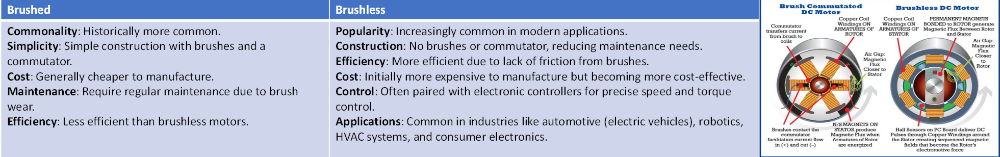
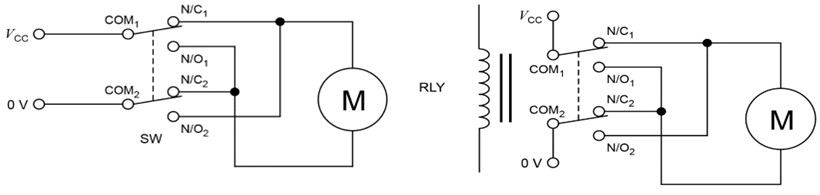
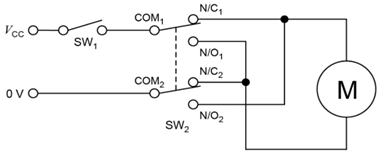
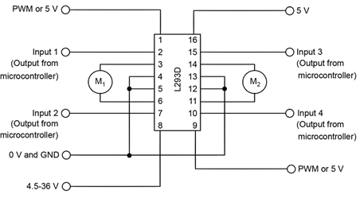
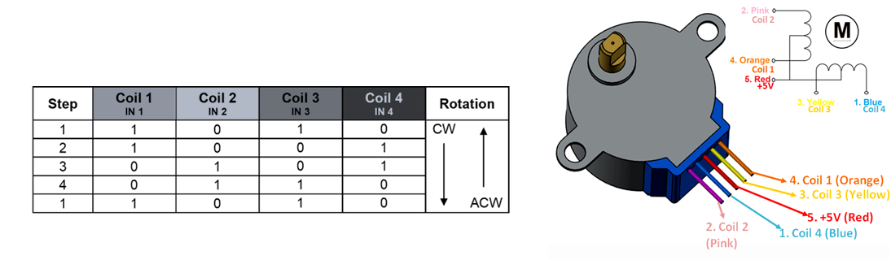
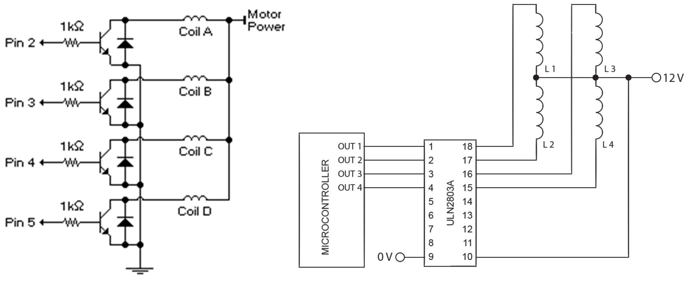

# motors

***

## DC motors

overview

- a DC motor is an electric motor that converts direct current electrical energy into mechanical energy
- DC motors are versatile and widely used in various applications due to their simple design, ease of control, and ability to provide high torque at low speeds

types of DC motor

- brushed DC motors were traditionally more common due to their simpler design and lower cost
- however, in recent years, brushless DC motors have gained popularity and are becoming more prevalent in many applications.
- 

driving DC motors

H-bridges

- an H-bridge is an essential circuit for controlling the direction of motors.
- in its simplest form, an H-bridge consists of four SPST switches arranged in a specific configuration.
- by closing and opening these switches in different combinations, the direction of the current/ voltage through the motor can be changed.
- *improved H-bridge:*
  - a more effective solution involves using a DPDT switch, which allows you to change the motor's direction with a single switch. alternatively, a DPDT relay can be used to achieve the same effect without manual intervention by applying a specific current or voltage to it.
  - 
  - however, there is a limitation with these circuits: it is not possible to stop the motor without disconnecting the power supply. this issue can be resolved by including an SPST switch after the power supply, which allows us to easily turn the motor on or off.
  - 

L293D motor driver

- the L293D motor driver is an integrated circuit (IC) used to control the direction and speed of DC motors from a microcontroller.
- it a versatile and widely used component for controlling small motors in various electronic projects.
- it is a type of H-bridge motor driver, which means it can drive motors in both directions.
- *key features:*
  - *dual H-Bridge configuration:* contains two H-bridge circuits, allowing it to control two motors independently.
  - bidirectional control: enables bidirectional control of the motors, meaning it can drive the motors forward, backward, or stop them.
  - *current handling:* can handle currents up to 600mA per channel, with peak currents up to 1.2A per channel for a short duration.
  - *voltage range:* can operate within a wide voltage range, typically from 4.5V to 36V, making it suitable for a variety of motors.
  - *protection diodes:* includes internal diodes to protect against back EMF generated when the motor is turned off, which helps to prevent damage to the circuit.

- *pinout:*
  - 
  - *power:*
    - pin 8 is connected to the power supply (4.5 - 36 V) required for the motors.
    - pin 16 is connected to the power supply (5 V) required for the L293D to perform internal logic functions.
  - *motor 1:*
    - pin 1 allows us to control the speed of M1.
    - pins 2 and 7 determine the direction of rotation for M1.
    - pins 3 and 6 are the outputs from the L293D that supply power to M1.
    - pins 4 and 5 are connected to 0 V of the power supply and GND of the microcontroller.
  - *motor 2:*
    - pin 9 allows us to control the speed of M2.
    - pins 10 and 15 determine the direction of rotation for M2.
    - pins 11 and 14 are the outputs from the L293D that supply power to M2.
    - pins 12 and 13 are connected to 0 V of the power supply and GND of the microcontroller.

methods of speed control

- *changing the input power:*
  - the simplest way to control the speed of a DC motor is to vary the voltage applied to the motor.
    - by lowering the voltage, the motor will spin slower.
    - by increasing the voltage, the motor will spin faster.
  - this method is very simple as it just involves physically changing the power supply connection.
  - however, changing the voltage (speed) will also change the current (torque).
  - also, if the voltage is too low then the motor won’t spin at all, and if the voltage is too high then the motor will likely break.

- *increasing/decreasing resistance:*
  - resistors can also be used to control the speed of a DC motor.
    - increasing the resistance will decrease the voltage/current available to the motor, meaning that the motor will spin slower.
    - decreasing the resistance will increase the voltage available to the motor, meaning that the motor will spin faster.
  - this method is very simple as it just involves physically inserting a resistor in series with the DC motor.
  - however, the power used by the resistor is essentially just wasted energy (it will be dissipated as heat).

- *assembling gearboxes:*
  - gears can also be used to control the speed of a DC motor by changing the velocity ratio:
    - if there are a higher number of teeth on the driver gear and a lower number of teeth on the follower gear, then the speed will be reduced (but the torque will be increased) \[gear reduction\].
    - if there are a lower number of teeth on the driver gear and a higher number of teeth on the follower gear, then the speed will be increased (but the torque will be decreased) \[gear overdrive\].
  - this method is very efficient as there is almost no power loss from the system (a small amount is dissipated as heat and sound due to the friction between gears).
  - however, this method involves trading off between speed and torque.

- *using pulse width modulation (PWM):*
  - we can also control the speed of a motor from a microcontroller, provided it has the ability for PWM.
    - by turning the output from a microcontroller on and off at a fast enough rate, we can provide a voltage to a DC motor that is anywhere between the maximum and minimum supply voltage.
  - this method is very efficient as there is very little power loss from the system. this method also enables us to control the speed digitally be adjusting the duty cycle of the PWM in the code.
  - however, if the frequency of the PWM is too low then the motor can stall.

stepper motors

overview

- a stepper motor divides a full 360° rotation into a specific number of equal-sized steps, allowing precise control of its position.
- it can be directed to move to and hold any of these steps.
- stepper motors are commonly utilized in applications requiring accurate control of position and speed.
  - examples include 3D printers and laser cutters

- there are two main types of stepper motors: unipolar and bipolar. in this course, we only need to know about unipolar stepper motors.
- *wiring:*
  - one or two common wire(s), which are connected to the supply voltage.
  - four coil wires, which are connected to outputs of a microcontroller.

function

- a unipolar stepper motor operates by sequentially energizing its coils, causing the rotor to move in discrete steps
  - the motor contains multiple coils arranged in phases, and each phase is energized in a specific sequence to produce motion

- the operation is controlled by a microcontroller, which sends electrical pulses to the motor's coils
  - these pulses determine the order and timing of the coil energisation

- as each coil is energized, a magnetic field is created, attracting the motor's rotor to align with the field
  - by carefully timing the pulses to energise the coils in a specific order, the rotor is made to step from one position to the next, resulting in rotational movement

- by adjusting the frequency of the pulses sent by the microcontroller, the motor's speed can be controlled
  - similarly, the direction of rotation can be reversed by reversing the order in which the coils are energised

- 

ULN2803A motor driver

- transistors and diodes are commonly used components to drive unipolar stepper motors effectively and safely
  - transistors act as switches to control the flow of current to the motor coils, while diodes protect the circuit from voltage spikes generated by the motor's inductance

- alternatively, a ULN2803A motor driver can be used instead of individual transistors and diodes
  - this simplifies the circuit design by integrating multiple transistors and diodes into a single package, providing higher current gain and better performance for driving stepper motors

- 

servo motors

*overview*

- a servo motor is a rotary actuator that enables precise control of angular position, velocity, and acceleration.
- servo motors are used in robotics, radio-controlled models, and precision control systems.
  - examples include conveyor belts, mobile robot wheels, and winches.

- there are two main types of servo motors: positional (closed loop) and rotational (open loop).
- *wiring:*
  - the signal wire is connected to the output of a microcontroller, which is used to control the position (for positional servos) or speed/direction (for rotational servos).
the voltage wire is connected to the positive terminal of a power supply, which is provide the required energy for the motor to spin.
the ground wire is connected to the negative terminal of a power supply, to complete the circuit and allow current to flow through the motor.

*positional servos*

- positional servo motors are designed to move to and maintain a specific position within a defined range of motion (typically from 0° to 180°).
- *key features:*
  - *feedback mechanism:* a potentiometer is used for position feedback, allowing the motor to adjust to the desired angle.
  - *positional control:* designed to precisely control the shaft's angle based on the input signal.
  - *physical stops:* physical stops are present to limit the rotation to a specific range, preventing over-rotation and ensuring accurate positioning.

*continuous servos*

- continuous servo motors can rotate continuously at different speeds in either a clockwise or anti-clockwise direction.
- *key features:*
  - **no feedback mechanism:** continuous servos lack a position feedback mechanism, as they are not designed to hold a specific angle.
  - **speed and directional control:** designed to control the rotation speed and direction based on the input signal.
  - **no physical stops:** physical stops are removed or modified to allow 360-degree continuous rotation, enabling unrestricted movement.

