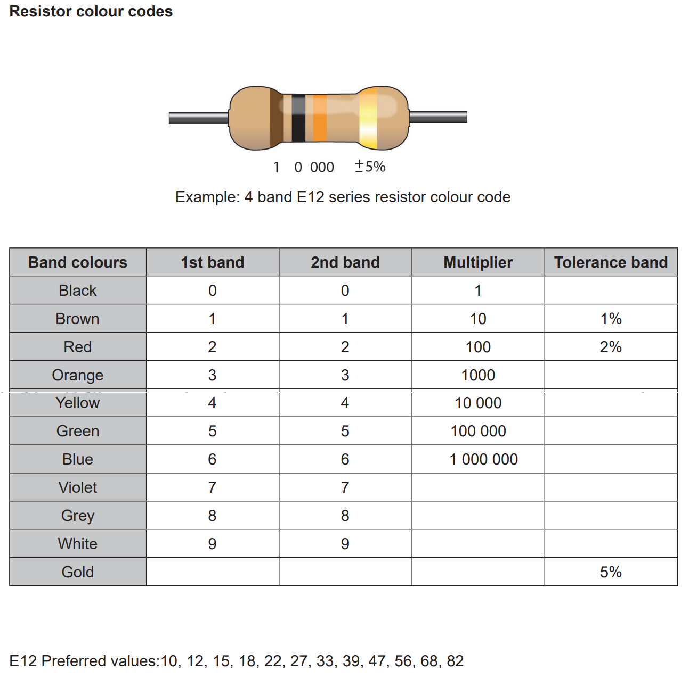
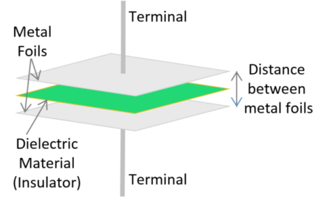
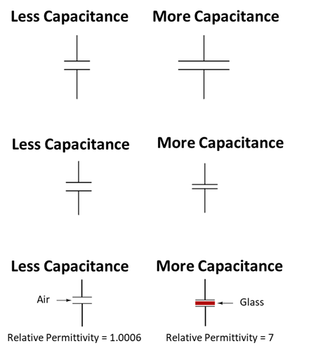
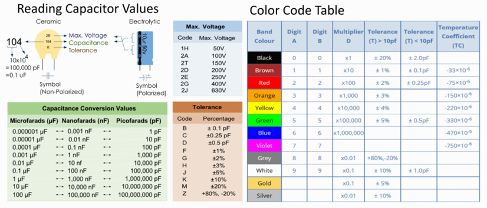

# passive components

***

## resistors

#### _types of resistors_
- **fixed value resistor: **the resistance cannot change, and is indicated by the coloured bands on the resistor
- **variable resistor/rheostat: **the resistance can be adjusted with the dial, spindle, or wiper, and there are two connection points to this resistor
- **potentiometer/trimpot: **the resistance can be adjusted with the dial, spindle, or wiper, and there are three connections to this resistor
- **NIC photoresistor: **the resistance is inversely proportional to the intensity of light falling on the resistor
- **NTC thermistor: **the resistance is inversely proportional to the temperature detected by the resistor

#### _4-band resistor colour codes_
- 
- the 1st and 2nd bands are digits, the 3rd band is a multiplier, and the 4th band is the tolerance

#### _E12 series preferred values_
- fixed value resistors are not available in an unlimited range of values. this would simply not be feasible for businesses to stock. therefore, a limited range of values is manufactured using what is known as preferred values
- for this course, E12 values are used. these are 10, 12, 15, 18, 22, 27, 33, 39, 47, 56, 68 and 82 as the base numbers, and are on the data sheet
- typically choose closest value unless it is a current-sensitive component, then always overspec resistor

## capacitors

#### _overview_
- batteries and capacitors are both components used in electronics to store and release electrical energy
- _key differences:_
  - capacitors store electrical energy in an electric field between two conductive plates. they can store less energy compared to batteries but can release it much faster
  - capacitors release energy much more rapidly than batteries, making them suitable for applications requiring quick bursts of power, such as camera flashes or smoothing out voltage fluctuations in electronic circuits
  - capacitors can be charged and discharged repeatedly without significant degradation, unlike some batteries, making them ideal for applications where frequent energy storage and release cycles are needed
  - capacitors are generally smaller and lighter than batteries of similar energy storage capacity, which can be advantageous in compact electronic devices

#### _formulae_
- 
- 
- 
- in series: <!--[if mathML]><mml:math xmlns:mml="http://www.w3.org/1998/Math/MathML"><mml:mfrac><mml:mn>1</mml:mn><mml:mrow><mml:msub><mml:mi>C</mml:mi><mml:mrow><mml:mi>t</mml:mi><mml:mi>o</mml:mi><mml:mi>t</mml:mi><mml:mi>a</mml:mi><mml:mi>l</mml:mi></mml:mrow></mml:msub></mml:mrow></mml:mfrac><mml:mo>=</mml:mo><mml:mfrac><mml:mn>1</mml:mn><mml:mrow><mml:msub><mml:mi>C</mml:mi><mml:mn>1</mml:mn></mml:msub></mml:mrow></mml:mfrac><mml:mo>+</mml:mo><mml:mfrac><mml:mn>1</mml:mn><mml:mrow><mml:msub><mml:mi>C</mml:mi><mml:mn>2</mml:mn></mml:msub></mml:mrow></mml:mfrac><mml:mo>+</mml:mo><mml:mfrac><mml:mn>1</mml:mn><mml:mrow><mml:msub><mml:mi>C</mml:mi><mml:mn>3</mml:mn></mml:msub></mml:mrow></mml:mfrac><mml:mo>+</mml:mo><mml:mo>…</mml:mo></mml:math><![endif]-->
- in parallel: <!--[if mathML]><mml:math xmlns:mml="http://www.w3.org/1998/Math/MathML"><mml:msub><mml:mi>C</mml:mi><mml:mrow><mml:mi>t</mml:mi><mml:mi>o</mml:mi><mml:mi>t</mml:mi><mml:mi>a</mml:mi><mml:mi>l</mml:mi></mml:mrow></mml:msub><mml:mo>=</mml:mo><mml:msub><mml:mi>C</mml:mi><mml:mn>1</mml:mn></mml:msub><mml:mo>+</mml:mo><mml:msub><mml:mi>C</mml:mi><mml:mn>2</mml:mn></mml:msub><mml:mo>+</mml:mo><mml:msub><mml:mi>C</mml:mi><mml:mn>3</mml:mn></mml:msub><mml:mo>+</mml:mo><mml:mo>…</mml:mo></mml:math><![endif]-->

#### _types of capacitors_
- *non-polarised:*
  - most use metal oxide film as their dielectric material
  - has a smaller capacitance than polarised capacitors of the same size
  - both voltage directions can be used (DC and AC)
- *polarised:*
  - most use electrolytes as their dielectric material
  - has a larger capacitance than non-polarised capacitors of the same size
  - can only be used in one voltage direction (DC)

#### _DC and AC_
- capacitors block direct current (if they are fully charged) but pass alternating current
- *direct current:*
  - initially when we connect a polarised/non-polarised capacitor to the DC supply, there will be a small current flow until the plates become saturated
  - once the applied voltage is equal to the voltage across polarised/ non-polarised capacitor, then the plates are said to be saturated and there will be no more current flow
  - at this stage, the polarised/ non-polarised capacitor behaves like an open circuit
  - *note:* If we increase the value of the applied voltage once it is saturated, then this could cause the polarised/ non-polarised capacitor to explode
- *alternating current:*
  - when we connect a non-polarised capacitor across an AC supply source, it will charge and discharge continuously due to continuous change in the polarity of the supply voltage
  - current is alternately flowing toward or away from the plates but not actually crossing from one side to the other
  - for this reason, it can be argued that a non-polarized capacitor allows alternating current to pass
  - *note:* a polarised capacitor will be damaged if the polarity of its power supply is reversed because they are polarity sensitive

#### _internal structure_
- a capacitor is made of two conducting plates that are separated by a dielectric material.
- the plates accumulate opposing charges when connected to power source
- 

#### _factors that affect capacitance_
- **plate area:** greater plate area gives greater capacitance; directly proportional
- **plate spacing:** further plate spacing gives less capacitance; inversely proportional
- **dielectric electric permittivity:** the greater the permittivity of the dielectric material, the greater the capacitance; directly proportional
- 

#### _smoothing_
- capacitor smoothing, also known as capacitor filter or reservoir capacitor, is a technique used in electronic circuits to reduce the ripple voltage in a direct current (DC) power supply
- by adding a capacitor, the circuit takes advantage of the capacitor's ability to store and release electrical energy
- during the peaks of the AC input voltage, the capacitor charges up
- then, during the troughs or lower points of the AC input voltage, the capacitor discharges into the circuit, effectively smoothing out the variations in voltage
- the larger the capacitance of the capacitor, the more effectively it can smooth out the ripple voltage
- *however, there are trade-offs involved:*
  - very large capacitors can lead to slower response times in the power supply, while smaller capacitors may not sufficiently reduce the ripple
  - designers must balance these factors to achieve the desired level of smoothing without compromising other aspects of the circuit's performance

#### _capacitor codes_
- 

