# semiconductors

***

## rectifier diodes

#### _overview_
- 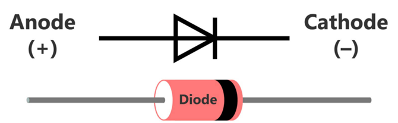
- rectifier diodes are the electrical equivalent of a one-way valve
- they are classified as a semiconductor because they conduct electricity in one direction but not in the other
- most rectifier diodes are made from silicon
- rectifier diodes require a specific voltage to operate which is typically around 0.6 V

#### _theory_
- 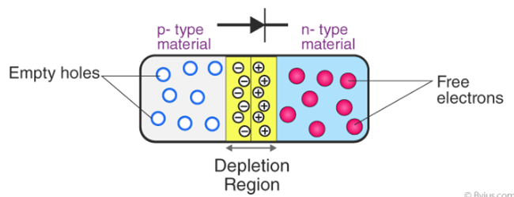
- *a diode consists of three main regions:*
  - P-type semiconductor material, which has an excess of holes (positively charged)
  - depletion layer, which has a lack of electrons and holes (neutral charge)
  - N-type semiconductor material, which has an excess of electrons (negatively charged)

- *when a diode is connected to a power supply with the correct polarity, then we say that it is forward-biased:*
  - applying a voltage in this direction will push the free electrons towards the empty holes, which in turn reduces the width of the depletion layer.
  - this means the free electrons will be able to cross the depletion later and therefore current can flow.

- *when a diode is connected to a power supply with an incorrect polarity, then we say that it is reverse-biased.*
  - applying a voltage in this direction will be pull the free electrons away from the empty holes, which in turn increases the width of the depletion layer.
  - this means that the free electrons will not be able to cross the depletion layer and therefore current can’t flow.

#### _issues with rectifier diodes_
- **voltage drop:** diodes have a forward voltage drop and this will reduce the output voltage of the rectified signal
- **ripple voltage:** regardless of whether it is half-wave or full-wave rectification, there is still a ripple in the output voltage
- **reverse leakage:** in an ideal diode, there should be no current flowing in the reverse direction when a reverse voltage is applied. however, real-world diodes exhibit a phenomenon called reverse leakage, where a tiny amount of current does flow in the reverse direction
- **temperature dependence:** the characteristics of diodes are temperature-dependent. operating diodes outside their specified temperature range can affect their performance and reliability
- **power dissipation:** diodes dissipate power as heat. this can lead to temperature rise and reduced overall efficiency
- **overcurrent and overvoltage protection:** diodes can be susceptible to damage from overcurrent conditions or overvoltage spikes. in critical circuits, additional protection components may be necessary to prevent diode failure
- **aging and degradation**: like all semiconductor devices, rectifier diodes can experience aging and degradation over time. factors such as operating conditions, temperature cycling, and current/voltage stress can contribute to gradual performance degradation and eventual failure

## applications of rectifier diodes

#### _protection against the reverse connection of a DC power supply_
- if the DC power supply is connected with the correct polarity, then the diode would be forward-biased, and current will be able to flow through the circuit.
- if it was connected with an incorrect polarity, then the diode would be reverse-biased, and this would block current from flowing though the circuit.
- 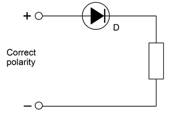

#### _protection against back E.M.F. when switching inductive devices_
- for any circuits that contain an inductor (i.e. a solenoid, relay, or motor), a problem can occur when the circuit is switched off or experiences a power interruption.
- when this happens, The inductor will release its stored energy as a very short lived but rather strong current that can damage various components in the circuit.
- however, if we place a rectifier diode in parallel with the inductor, then there is an alternative pathway for the current to circulate through so that it can dissipate as heat over time instead.
- when a diode is used in this manner, it is often referred to as a flywheel diode or a flyback diode.
- *inductors:*
  - an inductor (also known as a coil, choke, or reactor) is a passive two-terminal electrical component that stores energy in a magnetic field when electric current flows through it.
  - they are components that typically consists of an insulated wire wound into a coil around a core.

#### _back EMF_
- when current flows through an inductor, it builds up a magnetic field/ stores magnetic energy. if we suddenly stop the current (for example, by turning off a switch), the magnetic field collapses.
- this creates a large voltage spike known as back emf.
- a rectifier diode can be connected in parallel with the inductor to provide a safe path for the energy to dissipate.
- this prevents the voltage spike from harming other components in the circuit (in this case the transistor).
- 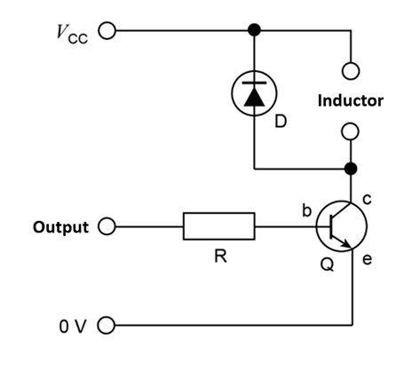

#### _AC rectification_
- *half-wave rectification:*
  - each time the voltage reverses to become negative, the resulting negative current is blocked by the diode (called a rectifier).
  - only the positive half of the voltage can pass across the load, which results in a pulsating DC output.
  - 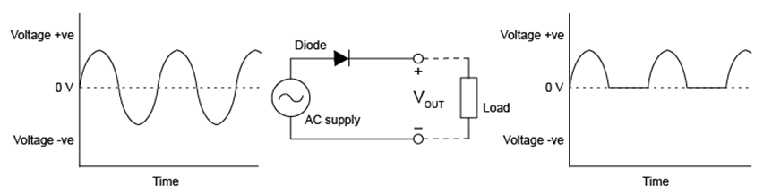
- *full-wave rectification:*
  - each time the voltage reverses to become negative, the resulting negative current has its direction reversed by the arrangement of diodes (called a bridge rectifier).
  - both the positive and negative half of the voltage can pass across the load, which results in a constant DC output.
  - 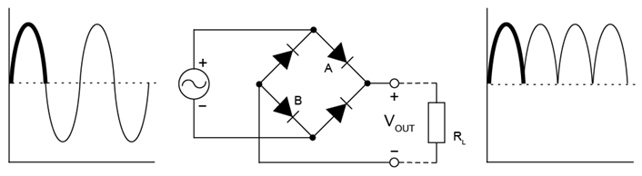

## light-emitting diodes (LEDs)

#### _overview_
- light-emitting diodes will emit light when forward biased but not when they are reversed biased
- light-emitting diodes emit different coloured light depending on the semiconductor material used in construction
- the voltage they require typically varies from 1.8-3.3 V
- 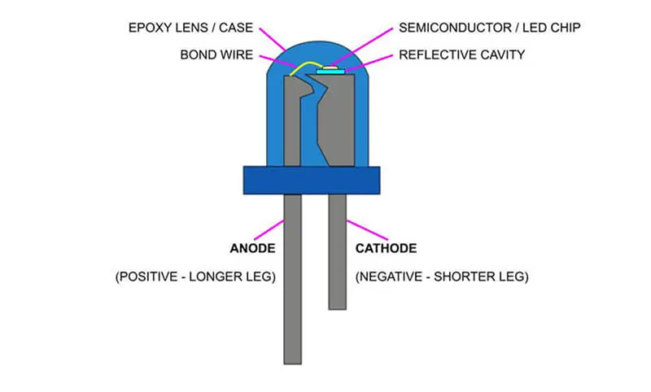

#### _applications_
- show whether power is on/off (light = on, no light = off)
- indicate a particular instruction (red = stop, yellow = wait, green = go)
- displays used in marketing/ advertisement (billboards, signs)
- back lighting for personal devices (televisions, phones, computers)

## transistors

#### _overview_
- a transistor is a semiconductor device used to amplify and switch electronic signals and electrical power
- there are many types of transistors available for use in circuits, but for this course we only need to know about negative-positive-negative (NPN) bipolar junction transistors (BJTs)
  - this name relates to the internal structure of the transistor; three layers of doped silicon that are negative-positive-negative

#### _function_
  - **amplifier:** when it works as an amplifier, it takes in a tiny electric current at one end and produces a much bigger electric current at the other.
    - in other words, it’s like a current booster
    - this is useful for things like hearing aids. A hearing aid has a tiny microphone in it that picks up sounds from the world around you and turns them into fluctuating electric currents
    - these are fed into a transistor that boosts them and powers a tiny loudspeaker, so you hear a much louder version of the sounds around you
  - **switch:** when it works as a switch, a small electric current flowing through one part of a transistor makes a big current flow through another part of it
    - in other words, the small current switches on the larger one
    - this is essentially how all computer chips work
    - for example, a memory chip contains hundreds of millions or even billions of transistors, each of which can be switched on or off individually
    - since each transistor can be in two distinct states, it can store two different numbers, zero and one. With billions of transistors, a chip can store billions of zeros and ones

## transistor properties

#### _gain_
- the ratio of collector current to base current is known as transistor gain (<!--[if mathML]><mml:math xmlns:mml="http://www.w3.org/1998/Math/MathML"><mml:mi>𝛽</mml:mi></mml:math><![endif]-->), and is a dimensionless value
- It is sometimes also referred to as the beta ratio
-  <!--[if mathML]><mml:math xmlns:mml="http://www.w3.org/1998/Math/MathML"><mml:mi>𝛽</mml:mi></mml:math><![endif]--> for any transistor is determined during its initial design and cannot be changed after manufacture

#### _modes of operation_
- *cut-off:*
  - when a transistor is in the fully-off state (like an open switch)
  - <!--[if mathML]><mml:math xmlns:mml="http://www.w3.org/1998/Math/MathML"><mml:msub><mml:mi>I</mml:mi><mml:mi>B</mml:mi></mml:msub><mml:mo>=</mml:mo><mml:mn>0</mml:mn></mml:math><![endif]-->, and thus there is no collector or emitter current either
  -  <!--[if mathML]><mml:math xmlns:mml="http://www.w3.org/1998/Math/MathML"><mml:msub><mml:mi>V</mml:mi><mml:mrow><mml:mi>C</mml:mi><mml:mi>E</mml:mi></mml:mrow></mml:msub></mml:math><![endif]--> is equal to the supply voltage
  - 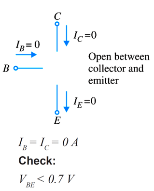

- *forward-active:*
  - when a transistor is somewhere between the cut-off and saturated state
  - the region between cut-off and saturation is known as the forward-active region
  - the transistor will function normally in this region
  - in the active state, collector current is <!--[if mathML]><mml:math xmlns:mml="http://www.w3.org/1998/Math/MathML"><mml:mi>𝛽</mml:mi></mml:math><![endif]--> times the base current
  - 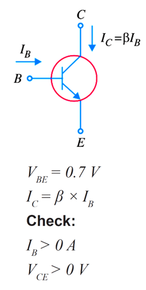

- *saturated:*
  - when a transistor is fully conductive between emitter and collector (passing as much current as the power supply will allow)
  - the base current asks for more collector current than can be produced by the power supply
  - the collector current is at a maximum
  - the collector and emitter are effectively a short circuit
  - the transistor behaves as though a switch has been closed between the collector and emitter
  - 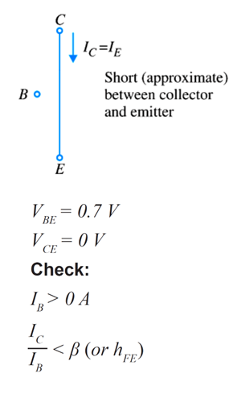

## example transistor question
- 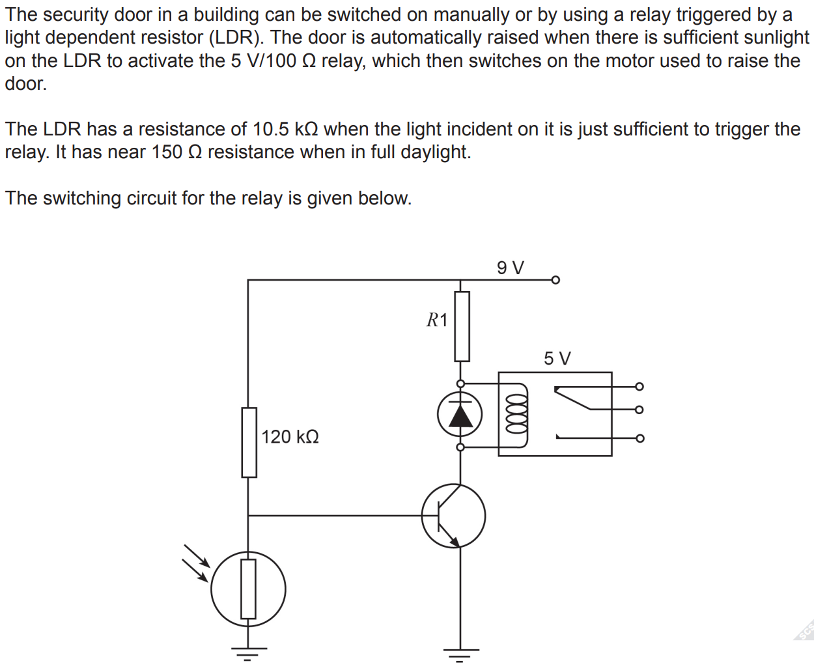
  - calculate the voltage across the 120 kΩ resistor when the relay is activated (the transistor is on)
    <!--[if mathML]><mml:math xmlns:mml="http://www.w3.org/1998/Math/MathML" display="block"><mml:mi mathvariant="normal">Σ</mml:mi><mml:mi>V</mml:mi><mml:mo>=</mml:mo><mml:mn>0</mml:mn></mml:math><![endif]-->
<!--[if mathML]><mml:math xmlns:mml="http://www.w3.org/1998/Math/MathML"><mml:mn>0</mml:mn><mml:mo>=</mml:mo><mml:msub><mml:mi>V</mml:mi><mml:mrow><mml:mi>b</mml:mi><mml:mi>a</mml:mi><mml:mi>t</mml:mi><mml:mi>t</mml:mi><mml:mi>e</mml:mi><mml:mi>r</mml:mi><mml:mi>y</mml:mi></mml:mrow></mml:msub><mml:mo>+</mml:mo><mml:msub><mml:mi>V</mml:mi><mml:mi>r</mml:mi></mml:msub><mml:mo>+</mml:mo><mml:msub><mml:mi>V</mml:mi><mml:mrow><mml:mi>B</mml:mi><mml:mi>E</mml:mi></mml:mrow></mml:msub></mml:math><![endif]-->
<!--[if mathML]><mml:math xmlns:mml="http://www.w3.org/1998/Math/MathML"><mml:msub><mml:mi>V</mml:mi><mml:mi>r</mml:mi></mml:msub><mml:mo>=</mml:mo><mml:mn>9</mml:mn><mml:mo>−</mml:mo><mml:mn>0</mml:mn><mml:mo>.</mml:mo><mml:mn>7</mml:mn></mml:math><![endif]-->
<!--[if mathML]><mml:math xmlns:mml="http://www.w3.org/1998/Math/MathML"><mml:mo>=</mml:mo><mml:mn>8</mml:mn><mml:mo>.</mml:mo><mml:mn>3</mml:mn><mml:mo> </mml:mo><mml:mi>V</mml:mi></mml:math><![endif]-->

  - calculate the power dissipated in the 120 kΩ resistor when the relay is activated
    <!--[if mathML]><mml:math xmlns:mml="http://www.w3.org/1998/Math/MathML" display="block"><mml:mi>P</mml:mi><mml:mo>=</mml:mo><mml:mfrac><mml:mrow><mml:msup><mml:mi>V</mml:mi><mml:mn>2</mml:mn></mml:msup></mml:mrow><mml:mi>R</mml:mi></mml:mfrac></mml:math><![endif]-->
<!--[if mathML]><mml:math xmlns:mml="http://www.w3.org/1998/Math/MathML"><mml:mo>=</mml:mo><mml:mfrac><mml:mrow><mml:msup><mml:mrow><mml:mn>8</mml:mn><mml:mo>.</mml:mo><mml:mn>3</mml:mn></mml:mrow><mml:mn>2</mml:mn></mml:msup></mml:mrow><mml:mrow><mml:mn>120</mml:mn><mml:mo>×</mml:mo><mml:msup><mml:mrow><mml:mn>10</mml:mn></mml:mrow><mml:mn>3</mml:mn></mml:msup></mml:mrow></mml:mfrac></mml:math><![endif]-->
<!--[if mathML]><mml:math xmlns:mml="http://www.w3.org/1998/Math/MathML"><mml:mo>=</mml:mo><mml:mn>5</mml:mn><mml:mo>.</mml:mo><mml:mn>74</mml:mn><mml:mo>×</mml:mo><mml:msup><mml:mrow><mml:mn>10</mml:mn></mml:mrow><mml:mrow><mml:mo>−</mml:mo><mml:mn>4</mml:mn></mml:mrow></mml:msup><mml:mo> </mml:mo><mml:mi>W</mml:mi></mml:math><![endif]-->

  - determine the current required to operate the relay
    <!--[if mathML]><mml:math xmlns:mml="http://www.w3.org/1998/Math/MathML" display="block"><mml:mi>I</mml:mi><mml:mo>=</mml:mo><mml:mfrac><mml:mi>V</mml:mi><mml:mi>R</mml:mi></mml:mfrac></mml:math><![endif]-->
<!--[if mathML]><mml:math xmlns:mml="http://www.w3.org/1998/Math/MathML"><mml:mo>=</mml:mo><mml:mfrac><mml:mn>5</mml:mn><mml:mrow><mml:mn>100</mml:mn></mml:mrow></mml:mfrac></mml:math><![endif]-->
<!--[if mathML]><mml:math xmlns:mml="http://www.w3.org/1998/Math/MathML"><mml:mo>=</mml:mo><mml:mn>5</mml:mn><mml:mo>.</mml:mo><mml:mn>00</mml:mn><mml:mo>×</mml:mo><mml:msup><mml:mrow><mml:mn>10</mml:mn></mml:mrow><mml:mrow><mml:mo>−</mml:mo><mml:mn>2</mml:mn></mml:mrow></mml:msup><mml:mi>A</mml:mi></mml:math><![endif]-->

-----

