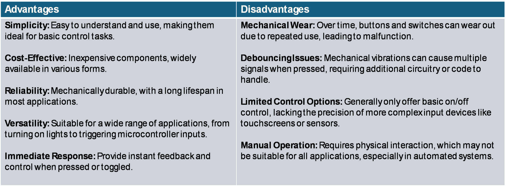
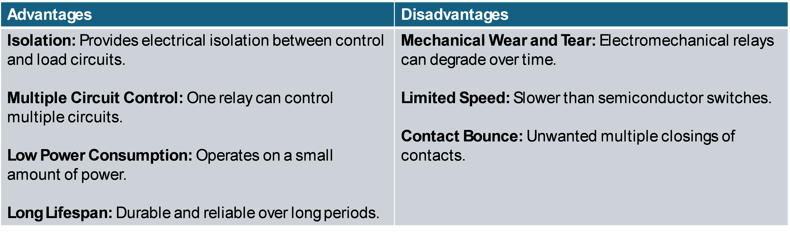

# switches and relays

***

## switches

#### _overview_

- buttons and switches are simple devices that control the flow of electricity in a circuit.
- they allow you to control devices manually by opening or closing a circuit, and they can send simple digital signals to microcontrollers to trigger specific actions in your projects.
- *types:*
  - **momentary buttons:** only complete the circuit while pressed
  - **toggle switches:** stay in one position until manually changed
  - **push-button switches:** like momentary buttons but can stay pressed

#### _with microcontrollers_

- **digital input:** buttons and switches are often used as digital inputs for microcontrollers
- **debouncing:** debouncing is a technique used to ensure that the microcontroller reads a single, clean signal when a button is pressed, avoiding multiple signals caused by mechanical vibrations
- **pull-up/pull-down resistors:** these resistors are used to ensure that a button's input is at a defined voltage when the button is not pressed

#### _applications_

- **home appliances:** used to turn on/off devices like lamps, fans, and kitchen appliances
- **automotive:** found in car ignition systems, dashboard controls, and window mechanisms
- **consumer electronics:** commonly used in remote controls, keyboards, and gaming consoles
- **industrial equipment:** control machines and safety systems, such as emergency stop buttons
- **security systems:** used in access control systems, such as doorbells or alarm triggers

#### _advantages and disadvantages_

- 

## relays

#### _overview_

- relays are electrically operated switches that control circuits by opening or closing connections based on an external signal.
- they allow a low-power signal, often from a microcontroller, to control a larger, high-power circuit safely and efficiently

#### _components_

- **coil:** when energized by a small current, it creates a magnetic field
- **armature:** a movable part that responds to the magnetic field
- **contacts:** metal parts that open or close the circuit based on the armature’s movement

#### _operation_

- when the coil receives a current, it generates a magnetic field
- the magnetic field pulls the armature, causing the contacts to either open or close the circuit
- when the current is turned off, the magnetic field disappears, and the armature returns to its original position, reversing the circuit state

#### _applications_

- **home appliances:** controls devices like air conditioners, refrigerators, etc
- **automotive:** used in car headlights, starter motors, etc
- **industrial automation:** controls machinery and safety systems
- **telecommunications:** used in signal switching and data transmission
- **microcontrollers:** relays allow microcontrollers to control devices that require higher voltages or currents than the microcontroller can handle directly

advantages and disadvantages

- 

