# diagrams

***

## overview
- engineered products are often too complex to explain to a layperson
- one way of dealing with this problem is to use a systems approach and present the concepts visually instead
- this makes it easier to understand how the various aspects of the engineered product are related to each other and integrated into a functioning whole

## universal system diagram
- all systems can be analysed in terms of their inputs, processes, and outputs
- the universal system diagram is the simplest way to represent a system to a layperson
- 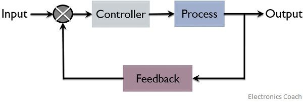
- *e.g. kettle*
  - the purpose of a kettle is to take cold water (input), heat it (process), and produce hot water (output)
  - however, if we think a little harder it becomes obvious that there are actually a lot more inputs and outputs for this system. Thus the universal block diagram for this example should look like:
    - 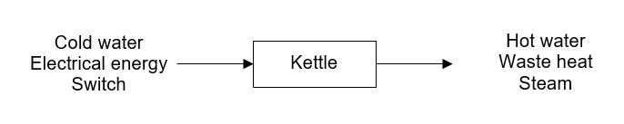

## sub-systems diagram
- once a universal system diagram has been developed, we can then analyse the process in more detail and produce a sub-systems diagram
- this is done to communicate some more specific details about the process, but we must make sure that they can still easily be understood by a layperson
- *e.g. washing machine*
  - the processes involved in a washing machine are more complex than most people realise
  - illustrated below is a sub-systems diagram that can be used to explain them in more detail
  - 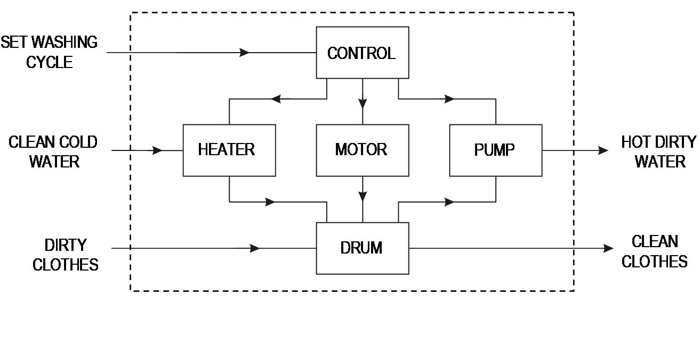

## control systems
#### *open-loop*
- an open loop system connects its blocks in a linear manner which means there is no feedback in this system
- this system is classified as a manual open-loop control system
  - 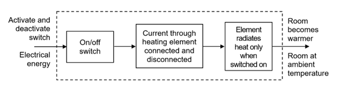
  - a person activates or deactivates the system and leaves the room then the heating element remains on or off and regulation of the room temperature is likely to be very inaccurate

- this system is classified as an automatic open-loop control system
  - 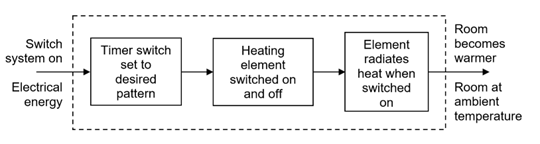
  - a person is not required to be present to control the heating element
  - although this does not require the direct intervention of a person the regulation of room temperature is likely to be an approximation at best and the heating element may be on when it should be off and vice-versa

#### *closed-loop*
- closed loop systems use a feedback loop to continually correct any error between the desired output and the actual output
- the simplest form of this system consists of a controller that has two inputs (the desired output and the actual output), a process, an output, and a feedback loop that includes a feedback sensor
- suppose a person remains in the room to adjust the temperature
  - 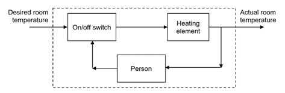
  - this is an example of a manual closed-loop control system
- suppose a temperature sensor takes the place of the person
  - this is an example of an automatic closed-loop control system
  - 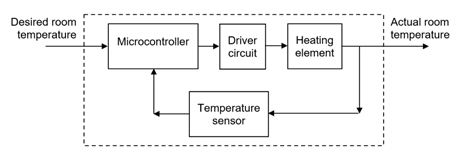

## error detection
- diagrams of closed-loop systems often incorporate an error detection symbol
- the error detector symbol is shown below:
  - 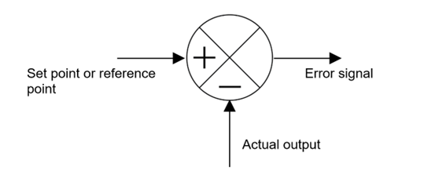

- inside the error detector the actual value is subtracted from the set value, and the resultant value is the error signal. the error signal is then inputted into some kind of controller so that it can adjust the relevant outputs
- in manual closed-loop control systems, the brain is the error detector. In automatic closed-loop control systems, the error detection is performed electronically
- *e.g. cruise control*
  - 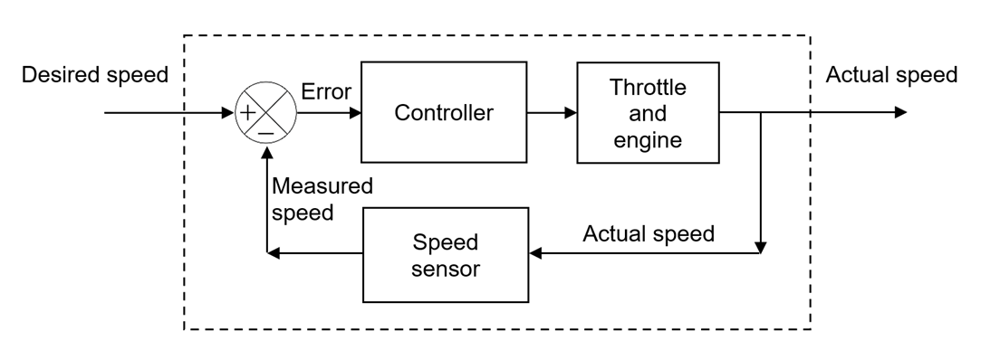
  - a primitive way to implement cruise control is simply to lock the throttle position when the driver engages cruise control
    - however, if the cruise control is engaged on a stretch of flat road, then the car will travel slower going uphill and faster when going downhill. as a result, the controller cannot account for changes acting on the car, like a change in the slope of the road
  - a modern technique is to use data from a sensor that monitors the car's speed and compares it to the desired speed. the difference between the two speeds is called the error and is used to determine how the position of the throttle should be adjusted
    - as a result, the controller is able to determine whether the car is moving too fast or too slow compared with the desired speed, and then will adjust the throttle accordingly

## types of feedback
#### *negative feedback*
- often the purpose of control is to ensure that the actual output level is maintained as closely as possible to the desired output level (error is decreased)
- in the case of an air conditioning system, a graph of the temperature in a room might appear as in the graph below
  - 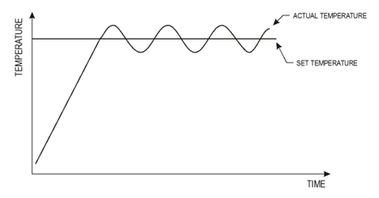
  - as can be seen from the graph, the control system is constantly trying to pull the temperature of the room back towards the set temperature level by reducing the error.

#### *positive feedback*
- the opposite effect where the actual output level constantly moves further away from the desired output level can also happen (error is increased)
- a common example of this is with public address systems when the microphone is held too close to the speakers, which can be seen in the graph below
  - 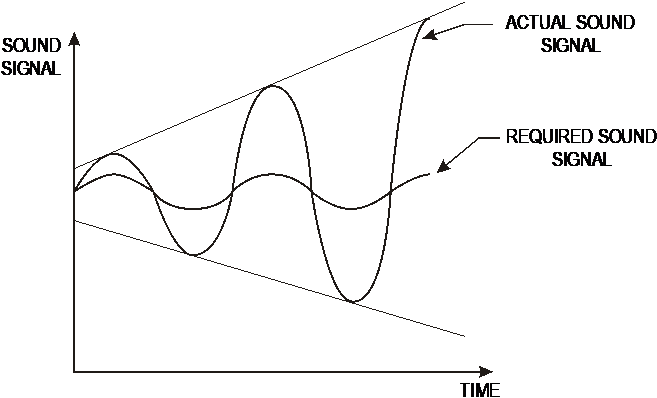
  - a sound is picked up by the microphone, amplified, and then output through the speaker
  - the amplified sound is then picked up, re-amplified and so on
  - the net result is a much louder sound than anticipated
- another more practical example is the initial powering on of an RF oscillator, as the output of the oscillator is fed back into the input to resonate and build the amplitude until the nonlinearities in the circuit limit it