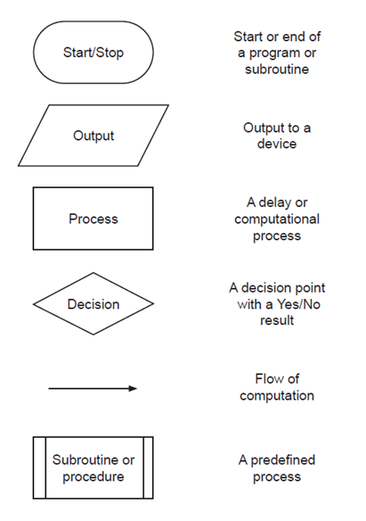
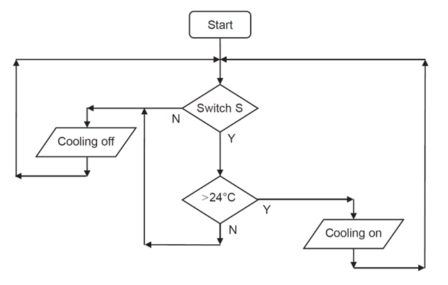

# flowcharts

***

## overview
- flowcharts are visual representations used to illustrate the step-by-step logic of a process or system
- they help to visually depict the sequence of actions, decisions, and interactions that occur within a procedure
- flowcharts typically consist of various symbols and shapes that represent different elements of the procedure

## symbols
- 

## structure
- **start with an oval:** begin your flowchart with an oval symbol labelled 'start'
- **sequence of actions:** use rectangles to represent each step or action in your process
- **decision points:** use diamonds to indicate decision points. These should branch out into different paths based on the outcome (*e.g.* yes/no)
- **flow direction:** utilize arrows to show the direction of flow from one step to the next. typically, flowcharts are organized from top to bottom or left to right
- **end with an oval or loop back to start:** conclude your flowchart with an oval symbol labelled 'end'. alternatively, if the process is continuous or ongoing, you may loop it back to the start

## example
- this flowchart depicts the operation of an air conditioning system in an office building:
  - 
  - **start:** the system receives power and is in standby mode
  - **switch check:** the system then assesses the status of the air conditioning switch
    - if the switch is off, the air conditioning unit is turned off, and the process loops back to the start
    - if the switch is on, the flowchart proceeds to the temperature check
  - **temperature check:** the system then assesses the status of the temperature sensor
    - if the temperature is less than 24°C, the air conditioning unit remains off, and the process loops back to the start
    - if the temperature is greater than 24°C, the air conditioning unit is turned on, and the process loops back to the start

## tips
- **label your symbols:** clearly label each symbol with a brief description of the action, decision, input, or output
- **keep it simple:** avoid cluttering your flowchart with too many details. Aim for simplicity and clarity
- **consistent spacing:** maintain consistent spacing between symbols for a neat and organized look
- **use straight lines:** keep your arrows straight and avoid crossing lines if possible. Use right-angle lines for clarity
- **limit decision paths:** try to limit the number of decision points in a flowchart to keep it manageable and easy to follow

## why use a flowchart?
#### *planning*
- flowcharts play a crucial role in the planning phase of mechatronic system development. by mapping out the system’s architecture visually, engineers and designers can foresee potential bottlenecks, inefficiencies, or conflicts in the design. this early identification allows for more informed decision-making, ultimately leading to a more streamlined and effective implementation process.

#### *optimization*
- flowcharts are essential tools for optimizing mechatronic systems. they help engineers and designers pinpoint areas where processes can be streamlined. by analysing the flowchart, it becomes easier to spot unnecessary steps, redundancies, or delays. this targeted analysis contributes to enhancing the overall efficiency and performance of the system.

#### *troubleshooting*
- when issues arise in a mechatronic system, flowcharts provide a systematic approach to diagnosing problems. they help trace the flow of signals and actions, making it easier to identify the exact point of failure. this structured approach to troubleshooting helps engineers address problems more quickly and accurately, reducing system downtime.

#### *communication*
- in mechatronics, where projects often involve collaboration among professionals from diverse disciplines—such as mechanical engineering, electronics, and software development—flowcharts serve as a universal language. they facilitate clear communication and mutual understanding among team members with different expertise, ensuring that everyone is aligned and contributing effectively to the system’s design and development.

