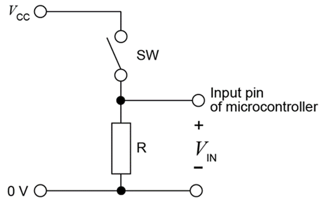
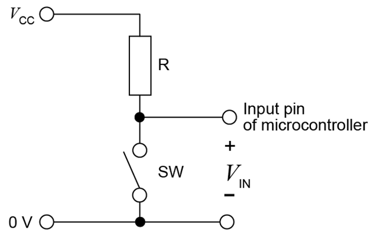
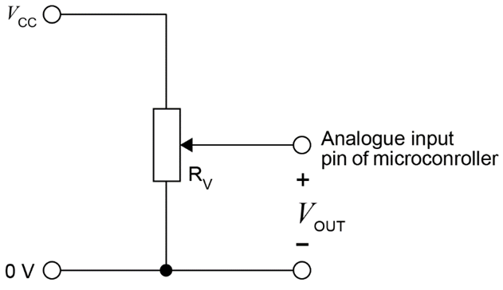
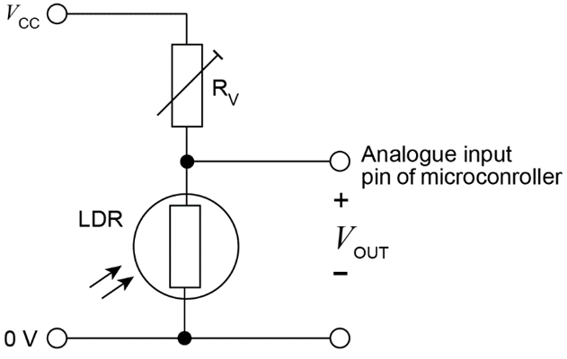
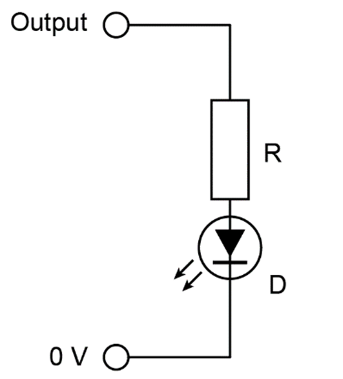
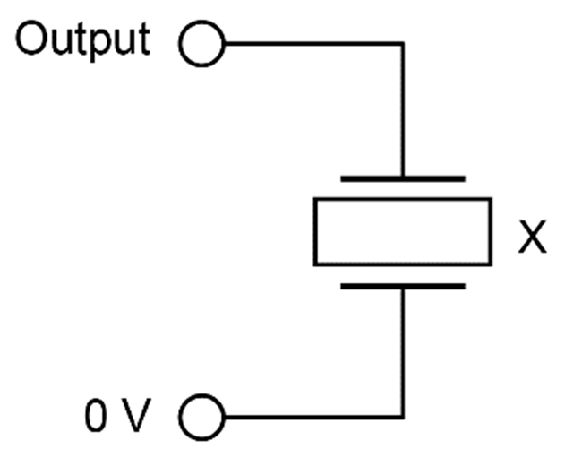
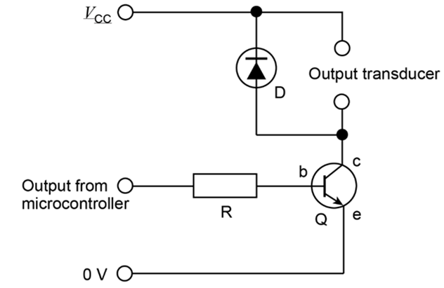

# interfacing circuits

***

## overview
- an interfacing circuit in the context of microcontrollers refers to the hardware components and connections that facilitate communication between a microcontroller and other devices or systems
- these circuits are essential because microcontrollers often need to interact with external peripherals, sensors, actuators, or communication modules, which may operate at different voltage levels, current requirements, or signal types

## inputs
#### *digital*
- a digital input has two discrete states, which are commonly described as 0 or 1, low or high, and off or on
- essentially this means that the input pin detects 0 V (0 or low or off) or 5 V (1 or high or on)
- the reference to 5 V can vary depending on the microcontroller being used as there are low voltage versions and so it is more accurate to say that that the high state is the maximum operational voltage supplied to the microcontroller
- in practice, high = 80% or more of VCC and low = 20% or less of VCC

#### *analogue*
- an analogue input can produce a signal anywhere between the minimum and maximum operational voltage being supplied to the microcontroller
- this voltage is converted to a value on a scale using a feature on the microcontroller’s internal circuitry known as an analogue to digital converter (ADC)

## common input interfacing circuits
#### *normally low (pull down resistor)*
- this arrangement causes the input pin to detect a low input signal when a switch is open and a high input signal when the switch is closed
- 

#### *normally high (pull up resistor)*
- this arrangement causes the input pin to detect a high input signal when a switch is open and a low input signal when the switch is closed
- 

#### *potentiometer*
- note that variable resistors are sometimes referred to as potentiometers and trimpots as well (these are different components to variable resistors, but can be configured to work in the same way as a variable resistor)
- the input signal will depend on the position that the spindle is adjusted to
- 

#### *variable resistor and LDR*
- a light detecting sensor can easily be made from a variable resistor and a light dependent resistor
- the intensity of light is inversely proportional to the resistance of the LDR (increase in light results in decrease of resistance)
- if there is lots of light, the input would read low
- if there is not much light, the input would read high
- 

#### *variable resistor and thermistor:*
- a temperature sensing circuit can be made from a variable resistor and a thermistor
- the temperature is inversely proportional to the resistance of the thermistor
- if it is a hot environment, the input would read low
- if it is a cold environment, the input would read high

## outputs
#### *digital*
- the digital output pins of a microcontroller generally cannot source large currents. the maximum current that the output pins can sustain is **approximately 20 mA**
- this is only really sufficient for outputs like LEDs and buzzers
- for outputs that require high currents it is normal practice to use the microcontroller’s digital outputs as a signal to trigger some form of driver circuit

#### *analogue*
- note that on microcontrollers there are only digital outputs. This is because a microcontroller cannot actually produce an analogue output
- however, they can mimic an analogue output using a control technique called PWM (pulse width modulation)
- this involves the microcontroller switching the output voltage on and off at a very high frequency to produce a value somewhere between the on and off voltage

## common output interfacing circuits
#### *LED*
- when the output is low the LED will turn off
- when the output is high the LED will turn on
- *note:* A 330 Ω resistor is included to limit the voltage through the LED in order to protect it
- 

#### *buzzer*
- when the output is low the buzzer makes no sound
- when the output is high the buzzer makes a sound
- 

#### *transistor*
- a transistor is a component that can be used as a switch and/ or an amplifier
- if the output is set to low, then no current will flow through the circuit
- if the output is set to high, then a collector current that is much larger than the base current will be able to flow through the circuit
- *note:* an inductor (also called a coil, choke, or reactor) is an electrical component that stores energy in a magnetic field when a current flows through it. it typically consists of an insulated wire that is wound into a coil. examples of inductors are electromagnets, motors, solenoids, and relays
- *note:* the diode has been included to protect components from back EMF that would result when inductors are used. In simple terms, back EMF is when the energy stored in an inductor is released backwards through the circuit when it is turned off
- 

