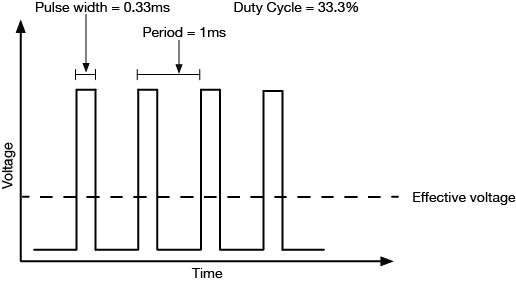

# microcontrollers

***

## what is a microcontroller?
- a microcontroller is a type of integrated circuit and semiconductor device. it is comprised of thousands or millions of tiny resistors, capacitors, diodes, and transistors.
- microcontrollers are utilized to control a wide array of automated devices. these include household appliances, security systems, cars, medical equipment, and communication devices, among others.
- *diagram:*
  - 

## parts of a microcontroller
- **central processing unit (CPU):** the hardware within the microcontroller that carries out the instructions that have been written in a control programme. incorporated in the CPU is the arithmetic logic unit (ALU) which performs mathematical and logic operations and the control unit (CU), which extracts instructions from memory which it decodes and executes
- **arithmetic logic unit (ALU):** as mentioned above, this performs mathematical and logic operations
- **read only memory (ROM):** memory that can only be read from and is programmed only once
- **random access memory (RAM):** memory that can be accessed as required. data is not held when power to the microcontroller is turned off
- **electronically erasable programmable read only memory (EEPROM):** this type of memory can be programmed with data and read back. it is stored even if power is turned off. EEPROM makes up most of the memory used by a microcontroller
- **I/O**: a general connection point for input (like sensors) and output (like LEDs). it can handle multiple signals simultaneously (parallel), such as turning on several LEDs or reading multiple switches. I/O ports can be either digital (on/off) or analogue (variable values)
- **serial:** specifically designed for communication between devices. it transmits data one bit at a time (serial), similar to sending a message letter by letter. serial ports include protocols like UART, SPI, and I2C
- **analogue to digital converter (ADC):** analogue sensors provide a signal in the form of varying voltages, usually in the range 0 – 5 V. the ADC converts this input voltage into digital data
- **clock:** a resonator, sometimes incorporated in the microcontroller and sometimes fitted as an external component, is used to determine the speed at which information is processed. typically, this is at a frequency of 4 MHz or more
- **bus:** information is carried between the various blocks of the microcontroller along 'groups' of wires called buses. the data bus carries the 8-bit data between the ALU and RAM / I/O registers, and the program bus carries the 13-bit program instructions from the ROM. the size of the data bus provides a description for the microcontroller. therefore an '8-bit microcontroller' has a data bus '8-bits' wide. microcontrollers with 16-bit and 32-bit data buses are also available

## digital vs analogue
#### *digital*
- digital data refers to information which is binary in nature.
  - for example, a light bulb with a switch will provide information as either off or on; there are only two possible states
- digital signals have only two defined values; 0 or 1, low or high, 0V or 5V

#### *analogue*
- analogue data refers to information which is continuous in nature
  - for example, a clock which has hour, minute, and second hands will provide information in a continuous form; the movement of the hands are continuous
- analogue signals have infinitely many levels of intensity
  - when the wave moves from value A to value B, it passes through an infinite number of values along its path

## inputs and outputs (I/O)
- microcontrollers are digital devices. this means that they can only understand and produce digital data, and that they can only input/output digital signals

#### *inputs*
- whilst microcontrollers cannot technically read analogue inputs, they have a component called an analogue to digital converter (ADC) that allows them to do so
- this component converts analogue signals into digital signals, so that the microcontroller can understand analogue inputs

#### *outputs*
- although microcontrollers cannot technically produce analogue outputs, they can use a technique called pulse width modulation (PWM) that allows them to mimic them
- this technique produces analogue signals from digital signals, so the microcontroller can effectively produce analogue outputs

## electrical noise and floating
- one of the most basic faults in programming is ‘floating’
  - this can affect the value read by pins of microcontrollers
- 
- when the switch is closed it connects the VCC to the input pin, so the microcontroller would register the input as a high (5 V)
- when the switch is opened, you would assume the microcontroller would register the input as a low (0 V). however, this is not the case because the input is not connected to GND. rather, we say that it is ‘floating’
- without being connected directly to VCC or GND, the input pin is susceptible to electrical noise that makes it randomly fluctuate between high and low values. such sources include thermal noise and electromagnetic interference since the pins acts like tiny antennas when they are ‘floating’

#### *solution*
- there are some adjustments that could be made to the code, but we can also alter the circuit physically to solve the issue
- by connecting the input pin to ground with a resistor, then it will be able to register a low rather than floating while the switch is open
- 

## advantages and disadvantages of microcontrollers
| advantages | disadvantages |
| - | - |
| • requires less physical space than complex electronic circuits   • more reliable and easier to troubleshoot due to having fewer parts   • simplifies assembly of the product as there are less parts to put together   • can be adapted for new parameters without having to change the hardware | • cannot drive high power devices without a separate external power supply   • operation of control sequences can be affected by electrical noise |

## analogue-to-digital conversion
- microcontrollers have to convert analogue inputs to digital inputs in order to read them
- analogue inputs provide a signal in the form of varying voltages, usually in the range of 0-5 V
  - the ADC normally converts this voltage into 8-bit data
- 8-bit microcontrollers will provide 255 steps between the minimum and maximum voltage detected at the analogue input
- the number of steps between the minimum and maximum voltage can be calculated using the following formula:
  - 
- therefore a 10-bit scale would have 1023 LSB, a 12-bit scale would have 4095 steps, and a 14-bit scale would have 16,383 steps…
- the more bits there are in a scale, the more precise the reading will be

## pulse width modulation
- a pulse width modulation (PWM) signal is a method of generating an analogue output using a digital output
- a PWM signal consists of two main components that define its behaviour, a duty cycle and a frequency
- the duty cycle describes the amount of time the signal is in a high state as a percentage of the total time of it takes to complete one cycle
- the frequency determines how fast a cycle is completed (i.e. 1000 Hz would be 1000 cycles per second), and therefore how fast it switches between high and low states
- by cycling a digital signal off and on at a fast enough rate, and with a certain duty cycle, the output will appear to behave like a constant voltage when providing power to devices
  - *e.g.,* to create a 3 V signal given a digital source that can be either high at 5 V or low at 0 V, you can use PWM with a duty cycle of 60%. if the digital signal is cycled fast enough, then the voltage seen at the output appears to be the average voltage. the average voltage can be calculated by taking the digital high voltage multiplied by the duty cycle: 5 V x 0.6 = 3 V

#### *advantages*
- there is almost no power loss.
- it can be adjusted digitally which allows us to easily and quickly achieve the required voltage.
- helps motors generate maximum torque even when they run at lower speeds.
- prevents overheating of LED while maintaining its brightness.

#### *disadvantages*
- if the frequency is too low then the LED would flicker/ the motor would stall.
- it is more complex than using batteries or resistors to increase or decrease the voltage.

#### *graph and terminology*
- the graph shows how PWM is applied.
- 
- the 'on' time is called the mark and the 'off' time is called the space.
- *for example:*
  - think of an electric motor. when the voltage is applied to the motor it accelerates to top speed. however, before the top speed is reached the motor is switched off and it slows down. if we increase the frequency that we turn it on and off, then the acceleration/deceleration becomes negligible and the motor rotates constantly at a chosen speed.

#### *duty cycle*
- the term duty cycle describes the proportion of on time. the amount of time required for one full cycle (on and off) is called the period.
- duty cycle is expressed as a percentage of on time. a 60% duty cycle is a signal that is on for 60% of the time and off for the other 40% of the time.
- 
- to calculate frequency, the formula is $$f=1/T$$

