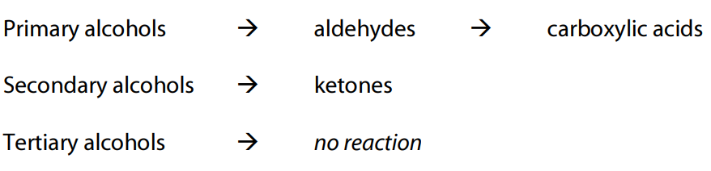

# organic

**hydrocarbons:**

* _alkanes:_
  * contain only single C-C bonds (saturated)
  * always demonstrate the formula C~~n~~H~~2n+2~~
  * _substitution reactions:_
    * slow
    * require UV light for halogens
* _alkenes:_
  * contain at least one double C=C bond (unsaturated)
  * demonstrate the formula C~~n~~H~~2n~~
  * _addition reactions:_
    * substances such as halogens, hydrogen, hydrogen halides will readily add across the double bond
    * fast
    * once the reaction has completed, substitution can occur if exposed to UV light
* _aromatic compounds:_
  * aromatic compounds are composed of a benzene ring with atoms/groups bonded to it

**functional groups:**

* _alcohols (-OH):_
  * _types of alcohols:_
    * primary alcohols have 1 carbon atom attached to the carbon atom that the -OH group is bonded to
    * secondary alcohols have 2, and tertiary alcohols have 3
  * _physical properties:_
    * boiling point is higher than that of the parent alcohol
    * solubility in water decreases with increasing chain length
      * this is due to an increased number of electrons, causing an increase in the strength of dispersion forces
  * alcohols also combust in excess air to form CO~~2~~ and H~~2~~O
* _carboxylic acid (-COOH):_
  * _physical properties:_
    * boiling points are higher than similar alcohols as the carbonyl group acts as another location for hydrogen bonding
    * soluble in water
    * weak acids, with strength decreasing as the chain length increases
* _esters (-COO-):_
  * esters are formed from the esterification reaction of a carboxylic acid with an alcohol in the presence of a concentrated acid catalyst (_e.g._ concentrated H~~2~~SO~~4~~)
    *  ethanoic acid ethanol ethanoate (ethyl)
  * _hydrolysis of esters:_
    * hydrolysis is a means of conversion of the ester to the original alcohol and either the carboxylic acid or the salt of the acid
    * either H~~3~~O^+^ or OH^-^ acts as a catalyst
      * _warming with acid (H_~~_**3**_~~_O_\*^+^\*\*):\*
        * R-COO-R' → RCOOH + R'OH
        * H~~3~~COCOH + H~~2~~O → HCOOH + CH~~3~~OH
      * _warming with base (OH_\*^-^\*\*) :\*
        * R-COO-R' → RCOO^-^ + R'OH
  * _physical properties:_
    * fruity odour
* _amines (-NH_~~_**2**_~~_):_
  * _physical properties:_
    * boiling point is relatively low as the hydrogen bonding between amines is weaker because the difference in electronegativity between N and H is less than that between O and H
    * soluble in water through hydrogen bonding
    * pungent odour like ammonia
    * weak bases and form basic solutions when hydrolysed
* _amides (=O, -NH_~~_**2**_~~_):_
  * formed similarly to esters with an amine reacting with a carboxylic acid
    * 
    * primary amides are prepared by reaction of (NH~~4~~)~~2~~CO~~3~~ with a corresponding carboxylic acid:
      * _e.g._ 2CH~~3~~COOH\~ (aq)\~ + (NH~~4~~)~~2~~CO~~3 (aq)~~ → 2CH~~3~~COONH~~4 (aq)~~ + CO~~2 (g)~~ + H~~2~~O\~ (l)\~
  * _types of amides:_
    *  primary secondary tertiary
  * _hydrolysis of amides:_
    * R-CO-NH~~2~~ + H~~2~~O + H^+ ^⟶ R-COOH + NH~~4~~^+^
    * R-CO-NH~~2~~ + NaOH ⟶ R-COONa + NH~~3~~
  * _physical properties:_
    * boiling points are higher than similar amines as there are two locations for hydrogen bonding
* _aldehydes (=O at terminal):_
  * _physical properties:_
    * boiling point is lower than that of the parent alcohol
    * solubility in water is decreases with increasing chain length
* _ketones (=O mid-chain):_
  * _physical properties:_
    * not able to be easily oxidised
* _α-amino acids (-COOH, -NH_~~_**2**_~~_)_
  * the α indicates that both the amine and carboxyl groups are attached to the same terminal carbon atom
  * behave as amphoteric molecules as they can form zwitterions (molecules with both + and - ions)
    * in basic conditions the carboxylic acid group can donate an H^+^ ion
    * in acidic conditions the amine functional group accepts an H^+^ ion
  * _physical properties:_
    * at room temperature, amino acids are all solids with relatively high melting/boiling points
    * soluble in water
    * typically exist in their ionic forms in the solid and aqueous state

**redox of organic molecules:**

* there are two oxidants that are typically used. these are either:
  * acidified dichromate (Cr~~2~~O~~7~~^2-^/H^+^)
    * orange
    * reduced to Cr^3+^ (green)
  * acidified permanganate (MnO~~4~~^-^/H^+^)
    * purple
    * reduced to Mn^2+^ (pale pink, virtually colourless)
*  **polymers:**
* polymers are large molecules formed by the reaction of small molecules called monomers **proteins:**
* proteins are macromolecules consisting of amino acid monomers joined together by peptide linkages
  * 
* sequences of less than 50 amino acids are typically called peptides
* _protein structure:_
  * _primary structure:_
    * the primary structure of a protein is given by the amino acids sequence of the protein
  * _secondary structure:_
    * within the long protein chains there are regions in which the chains are organised into regular structures
    * _alpha helix:_
      * 
    * _beta pleated sheets:_
      * 
  * _tertiary structure:_
    * the tertiary structure of a protein is a description of the way the whole chain (including the secondary structures) folds itself into its final 3-dimensional shape
    * this shape determines the function of the protein
    * _forces involved:_
      * ionic interactions
      * H-bonds in side chains
      * dispersion forces
      * disulfide bridges
  * _quaternary structure:_
    * the quaternary structure is the arrangement of proteins with more than one amino acid chain and how these fold and arrange themselves in 3D
  * 

**soaps and detergents:**

* _fats and oils:_
  * soaps are derived from natural fats and oils (esters referred to as triglycerides) and are formed from the same alcohol precursor (glycerol / triol)
    * 
  * glycerol requires a carboxylic acid (normally referred to as a fatty acid) to form a triester fat
    * they have long unbranched chains, between C~~10~~ and C~~20~~ and contain no other functional groups
    * 
  * _properties:_
    * the long hydrocarbon chains of the fat (triglyceride) is non-polar meaning dispersion forces over most molecules are predominant
    * animal fats are usually saturated (_i.e._ single C-C bond) whereas plant oils are often unsaturated (_i.e._ containing at least one C=C bond)
* _hydrolysis of triglycerides:_
  * triglycerides may be hydrolysed using a strong base such as NaOH or KOH to produce glycerol and the salt of the long chain fatty acid in a process known as saponification
  * the salt of the fatty acid precipitates and is removed by filtration
  * 
* _soaps:_
  * soap is used as a cleaning agent due to its emulsifying properties
    * an emulsifying agent (_i.e._ a surfactant) helps two immiscible substances to remain mixed
  * water with soap is slightly basic
  * _structure:_
    * soap is the salt of a long chain fatty acid
    * 
    * 
    * the polar head of the molecule hydrogen bonds to water molecules around it while the non-polar tail dissolves in the oil forming a micelle
* _detergents:_
  * when soap is mixed with water containing Ca^2+^ or Mg^2+^ ions, an insoluble 'scum' is produced (calcium or magnesium stearate)
    * this deposits on clothes and is difficult to remove, so detergents were developed which don't produce scum
  * by replacing the carboxylate, COO^-^, with a sulfonate group, SO~~3~~^-^, an effective surfactant that does not produce scum is made
    * this is achieved as shown below:
    * 

**biodiesel:**

* _transesterification:_
  * a triester (vegetable oil) has its three fatty acids removed
  * the fatty acids react with a small alcohol molecule to produce three esters
  * 
  * where R^1^ represents the hydrocarbon chains for the fatty acid and R^2^ is an alkyl group (typically methyl or ethyl)
  * the low purity glycerol formed is immiscible with the biodiesel so it forms a separate layer
    * if good separation is not achieved then this can lead to poor fuel quality and engine damage

***
