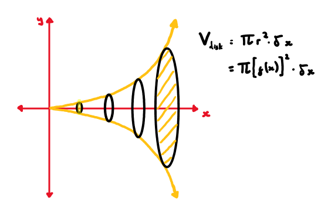
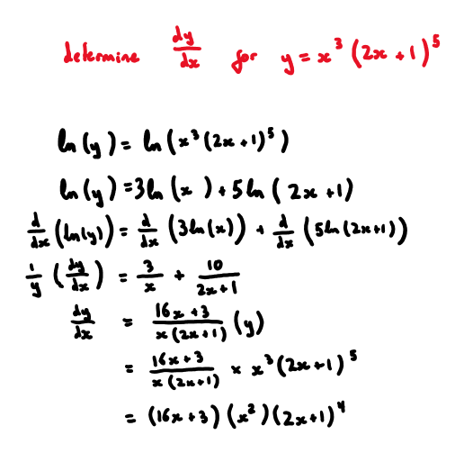
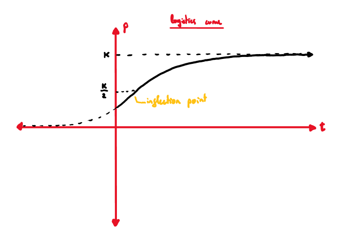
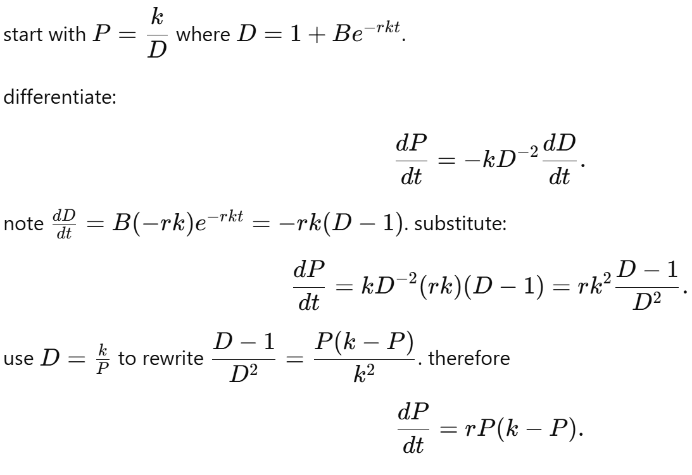

# calculus

***

## **integration:**

#### _u substitution:_

* $$\int f^n(x) \, dx \;\;\longrightarrow\;\; u = f(x), \quad du = a \, dx$$
* $$\int a \cos^p(bx) \, \sin^q(bx) \, dx \;\;\longrightarrow\;\;u = \cos(bx), \quad du = -b \sin(bx) \, dx$$

#### _trig substitution:_

* 

#### _partial fractions:_

* given a function $\frac{f\left(x\right)}{g\left(x\right)}$ where the degree of $f$ is greater than the degree of $q$:
  * for distinct linear factors $g\left(x\right)=\left(x-a\right)\left(x-b\right)\dots $
    * $$\begin{aligned}\frac{f(x)}{g(x)} &= \frac{A}{x-a} + \frac{B}{x-b} + \dots \\f(x) &= A(x-b) + B(x-a) + \dots\end{aligned}$$
  * for repeated linear factors $g\left(x\right)={\left(x-a\right)}^{n}$
    * $$\begin{aligned}\frac{f(x)}{g(x)} &= \frac{A}{x-a} + \frac{B}{(x-a)^2} + \dots + \frac{N}{(x-a)^n} \\f(x) &= A(x-a)^{n-1} + B(x-a)^{n-2} + \dots + Y(x-a) + Z\end{aligned}$$

#### _volumes of revolution:_

* $$\begin{aligned}V &= \pi \int_a^b f^2(x) \, dx \quad \mathrm{or} \quad \pi \int_c^d f^2(y) \, dy \end{aligned}$$
* 

## **differentiation:**

#### _implicit differentiation:_

* $$\frac{d}{dx} \big(x^p + y^q \big) = p x^{p-1} + \frac{dy}{dx} \, q y^{q-1}$$

#### _logarithmic differentiation:_

* 

#### _differential equations:_

* just integrate with separation of variables

#### _related rates:_

* just write down all parameters at start of question and remember $\frac{dy}{dx}=\frac{dy}{dz}\times \frac{dz}{dx}$

#### logistic curves:

* $$\begin{aligned}\frac{dP}{dt} &= r P (k - P) \\P &= \frac{k}{1 + \left( \frac{k}{P_0} - 1 \right) e^{-r k t}}\end{aligned}$$
* 
* to go from $\frac{dP}{dt}$ to $P$, separate and use partial fractions
* to go from $P$ to $\frac{dP}{dt}$, use a u- substitution for the denominator and implicitly differentiate
  * 

## **motion:**

#### _rectilinear motion:_

* $$a = \frac{dv}{dt} = v \frac{dv}{dx} = \frac{d}{dx}\left(\frac{v^2}{2}\right)$$

#### _simple harmonic motion:_

* $$\frac{d^2 x}{dt^2} = -k^2 x$$
  * $$x = A \sin(kt + \phi) \quad \text{or} \quad x = A \cos(kt + \phi)$$
* $$v^2 = k^2 (A^2 - x^2)$$

## **vector calculus:**

* just normal calculus with vectors
* not that deep
