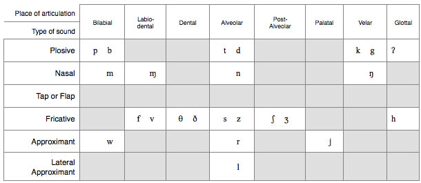

# close reading

***

## **dominant-only format**

#### _introduction_

* Read literally, this _\[placement]_ excerpt from _\[author]_'s _\[year]_ _\[genre]_ \[text type] _\[name]_ details _\[literal reading]_.
* However, upon reading for a deeper meaning, the text reveals itself as an exploration of _\[dominant reading]_
* This reading is chiefly articulated through _\[author]_'s manipulation of _\[techniques]_.

#### _paragraphs_

* The \[type of technique] of _\[techniques]_ are integral in the development of the idea that _\[aspect of dominant reading]_.
* Underpinned by _\[author]_'s application of _\[techniques]_, the text effectively forwards the idea that _\[aspect of dominant reading]_.
* The concept of _\[aspect of dominant reading]_ is developed in _\[name]_ through the integration of _\[techniques]_

#### _conclusion_

* A thorough close reading of this excerpt from _\[author]_'s _\[year]_ _\[genre]_ text _\[name]_ highlights how the author illustrates _\[dominant reading]_ through its use of _\[techniques]_.
* _\[waffle]_

## **with alternate reading**

#### _introduction_

* Read literally, this _\[placement]_ excerpt from _\[author]_'s _\[year]_ _\[genre]_ text _\[name]_ details _\[literal reading]_.
* However, upon reading for a deeper meaning, the text reveals an exploration of _\[dominant reading]_
* This reading is chiefly developed through _\[author]_'s manipulation of _\[techniques]_.
* Furthermore, by adopting a _\[reading theory]_ perspective, an alternate reading of the text as _\[alternate reading]_ emerges, substantiated by the use of _\[techniques]_.

#### _paragraphs_

* The _\[type of technique]_ of _\[techniques]_ are integral in the development of the idea that _\[aspect of dominant reading]_.
* Underpinned by _\[author]_'s application of _\[techniques]_, the text effectively forwards the idea that _\[aspect of dominant reading]_.
* Shifting focus from the dominant reading, the text constructs a nuanced _\[reading theory]_ interpretation by employing _\[techniques]_. This alternate reading highlights _\[alternate reading]_, expanding the analytical scope of the text.

#### _conclusion_

* A thorough close reading of this _\[placement]_ excerpt from _\[author]_'s _\[year]_ _\[genre]_ text _\[name]_ highlights how the author illustrates _\[dominant reading]_ through their manipulation of _\[techniques]_.
* _\[waffle]_
* Additionally, the alternate reading provided by applying a _\[reading theory]_ lens offers a deeper interpretation of the text in _\[alternate reading]_.
* _\[waffle more]_

## **reading theories**

#### _ideological frameworks_

* **modernist:** a literary and cultural paradigm privileging formal experimentation, epistemic certainty, and the autonomous subject; it asserts the possibility of objective knowledge and truth within a coherent framework.
* **existentialist:** a philosophical and literary approach asserting that human existence precedes essence, foregrounding individual freedom, ethical responsibility, and the creation of meaning in an inherently meaningless world.
* **post-modernist:** a critical and theoretical stance that rejects universal narratives and absolute truths, emphasising textual instability, intertextuality, and the contingency of meaning.
* **marxist:** an analytical framework interpreting texts and social phenomena in terms of material conditions, class relations, modes of production, and the dynamics of economic and ideological power.
* **structuralist:** a methodology that investigates the deep, often unconscious, relational systems—such as language, myth, or social codes—that structure human experience and determine meaning.
* **deconstructivist:** a critical practice aimed at revealing inherent instabilities, contradictions, and hierarchical oppositions in texts, demonstrating that meaning is contingent, deferred, and non-fixed.

#### _psychoanalytic approaches_

* **sigmund freud**
  * ego, superego, and id as psychic structures
  * defence mechanisms:
    * idealisation
    * reaction formation
    * denial
    * repetition compulsion
* **jaques lacan**
  * desire structured around lack
  * projection of desires
  * concept of object petit a
* **carl jung**
  * collective unconscious
  * archetypes
* **alfred adler**
  * inferiority complex
  * striving for superiority

## **sound devices**

