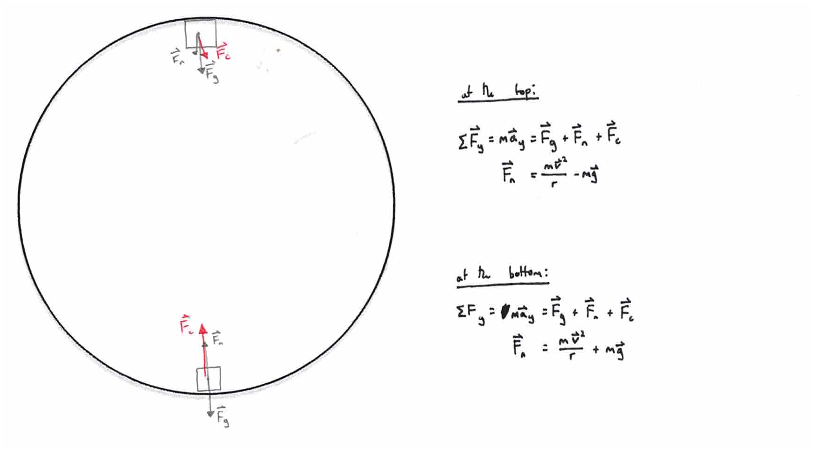

# **uniform circular motion**
- uniform circular motion occurs when a body travels at a constant speed and is constantly accelerating towards the centre curvature
- direction is constantly changing and hence velocity is always changing despite no change in speed
  - $$\left| \overrightharpoon{v}\right|=2\pi rf$$
- the direction of velocity is always tangential to the path of motion, while the direction of acceleration is always perpendicular to the velocity of the body
### ***centripetal force***
  - centripetal force is the net force directed towards the centre of curvature that keeps an object moving in uniform circular motion
  - as it is a description of the direction the net force is acting in and thus should not be drawn on free-body diagrams
  - $$
\begin{aligned}\overrightharpoon{F}_c &= m \overrightharpoon{a}_c = \frac{m \left| \overrightharpoon{v} \right|^2}{r} \, \hat{r} \\[1ex]\left| \overrightharpoon{F}_c \right| &= \frac{m v^2}{r} \\[1ex]&= \frac{m \left( 2\pi r f \right)^2}{r} \\[1ex]&= 4 \pi^2 m r f^2\end{aligned}$$
### ***centrifugal force***
  - centrifugal force is the sensation that a body feels while moving in a circular path due to being in a non-inertial reference frame
  - it is not to be confused with centripetal force or any other force for that matter as it is only a descriptive tool for the physical sensation of centripetal acceleration
- ***constant speed vs constant period***
  - 

# **banked curves**
- for a body travelling at a certain speed, it is possible to bank a curve such that no frictional force between the body and the incline to maintain a stable circular path
  - this can be achieved through allowing the horizontal component of the normal force to provide the centripetal force
- for a curve with optimal velocity of $${v}_{opt}$$:
  - if $${v}_{body}>{v}_{opt}$$, the required $$\left| \overrightharpoon{F}_c \right|$$ is increased assuming $$m$$ and $$g$$ are constant
    - to maintain the ratio of $${v}^{2}:r$$, the radius of the path of the body must increase
    - this means there must be friction acting between the body and the slope to keep it from sliding up the incline
  - if $${v}_{body}<{v}_{opt}$$, the required $$\left| \overrightharpoon{F}_c \right|$$ is decreased assuming $$m$$ and $$g$$ are constant
    - to maintain the ratio of $${v}^{2}:r$$, the radius of the path of the body must decrease
    - this means there must be friction acting between the body and the slope to keep it from sliding down the incline
### ***derivation of $$\bm{v_{opt}}$$***

  $$
  \begin{aligned}
  \sum F_y &= m a_y = F_g - F_{n y} \\[1ex]
  F_{n y} &= m g \\[2ex]
  \sum F_x &= m a_c = F_{n x} = F_c \\[2ex]
  \frac{m g}{\cos \theta} &= \frac{m v^2}{r \sin \theta} \\[1ex]
  v^2 &= r g \tan \theta \\[1ex]
  \therefore v_\mathrm{opt} &= \sqrt{ r g \tan \theta }
  \end{aligned}
  $$

### ***example question***
  

# **vertical centripetal motion**
### ***upwards circular path***
  

### ***downwards circular path***
  

### ***loop-the-loop***
  
