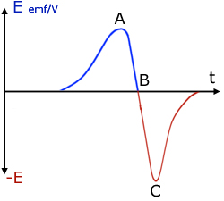
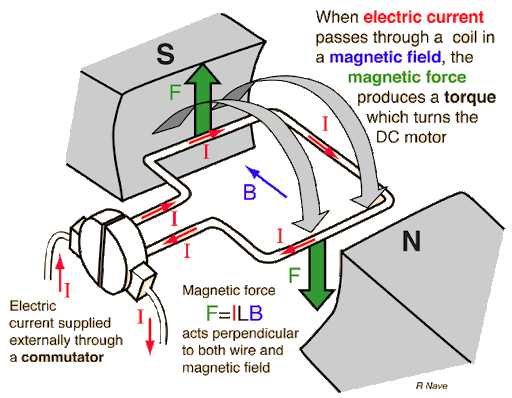

-----
**electrostatics:**
- ***charge:***
  - charge is a fundamental property of subatomic particles that governs how they are affected by an external electric or magnetic field.
  - units of $$C$$
- ***electrostatic force:***
  - coulomb's law states that the magnitude of an electric force between two point charges is directly proportional to the product of the charges and inversely proportional to the square of the distance between them
    - $$\begin{aligned}\overrightharpoon{F}_E = \frac{1}{4\pi\varepsilon_0} \frac{q_1 q_2}{r^2}\end{aligned}$$
  - in a tri-charge system, calculate the forces exerted from other charges and use the pythagorean theorem or…
    - $$\begin{aligned}\overrightharpoon{F}_{E \to q_0} = \frac{q_0}{4\pi\varepsilon_0} \sum_{i=1}^{N} \frac{ \overrightharpoon{r} - \overrightharpoon{r}_i }{ \left| \overrightharpoon{r} - \overrightharpoon{r}_i \right|^3 }q_i \end{aligned}$$
- ***electric fields:***
  - an electric field is a region of influence that surrounds a charged particle
  - the assigned direction of an electric field at a given point is the direction in which a positive test charge would move under the influence of the field
  - uniform electric fields produce the parabolic motion of a charge as they provide constant acceleration in the same direction
  - *electric field strength:*
    - the electric field strength ($$\overrightharpoon{E}$$) is defined as the force per unit positive charge at a specific point in space
    - $$\begin{aligned}\overrightharpoon{E} &= \frac{\overrightharpoon{V}}{\overrightharpoon{s}} \\ &= \frac{\overrightharpoon{F}_E}{q} \end{aligned}$$
      - units of $$N{C}^{-1}$$ or $$V{m}^{-1}$$
  - *work:*
    - $$\begin{aligned}
    W &= \Delta E \\
    &= q \Delta V
    \end{aligned}$$
    - the field will do work on the charged particle when:
      - a positive charge moves with the field
      - a negative charge moves against the field
    - work must be done on the system when:
      - a positive charge moves against the field
      - a negative charge moves with the field
  - *field lines:*
    - lines can never cross
    - must enter and exit a charged body perpendicular to its surface
    - arrows are oriented towards negative and away from positive charges
    - uniform electric fields produce parallel and evenly spaced lines

**magnetism:**
- ***domain theory of magnetism:***
  - a domain is a small region of spontaneous magnetism that exists even when no external magnetic field is present due to the alignment of magnetic moments of a group of atoms
  - to magnetise a material, these domains must change so that they coalesce to form a singular domain
  - *ferromagnetic materials:*
    - strongly attracted to external magnetic fields, producing large magnetisation
    - examples include $$Fe$$, $$Ni$$, and $$Co$$
  - *paramagnetic materials:*
    - weakly attracted to external magnetic fields due to temporary alignment of magnetic moments with an external field
    - examples include $$Al$$, $${O}_{2}$$, and $$Na$$
  - *diamagnetic materials:*
    - weakly repelled by external magnetic fields as induced magnetic moments oppose the applied field
    - examples include $$Cu$$, $$Pb$$, and $${H}_{2}O$$
  - *demagnetising conditions:*
    - physically striking a magnet disrupts its domain alignment
    - applying an opposing external magnetic field can reverse magnetisation
    - heating above the curie temperature $${T}_{c}$$ allows thermal agitation to randomise domain alignments
  - *hysteresis loops:*
    - the area bound by a hysteresis loop of represents the amount of energy required to take it through a complete magnetisation and demagnetisation cycle
    - materials with narrow loops (*e.g.* soft iron) require very little energy to lose domain alignment, making them ideal for minimising energy loss in AC applications like transformer cores
    - materials with wide loops (*e.g.* hard iron) retain domain alignment, making them ideal for permanent magnets
- ***magnetic force:***
  - on a moving charged particle:
    - $$\begin{aligned}
    \overrightharpoon{F}_B &= q \left( \overrightharpoon{v} \times \overrightharpoon{B} \right) \\
    \left| \overrightharpoon{F}_B \right|&= q \left| v \right| \left| B \right| \sin\theta
    \end{aligned}$$
  - on a current-carrying conductor:
    - $$\begin{aligned}
    \overrightharpoon{F}_B &= I \left( \overrightharpoon{L} \times \overrightharpoon{B} \right) \\
    \left| \overrightharpoon{F}_B \right| &= I \left| \overrightharpoon{L}\right| \left| \overrightharpoon{B} \right| \sin\theta
    \end{aligned}$$
- ***magnetic fields:***
  - a magnetic field is a region of influence that surrounds a magnetic material
  - magnets are always dipolar unlike electric charges which can exist as isolated monopoles
  - uniform magnetic fields produce the circular motion of a charge as they act perpendicular to the particle's velocity, providing a constant centripetal acceleration without changing the particle's speed
  - *field lines:*
    - lines can never cross
    - arrows are oriented towards south and away from north
  - *earth's magnetic field:*
    - the earth's magnetic field is caused by convection currents within the core generating electric current through the friction between the molten layers of rocks
    - magnetic declination is the angular difference between the magnetic and geographic poles, while magnetic inclination is the angle that the earth's magnetic field makes with the ground
- ***magnetic flux:***
  - magnetic flux is a measurement of the total magnetic field that passes through a given area
    - effectively a measurement of the concentration of the magnetic field
  - $$\begin{aligned}
  \Phi &= \overrightharpoon{B} \cdot \overrightharpoon{A}_\perp \\
  &= \left| \overrightharpoon{B} \right| \, \left| \overrightharpoon{A} \right| \cos\theta
  \end{aligned}$$
    - where $$\mathit{\theta}$$ is the angle between the normal vector of the area and the direction of the magnetic field
    - units of $$Wb$$ or $$T{m}^{2}$$ or $$Vs$$

**principles of electromagnetism:**
- ***electromotive force (EMF):***
  - electromotive force is a difference in potential that gives rise to an electric current
    - units of $$V$$ or $$J{C}^{-1}$$ or $$kg\ {m}^{2}\ {s}^{-3}\ {A}^{-1}$$
- ***electromagnetic induction:***
  - electromagnetic induction is the production of an electromotive force and thus current across an electrical conductor due to its interaction with an external magnetic field
  - *faraday's law:*
    - "the induced EMF in a conductor is proportional to the rate of change of magnetic flux with respect to time"
    - $$\begin{aligned}
    \varepsilon &= -\frac{d\Phi}{dt} \\
    &\approx -\frac{\Delta\Phi}{\Delta t}
    \end{aligned}$$
  - *lenz's law:*
    - "the direction of the induced EMF and thus the associated current will be such as to oppose the change in magnetic flux that induced it" or "if the magnetic flux increases, the induced EMF and current will be in such a direction to decrease the net magnetic flux"
    - required by the conservation of energy as otherwise magnets and solenoids would form positive feedback loops and accelerate without work being done on the system
  - *general explanation for coil entering a magnetic field:*
    - as the coil enters the magnetic field, the area bounded by the coil experiences a change in magnetic flux directed \_\_\_\_\_
    - faraday's law states that the induced EMF is proportional to the rate of change of magnetic flux with respect to time
    - lenz's law states that the direction of the induced EMF and thus associated current will be such as to oppose the change in magnetic flux that induced it, hence \_\_\_\_\_
    - as per Ampere's right-hand grip rule, the induced current that flows in the coil travels \_\_\_\_\_
    - the induced magnetic field interacts with the external magnetic field to create a \_\_\_\_\_ force
  - *graphing changes in EMF:*
    - for a magnet dropped through a coil (accelerating):
      - 
  - *motional induced EMF:*
    - when a metal conductor moves in an external magnetic field, forces will be exerted on the charged particles within it
    - the forces on the different charges will be in different directions, creating a separation of charges across its direction of movement and thus an induced EMF
    - realistically, only the delocalised electrons within the metal will move as the positively charged atomic nuclei are locked into a lattice
    - $$\begin{aligned}
    \varepsilon &= \left( \overrightharpoon{v} \times \overrightharpoon{B} \right) \cdot \overrightharpoon{L} \\
    &= \left| \overrightharpoon{v} \right| \left| \overrightharpoon{B} \right| \left| \overrightharpoon{L} \right| \sin\theta
    \end{aligned}$$
- ***hand rules (thumb, $$\bm{1^{st}}$$, $$\bm{2^{nd}}$$):***
  - *fleming's left-hand rule ($$\overrightharpoon{F}$$, $$\overrightharpoon{B}$$, $$I$$):*
    - use when a current is flowing through a conductor in a magnetic field and you want to find the direction of the force on that conductor
    - also called the motor rule
  - *fleming's right-hand rule ($$\overrightharpoon{F}$$, $$\overrightharpoon{B}$$, $$I$$):*
    - use when a conductor is moving in a magnetic field and you want to find the direction of motional EMF / current in the conductor
    - also called the generator rule
  - *lorentz right-hand rule ($$\overrightharpoon{F}$$, $$\overrightharpoon{v}$$, $$\overrightharpoon{B}$$):*
    - use when a charged particle is moving in magnetic field to find the direction of the force on the particle
    - also called the motional EMF rule
  - *ampere's right-hand grip rule:*
    - use to find the direction of the magnetic field around a current-carrying conductor
    - fingers curl in the direction of the magnetic field $$\overrightharpoon{B}$$ and thumb points in the direction of the current $$I$$

**applications of electromagnetism:**
- ***DC motors:***
  - a motor is a device that converts electrical energy into mechanical energy
  - *components of a DC motor:*
    - rotor: the moving part of a motor that carries the windings through which current flows
    - stator: produces the external magnetic field that the magnetic field of the rotor interacts with
    - split-ring commutator: reverses the direction of current through the windings every half-cycle to ensure continuity in the direction of applied torque
    - brushes: supplies current to the rotating split-ring commutator from a stationary circuit
  - *functionality:*
    1. current flows through the rotor and generates a magnetic field by ampere's law
    2. the rotor field interacts with the approximately uniform stator field, producing equal and opposite forces to be exerted on the rotor and stator by newton's $$3^{\mathrm{rd}}$$ law
    3. the forces exerted on opposite sides of the rotor act at a distance from the rotation axis in opposing directions, producing a net torque that rotates the rotor in a single direction while the fixed stator experiences no motion
    4. the split-ring commutator reverses the current in the rotor every half rotation, maintaining the torque direction and enabling continuous rotation
  - 
  - *torque:*
    - $$\begin{aligned}
      \vec{\tau} &= r \overrightharpoon{F}_\perp \\
      &= r |\overrightharpoon{\overrightharpoon{F}}| \sin\theta \\
      \vec{\tau}_{\max} &= n\,2r\,|\overrightharpoon{F}| \sin\theta \\
      &= n\,2r\,I\,|\overrightharpoon{L}|\,|\overrightharpoon{B}| \sin\theta \\
      &= n\,A\,I\,|\overrightharpoon{B}| \sin\theta
      \end{aligned}$$
- ***generators:***
  - a generator is a device that converts mechanical energy into electrical energy
  - *components of an AC generator:*
    - rotor: the moving part of a generator that carries the windings in which current is generated
    - stator: produces the external magnetic field that the magnetic field of the rotor interacts with
    - slip rings: maintain a continuous electrical connection between the rotating rotor windings and the brushes
    - brushes: allow current to flow between the rotating slip rings and a stationary circuit
  - *functionality:*
    1. as the rotor turns inside of the external magnetic field, the magnetic flux changes as the area bounded by the coil perpendicular to the field lines changes
    2. this $$\mathrm{\Delta}\mathrm{\Phi}$$ induces an EMF by faraday's law, which states that the induced EMF in a conductor is proportional to the rate of change of magnetic flux with respect to time
    3. this EMF produces a corresponding current, which creates its own magnetic field and opposes the motion of the rotor by Lenz's law
    4. hence mechanical work must be done on the rotor to produce a current and thus electrical energy in the windings of the rotor
  - to produce DC, a split-ring commutator can be used which will ensure the polarity of the current is the same at all points in the cycle despite a changing magnitude
  - *maximum EMF:*
    - an AC generator produces an AC voltage, with the peak voltage given by the below formula
      - $$\begin{aligned}
\Phi
   &= n |\overrightharpoon{B}| |\overrightharpoon{A}| \cos(2\pi f t) \\[1.2ex]
\frac{d\Phi}{dt}
   &= 2\pi f n |\overrightharpoon{B}|  |\overrightharpoon{A}| \sin(2\pi f t) \quad \quad , \text{maximum will occur when} \sin(2\pi f t)=1\\[1.2ex]
\therefore \varepsilon_{\max}
   &= 2\pi |\overrightharpoon{B}| |\overrightharpoon{A}| n f \\
      &= 2 n \left| \overrightharpoon{v} \right| \left| \overrightharpoon{B} \right| \left| \overrightharpoon{L} \right|
\end{aligned}
$$
    - in order to apply standard circuit equations to the AC, the root mean square (RMS) voltage must be considered instead of the peak voltage
      - the RMS voltage represents the equivalent DC voltage that would deliver the same power to a resistive load
      
- ***self-induction:***
  - self-induction is the process by which a changing current in a conductor induces EMF in the same conductor
  - *consider the below circuit:*
    - 
    - when the switch is closed, current flows through the circuit due to the voltage supply
    - this $$\mathrm{\Delta}I$$ results in a $$\mathrm{\Delta}\mathrm{\Phi}$$ and thus an induced EMF by faraday's law
    - this EMF is known as back EMF and will oppose the change in current that caused it by lenz's law, reducing the net rate at which current is drawn
    - eventually, $$\frac{dI}{dt}$$ will return to zero and there will no longer be any more back EMF in the circuit
  - *back EMF in a motor:*
    - when a current is applied to the rotor of a motor it begins to rotate, thus causing the area bounded by the coil experiences a change in magnetic flux
    - by faraday's law, this causes a change in EMF proportional to $$\frac{d\mathrm{\Phi}}{dt}$$
    - lenz's law states that the induced EMF (and hence the induced current and associated magnetic field) will be in such a direction as to oppose the applied EMF that drives the motor
      - this is back EMF
    - the magnitude of the back EMF is proportional to the rotational speed of the motor
    - *stages:*
      - when the motor is first started, there is no rotational speed and thus no back EMF
      - as the motor starts to turn, the rotational speed and back EMF increase, causing the net EMF and current to decrease alongside torque
      - when the motor is under load, the rotational speed and back EMF decrease, resulting in an increase in the net EMF and current as well as torque (if the motor runs too slowly, the large current can cause overheating)
      - if the motor is jammed, the rotational speed and back EMF are zero leading to a large current and potentially overheating
      - when the motor is spinning freely, the rotational speed and back EMF are at their maximum, so net EMF and current are at a minimum (current is just sufficient to provide the torque to overcome friction and air resistance)
- ***eddy currents:***
  - faraday's law states that the induced EMF in a conductor is proportional to the rate of change of magnetic flux with respect to time
  - when a bulk piece of metal experiences a change in magnetic flux, an EMF and corresponding currents are induced due to electrons circulating throughout the metal
    - these currents are known as eddy currents
  - *magnetic damping for a moving sheet of metal:*
    - as the sheet enters the magnetic field, there is an increase in magnetic flux through its surface
    - by faraday's law, this $$\mathrm{\Delta}\mathrm{\Phi}$$ induces an EMF in the plate, causing eddy currents
    - by lenz's law, the direction of induced EMF and hence the eddy currents will be such as to oppose the change in magnetic flux that induced it
    - the eddy currents induced will experience a force opposing the direction of motion of the plate due to their interactions with the external magnetic field
    - when the plate is entirely within the magnetic field, $$\mathrm{\Delta}\mathrm{\Phi}=0$$ and therefore no more EMF is induced
  - if slots are cut into the plate, the eddy currents and corresponding retarding forces due to the external magnetic field are reduced as they prevent the formation of large current loops thus reducing the magnitude of current
- ***transformers:***
  - a transformer is a device for transferring power from one coil to another to either raise or lower AC voltage
  - an ideal transformer neglects losses to resistive heating in the primary coil and assumed ideal coupling through the core to the secondary coil
    - in reality there will be power loss and a decrease in efficiency
  - *functionality:*
    - an AC voltage source producing an alternating current in the primary coil, which produces a corresponding alternating magnetic field
    - this induces an alternating magnetic field within the transformer core as the domains within the material will align themselves with the external magnetic field surrounding the coils
    - the alternating magnetic flux permeates through the transformer core and passes through the secondary coil, which induces an alternating EMF and associated current by faraday's law
    - if the number of windings on the secondary is greater than the number on the primary, there will be more charged particles to experience the magnetic force and a larger EMF will be induced
      - this comes at the compromise of a decreased current
    - $$\begin{aligned}\frac{V_s}{V_p} = \eta \frac{n_s}{n_p}\end{aligned}$$
    - $$\begin{aligned}\frac{I_s}{I_p} = \frac{n_p}{n_s}\end{aligned}$$
  - *types of transformer:*
    - step-up transformers have a $$1:\_$$ ratio as $${n}_{s}>{n}_{p}$$ causing $${V}_{s}>{V}_{p}$$
    - step-down transformers have a $$\_:1$$ ratio as $${n}_{s}<{n}_{p}$$ causing $${V}_{s}<{V}_{p}$$
