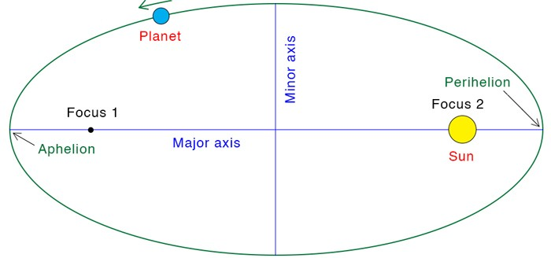
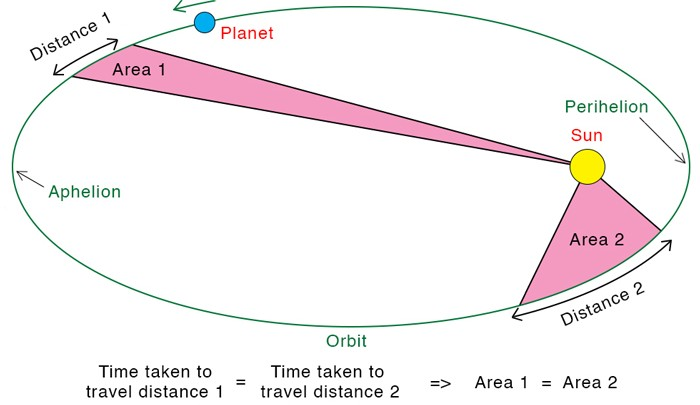
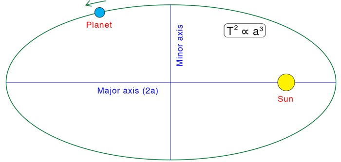

-----
# **gravitation:**
- anything that has energy-momentum generates a gravitational field which influences other masses with a force
### ***gravitational fields:***
  - a gravitational field is a region of influence that extends outwards from an object, within which another object can be acted upon by the mediators of gravitational force
  - $$\overrightharpoon{g} = \dfrac{\overrightharpoon{F}_g}{m} = \dfrac{GM}{r^2}$$
    - where $$G$$ is the Newtonian constant of gravitation (units of $$N{m}^{2}{kg}^{-2}$$)

# **gravity of the earth:**
### ***impacts of rotation:***
  - because the earth is rotating about its axis, it is a non-inertial frame of reference and thus on any point other than the poles of rotation a body's measured weight will not be its true weight
    - this is because there is a centripetal acceleration towards the centre of curvature which reduces the normal force slightly
  - along the axis of rotation, a body undergoes no circular motion relative to the centre of the earth (in translational equilibrium)
### ***weightlessness and microgravity:***
  - true weightlessness is not possible due to the infinite range of gravity; however, it is often perceived simply as the state of experiencing zero normal force
    - a body in space is not truly weightless but as it are free-falling in the same reference frame as its surroundings there is no normal force to act on it leading to no apparent weight
  - the body is said to be experiencing microgravity, which has the below impacts on the human body:
    - drop in red blood cell count
    - decrease in bone density
    - loss of muscle tone
### ***escape velocity:***
  - at a certain speed known as the escape speed an object will leave the earth and continue indefinitely, never reaching a velocity of zero due to the gravitational influence of the earth
  - for this to occur, the object must be given enough kinetic energy to do the work necessary to move it from the surface to infinity
    - while it could be expected that this value is infinite, as the acceleration due to gravity decreases by the inverse square law effectively all work is done within 10000km of the earth
  - $$v_\mathrm{esc} = \sqrt{2G \dfrac{m_e}{r}}$$

# **kepler's laws:**
1. all planets move in elliptical orbits with the sun at one focus of the ellipse
    - 
2. a line from the sun to a given planet sweeps out equal areas in equal times
    - 
3. the square of the orbital period of any planet is proportional to the cube of the semi-major axis of the elliptical orbit
    - 
    - *derivation:*
    
      $$
      \begin{aligned}
      \sum \overrightharpoon{F} = m_s \overrightharpoon{a}_c &= \overrightharpoon{F}_g \\
      \frac{m_s v^2}{r} &= G \frac{m_s m_e}{r^2} \\
      v^2 &= G\frac{m_e}{r} \\
      \left(\frac{2\pi r}{T}\right)^2 &= G\frac{m_e}{r} \\
      \therefore \frac{r^3}{T^2} &= \frac{G m_e}{4\pi^2}
      \end{aligned}
      $$

# **satellites:**
### ***circular motion of satellites:***
  - a satellite must be accelerated to a sufficiently high tangential speed such that the earth's curvature becomes significant to achieve stable orbit
    - this allows it to 'constantly fall' around the earth at the right speed to keep the distance from the satellite to the earth constant
  - *deriving the speed of a satellite:*

     $$
    \begin{aligned}
    \overrightharpoon{F}_g &= \overrightharpoon{F}_c \\
    G\frac{m_s m_e}{r^2} &= \frac{m_s v_s^2}{r} \\
    v_s &= \sqrt{G\frac{m_e}{r}}
    \end{aligned}
    $$
  - if $${v}_{s}$$ is too slow, the satellite will demonstrate projectile motion towards the surface
  - if $${v}_{s}$$ is too fast, the satellite will eventually reach escape velocity
### ***thruster dynamics:***
  - *firing the thrusters backwards (retrograde):*
    - this adds kinetic energy in the satellite's non-inertial reference frame because the expulsion of gas increases its tangential speed by newton's $$3^{rd}$$ law
    - total mechanical energy is increased, and due to the conservation of energy the added kinetic energy is converted into gravitational potential energy, raising the satellite into a higher-altitude orbit
    - as $${v}_{s}\propto \frac{1}{\sqrt{r}}$$, this increase in orbital radius decreases the tangential speed of the satellite
  - *firing the thrusters forwards (prograde):*
    - this removes kinetic energy in the satellite's non-inertial reference frame because the expulsion of gas decreases its tangential speed by newton's $$3^{rd}$$ law
    - total mechanical energy is increased, and due to the conservation of energy the removed kinetic energy is replaced by gravitational potential energy, lowering the satellite into a lower-altitude orbit
    - as $${v}_{s}\propto \frac{1}{\sqrt{r}}$$, this decrease in orbital radius increases the tangential speed of the satellite
  - *firing the thrusters radially towards the earth:*
    - this adds kinetic energy to the radial component of the satellite's motion towards the earth
    - due to this new component the orbit increases in eccentricity and becomes elliptical, with the burn point becoming opposite the perigee
    - total mechanical energy is increased, with radial and tangential kinetic energy exchanging with potential energy throughout the orbit
    - as $${v}_{s}\propto \frac{1}{\sqrt{r}}$$, the tangential speed of the satellite is the same at the perigee and decreased at the apogee
  - *firing the thrusters radially away from the earth:*
    - this adds kinetic energy to the radial component of the satellite's motion away from the earth
    - due to this new component the orbit increases in eccentricity and becomes elliptical, with the burn point becoming opposite the apogee
    - total mechanical energy is increased, with radial and tangential kinetic energy exchanging with potential energy throughout the orbit
    - as $${v}_{s}\propto \frac{1}{\sqrt{r}}$$, the tangential speed of the satellite is the same at the apogee and increased at the perigee
### ***types of orbit:***
  - *low altitude earth orbit ($$\, 180 - 2000 \:\mathrm{km}$$):*
    - polar orbit:
      - a highly inclined orbit where the satellite moves around the earth from pole to pole
      - approximately a 99 minute period
      - flies over all latitudes and longitudes so its instruments can gather data on almost the entire surface of the earth
    - sun-synchronous orbit:
      - a 96° inclined orbit that keeps the angle of sunlight on the surface of the earth as consistent as possible
      - this allows for the comparison of images taken at different times, such as those used to study climate change
  - *medium altitude earth orbit ($$\, 2000 - 35780 \:\mathrm{km}$$):*
    - semi-synchronous orbit:
      - a nearly circular orbit with a period of 12 hours
      - the earth rotates beneath the satellite and so it crosses the same two points on the equator, producing a highly predictable orbit
      - used for communication, GPS, and other navigation satellites
    - molniya orbit:
      - a highly eccentric orbit that is used to observe high latitudes with a period of 12 hours
      - travels very fast at the perigee and very slowly at the apogee
      - used mainly for communications in the far north or south
  - *high altitude earth orbit ($$\, >35780 \:\mathrm{km}$$):*
    - geosynchronous orbit:
      - an orbit with an period of one sidereal day, matching the earth's sidereal rotation period
      - can exist at any inclination with any eccentricity
    - geostationary orbit:
      - a special case of geosynchronous orbit with zero eccentricity or inclination (above the equator)
      - its position relative to a point on the surface of the earth remains the same
      - used mainly for weather monitoring and communications
