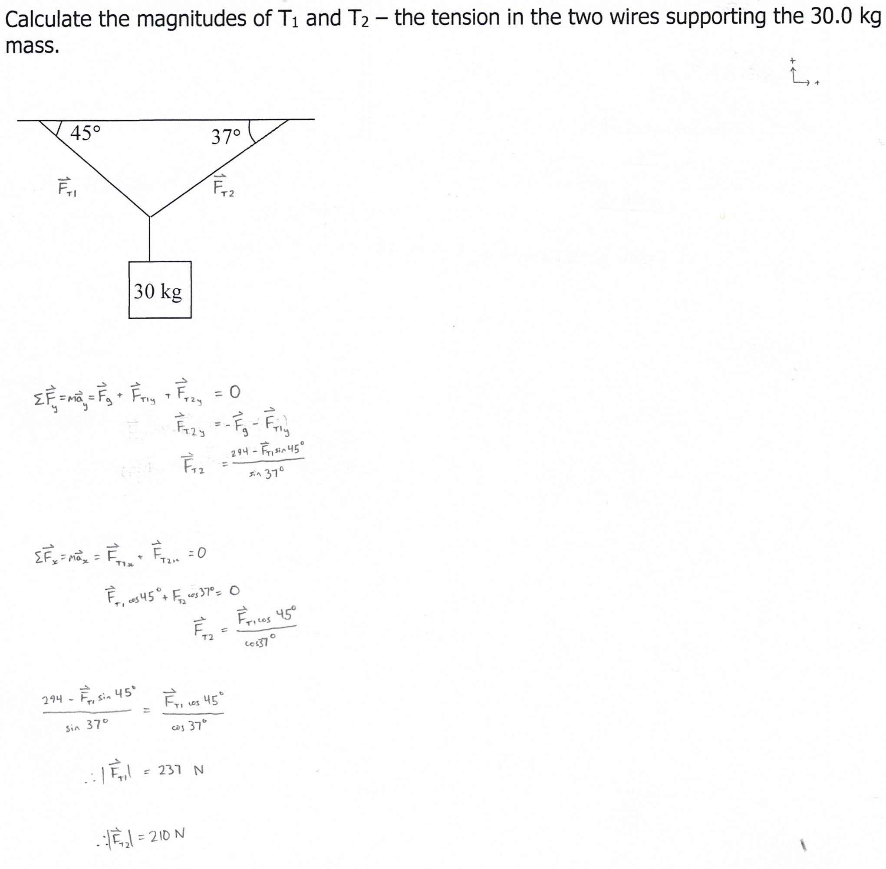
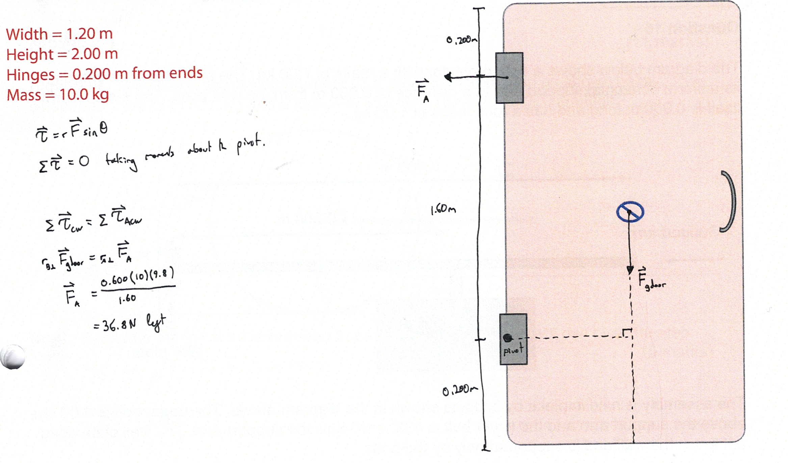
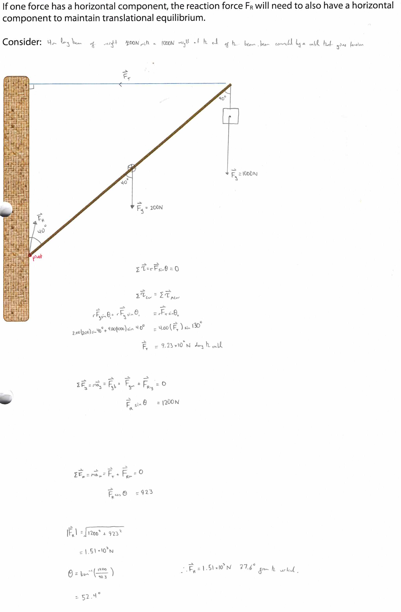
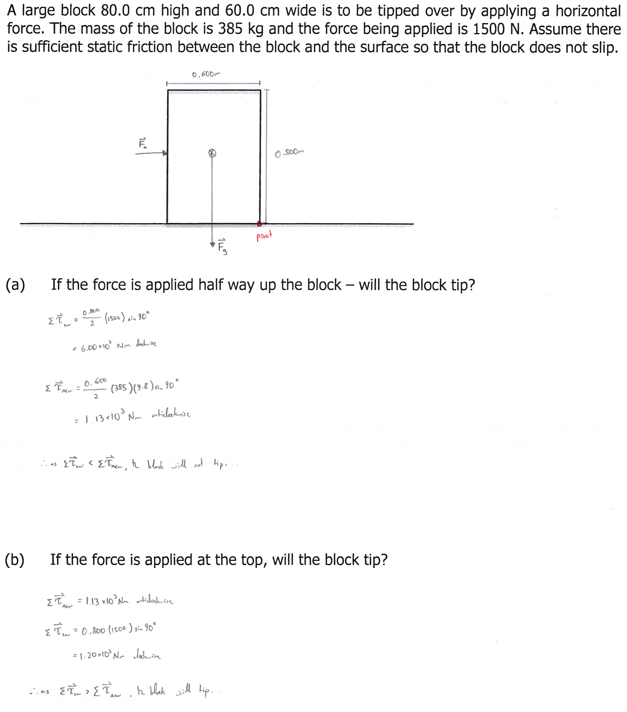
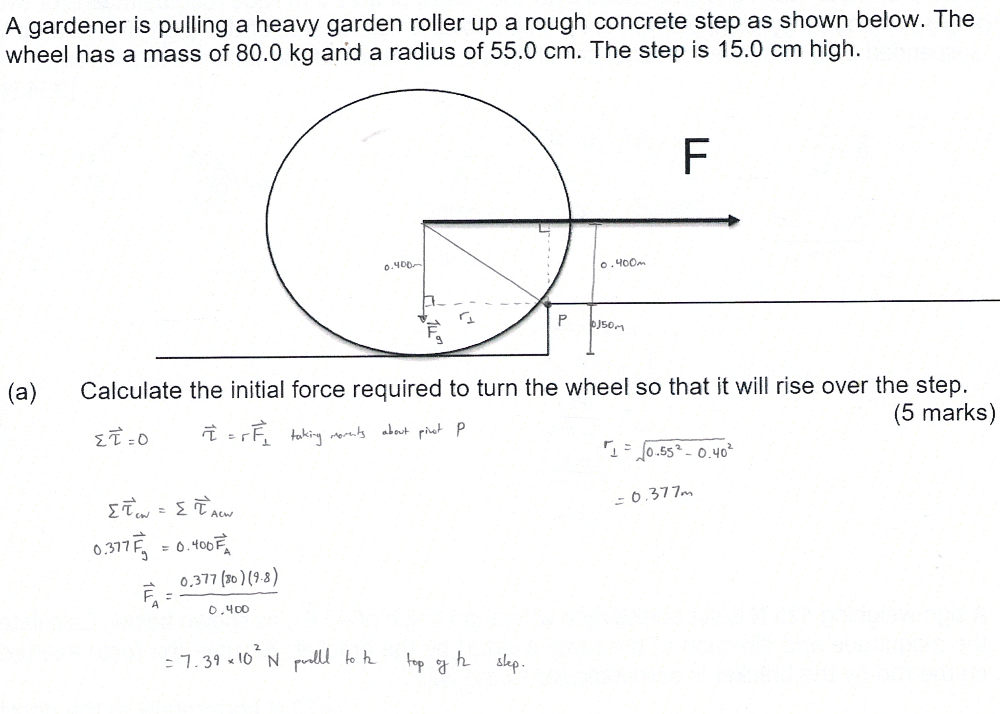
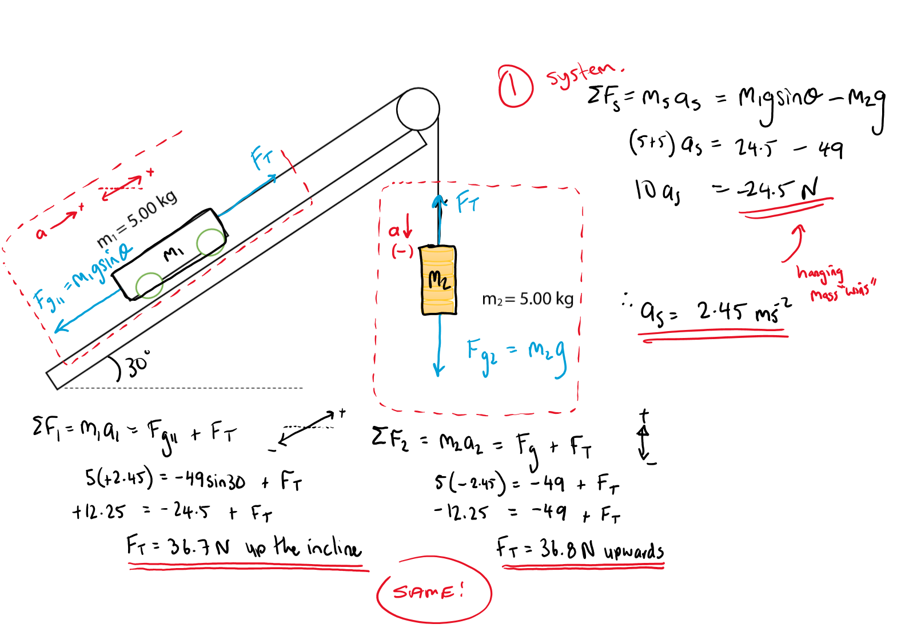

**newton's laws of motion:**
1. a body at rest will stay at rest and an object in motion will stay in uniform rectilinear motion unless acted upon by an unbalanced external force (law of inertia)
2. the acceleration of a body will vary proportionate to the unbalanced external force and inversely to the mass of the body
3. for every action force, there must exist an equal and opposite reaction force
**torque and equilibrium**
- ***centre of mass:***
  - centre of mass is the mass-weighted average position of all particles in a system
    - if a homogenous body has a geometric centre, it is the centre of mass of the body
    - if a body has an axis or axes of symmetry, the centre of mass will lie somewhere along it or on their intersection respectively
    - centre of mass can lie outside of a body (*e.g.* for a torus)
  -  $$\begin{aligned} \left({x}_{c},{y}_{c},\ {z}_{c}\right) &= \left(\frac{{m}_{1}{x}_{1}+{m}_{2}{x}_{2}+\dots +{m}_{n}{x}_{n}}{{m}_{1}+{m}_{2}+\dots +{m}_{n}},\ \ \frac{{m}_{1}{y}_{1}+{m}_{2}{y}_{2}+\dots +{m}_{n}{y}_{n}}{{m}_{1}+{m}_{2}+\dots +{m}_{n}},\ \ \ \ \frac{{m}_{1}{z}_{1}+{m}_{2}{z}_{2}+\dots +{m}_{n}{z}_{n}}{{m}_{1}+{m}_{2}+\dots +{m}_{n}}\right) \\
  &= \left(\frac{\sum _{i=1}^{n}{m}_{i}{x}_{i}}{\sum _{i=1}^{n}{m}_{i}},\ \ \frac{\sum _{i=1}^{n}{m}_{i}{y}_{i}}{\sum _{i=1}^{n}{m}_{i}},\ \ \frac{\sum _{i=1}^{n}{m}_{i}{z}_{i}}{\sum _{i=1}^{n}{m}_{i}}\right) \end{aligned}$$
  - applying a force through the centre of mass of an object will simply result in translational motion
  - however, if the moment of force is applied elsewhere on an object, rotational motion will occur about the centre of mass as well as translational motion
- ***torque:***
  - torque is the rotational correspondent of linear force that tends to produce torsion about a pivot
  - $$\begin{aligned}
      \vec{\tau} &= r \overrightharpoon{F}_\perp \\
      &= r |\overrightharpoon{\overrightharpoon{F}}| \sin\theta
      \end{aligned}$$
    - units of $$Nm$$
- ***equilibrium:***
  - a body is in translational equilibrium if the sum of all external forces acting on its centre of mass is zero, so it experiences no linear acceleration ($$\sum \overrightharpoon{F}=0$$)
  - a body is in rotational equilibrium if the sum of all torques about any axis is zero, so it experiences no angular acceleration ($$\sum \overrightharpoon{\tau}=0$$)
  - a body is in static equilibrium if it simultaneously satisfies the criteria of both translational and rotational equilibrium (i.e. $$\sum \overrightharpoon{F}=0$$ and $$\sum \overrightharpoon{\tau}=0$$)
    - this means it remains at rest in an inertial reference frame
- ***stability:***
  - stability is a relative concept
    - an object is most stable when it has a wide base and a low centre of mass
  - if an object in static equilibrium is displaced slightly there are three possible outcomes depending on the position of the centre of mass in relation to its support
    1. *stable:* the object returns to its original position
      - occurs if the centre of mass moves upwards relative to the surface it is on
    2. *unstable:* the object moves farther away from its original position
      - occurs if the centre of mass moves downwards relative to the surface it is on
    3. *neutral:* the object remains in its new position
  - *tipping and toppling:*
    - an object will begin to tip when $$\sum {\overrightharpoon{\tau}}_{direction\ of\ tipping}>\sum {\overrightharpoon{\tau}}_{opposite\ direction\ to\ tipping}$$
    - an object will topple if a vertical line from its centre of mass falls outside the object's base
      - tipping can potentially lead to toppling
  - *slipping vs tipping:*
    - if the force applied is larger than the static friction between the object and the surface but not large enough to cause tipping the object will start to tip
- ***types of problems:***
  - *translational equilibrium:*
    - 
  - *rotational equilibrium:*
    - 
  - *static equilibrium:*
    - 
  - *tipping/toppling:*
    - 
  - *rolling up a step:*
    - 
  - *atwood apparatus:*
    - 
-----
