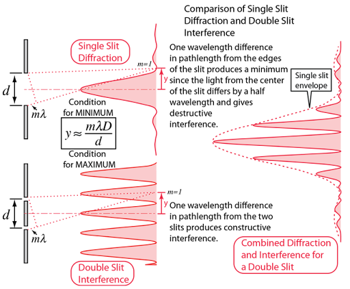
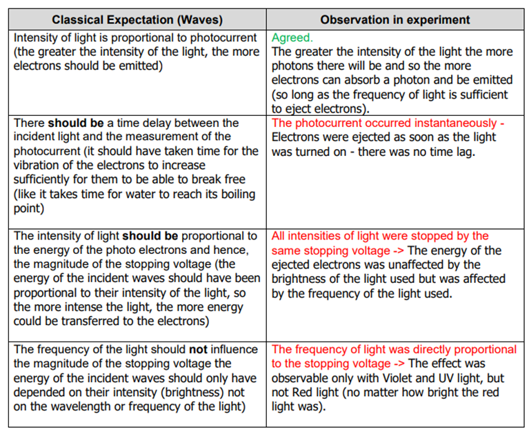
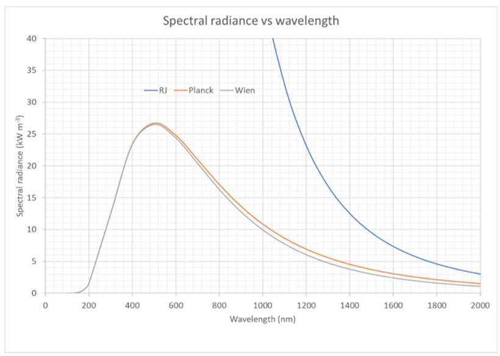
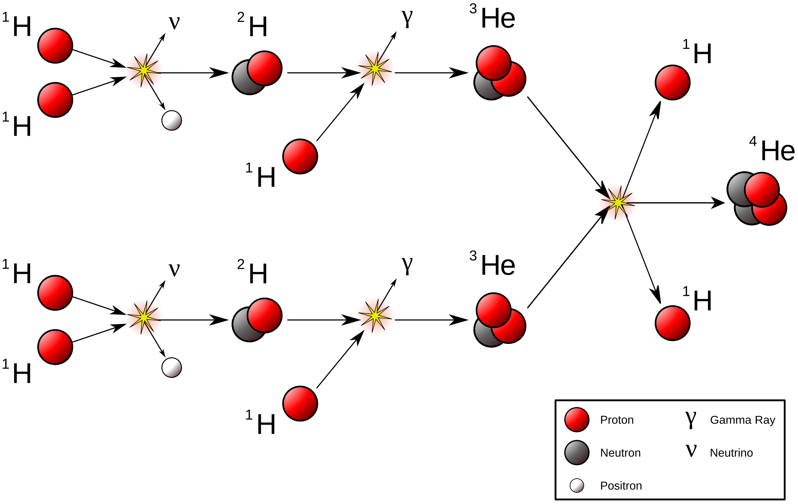
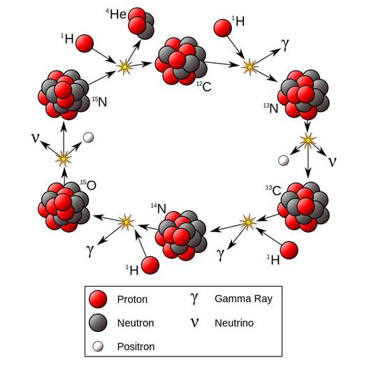

**quantum theory:**
- ***evidence for wave-particle duality:***
  - *young's double-slit experiment:*
    - thomas young proposed that light was a wave and so it was therefore subject to the superposition principle
    - explanation was based on constructive and destructive interference producing bright and dark bands, which was empirically observed
    - this was the first serious challenge to the Particle Theory presented by Newton as particles cannot undergo superposition
    - the experiment:
      - used a monochromatic light source with two narrow slits
      - the light emerging from the slits is coherent (in phase) because a single source produced both beams of light
    - 
    - 
  - *the photoelectric effect:*
    - einstein attributed the quantisation of energy that planck suggested to be intrinsic to the light itself, called the particles photons
    - the photons were extremely localised in that they give all of their energy to one electron in the metal
      -  $$brightness\propto {n}_{photons}$$ and f$$\propto {E}_{photons}$$
    - if the energy of a photon is greater than or equal to the work function for a metal, a photoelectron can be emitted
      - the energy of this photoelectron is given by the formula:
        - 
      - the excess energy of the photon (after overcoming the work function) becomes the kinetic energy of the ejected electron
      - the work done by the stopping potential is equal to the maximum kinetic energy of the photoelectrons:
    - 
- ***uv catastrophe:***
  - *black body radiation:*
    - an ideal system that absorbs all energy incident on it
      - absorbs all radiation falling on it, at all frequencies
      - the radiation that is emitted depends only on the temperature of the cavity walls (not on the material from which they are constructed)
    - can be approximated empirically by a hollow object with a very small hole leading to its interior
  - *rayleigh-jeans law:*
    - stated that a black body at thermal equilibrium will emit radiation across all frequencies, emitting more energy as frequency increases
    - this implies that all matter radiates all its energy until near absolute zero
    - however, the law only functions for low frequencies below 10^5^ Hz
      - this is what is known as the UV catastrophe
  - *wien's displacement law:*
    - states that the black body radiation curve for different temperatures peak at a wavelength inversely proportional to the temperature
    - four important features:
      1. all black bodies at the same temperature produce the same spectrum (i.e. the spectrum is dependent solely on temperature)
      2. making an object hotter produces a higher intensity of radiation across all frequencies
      3. the higher the temperature the higher the frequency peak
      4. the visible spectrum is only a small region of the whole emission spectrum
    - 
    - wien’s law could only accurately describes the short wavelength (high frequency) spectrum of thermal emission of objects, BUT fails to accurately fit the experimental data for long wavelengths (low frequency emissions)
    - 
  - *planck:*
    - planck successfully derived the correct formula by assuming that electromagnetic radiation can only be emitted or absorbed in discrete quanta of energy
    - 
      - where:
        -  $$h$$ is planck's constant ($$~6.626\times {10}^{-34}\ \mathrm{Js}$$)
        -  $$k$$ is boltzmann's constant ($$~1.381\times {10}^{-23}\ \mathrm{J}{\mathrm{K}}^{-1}$$
    - this formula produces two bold results about the atoms at the surface of a blackbody:
      1. the atoms can only have discrete values of energy
      2. the atoms emit or absorb energy in discrete amounts
    - this means that there is not a continuous distribution of oscillator energies, but instead the oscillators could only have specific discrete energies that were dependent on their frequency
    - while for classical waves energy is proportional to amplitude, for electromagnetic waves it is proportional to frequency
    - for a given energy there is a highest possible frequency that a blackbody can emit
      - 

- ***photoelectric effect:***
  - electromagnetic radiation transmits energy, so when this radiation interacts with a piece of metal, the surface of the metal absorbs some of the radiated energy
  - some of the electrons in the atoms at the surface of the metal absorb enough energy to delocalise them
    - these electrons are called photoelectrons
  - first noted in 1887 by Heinrich Rudolf Hertz
  - *key terms:*
    -  $${f}_{0}$$* = threshold frequency*
      - *the frequency below which no electrons are ejected from the metal surface*
    -  $${V}_{0}$$* = stopping voltage*
      - *to measure the *$${E}_{k}$$* of ejected electrons, a voltage can be applied in the opposite direction of electron current*
      - *stopping voltage is the voltage required to stop the most energetic photoelectron (when the photocurrent is reduced to zero)*
      - *the energy of photoelectrons can then be measured as *$${E}_{k}=q{V}_{0}$$
    -  $$\mathit{\phi}$$* = work function*
      - *the energy required to liberate the least bound electron from the surface of the metal*
  - *experiments:*
    - experiment 1 (- cathode, + anode):
      - aim was to observe the emission of electrons from a metal surface when illuminated
      - light of varying frequency and intensity was directed at the cathode, and the anode was positively charged to attract emitted electrons
      - observed:
        - electrons emitted only when light frequency exceeded the threshold $${f}_{0}$$
        - increasing intensity below $${f}_{0}$$​ resulted in no emission
        - above $${f}_{0}$$​, emission occurred without delay regardless of intensity
        - photocurrent increased with light intensity (above $${f}_{0}$$​) but $${E}_{k}$$ of electrons depended on frequency
    - experiment 2 (+ cathode, - anode):
      - aim was to determine the kinetic energy of photoelectrons by opposing their motion with an electric field
      - observed:
        - some electrons had enough energy to overcome the opposing field and reach the anode, causing a detectable current
        - as the reverse voltage increased, fewer electrons arrived
        - photocurrent became zero at the stopping voltage $${V}_{0}$$​, where even the most energetic electrons were repelled
      - the maximum kinetic energy of the emitted electrons was determined from $${E}_{k}=q{V}_{0}$$
      - confirmed that maximum kinetic energy given by $${E}_{k}=q{V}_{0}$$ independent of intensity, linear with light frequency, confirming Einstein’s photoelectric equation $${E}_{k}=hf-\mathit{\phi}$$
      
- ***de broglie wavelength:***
  -  $$$${\mathit{\lambda}}_{d}=\frac{h}{p}$$$$
$$$$\ \ \ \ \ \ =\frac{h}{mv}$$$$
  - any particle with momentum has a wavelength
    - for large objects this wavelength is so small it is undetectable but for subatomic particles it is increasingly important
- ***phosphorescence:***
  - *once excited an atom or molecule will spontaneously decay quickly*
  - *some levels, however, have significantly longer lifetimes, and are said to be metastable*
    - *when visible and UV light excites the atoms or molecules to metastable states, decay occurs slowly and phosphorescence occurs*
  - *glow in the dark paints and luminescent dials on watches utilise phosphorescence*
- ***fluorescence:***
  - occurs when an atom is excited to a level several steps above its ground state, typically by the absorption of a relatively high energy photon
    - electric discharges can also induce fluorescence (*i.e.* doesn’t have to be absorption of UV)
  - fluorescent paint, dyes and soaps can make colours seem brighter by converting some UV into visible light
  - *ways to decay:*
    - could remit a photon of the same energy that it absorbed in a single step back down to the ground state
    - could decay via cascade decay, with de-excitation involving smaller steps in which lower energy photons are emitted
      - as the energy separation between energy levels is smaller, emitted photons have a lower frequency
      - some of the emitted photons may then be in the visible range
  - *fluorescent lights:*
    - a fluorescent lightbulb consists of a cylindrical glass tube with electrodes at each end
    - when switched on, electrons are boiled from one of the electrodes and accelerated to very high velocities through the glass tube due to an AC voltage
    - the glass tube is filled with very low pressure mercury vapour, which is excited by the impact of the high speed electrons
      - much of the light emitted by the excited mercury will be UV
      - this light then strikes a phosphor layer on the inner surface of the tube the phosphors are excited by the absorption of the UV photons and fluoresce, decaying to give lower frequency photons that combine to produce white light
      - different phosphors can be used to produced different colours of light
    - 
- ***photovoltaic cells:***
  - a photovoltaic cell is a device that converts light energy directly into electrical energy utilising the photoelectric effect
  - *how it works:*
    1. light hits the cell
      - the cell is made of semiconductor materials (typically silicon) with an electric field at the p-n junction
    2. photon absorption
      - when a photon strikes the cell, it may transfer its energy to an electron in the semiconductor if $$hf$$ exceeds the band gap
    3. electron excitation
      - the electron is promoted from the valence band to the conduction band, leaving behind a hole
      - the built-in electric field at the junction drives electrons toward the n-type side and holes toward the p-type side
    4. current generation
      - separated charge carriers flow through an external circuit, producing a direct current
      - the output voltage is set by the junction potential, while current depends on light intensity
- ***lasers:***
  - stands for **l**ight **a**mplification by **s**timulated **e**mission of **r**adiation
  - produces highly focused, coherent, and monochromatic light
  - *how it works:*
    - in addition to spontaneous emission, stimulated emission also occurs
      - where the decay is forced to occur before the lifetime of the state
    - if an atom is in a metastable excited state (a state with a lifetime longer than the usual 10^\-8^ s lifetime of excited states) then the time interval until spontaneous emission occurs will be relatively long
    - if in that period of time a photon of energy equal to $${E}_{2}-{E}_{1}$$ is incident on the atom stimulated emission can occur
  - *for laser action:*
    - the system must be in a state of population inversion
    - the excited state to be metastable, so stimulated emission occurs before spontaneous emission
    - the emitted photons need to stay in the system long enough to stimulate other excited atoms

**special relativity:**
- at high speeds, the laws of classical mechanics break down and cannot be used to explain or predict observed behaviour and phenomenon
- the special theory of relativity explains and quantifies the behaviour of objects travelling at relativistic ($$>0.1c$$) speeds
- ***experiments:***
  - *michelson-morley experiment:*
    - aim was to detect earth's movement through the aether by measuring changes in light speed in different directions
    - used an interferometer to split a beam of light into two perpendicular paths
    - if earth was moving through the aether, one beam should take slightly longer than the other
    - this was not empirically observed
  - *muon decay experiment:*
    - aim was to test time dilation predicted by special relativity using atmospheric muons
    - muons produced in upper atmosphere by cosmic ray interactions have a proper mean lifetime of about 2.2 μs before decaying
    - the classical expectation predicts significantly fewer muons reaching the surface than are observed due to the distance they must travel
    - this is because the relative length from a muon's frame of reference is significantly shorter, allowing it to travel further in its proper mean lifetime

**particles of the standard model:**
- ***bosons (force-mediating particles):***
  - follow bose-einstein statistics and have integer spin
  - *elementary bosons:*
    - gauge bosons:
      - gluons (strong nuclear force)
        - acts on colour charge
      - photons (electromagnetism)
        - acts on the charge of particles
      - $${W}^{+}$$, $${W}^{-}$$, $${Z}^{0}$$ bosons (weak nuclear force)
        - acts on the flavour of particles, require weak isospin to interact, allowed to violate conservation of strangeness
      - graviton (gravity, theorised)
        - acts on energy
    - scalar bosons:
      - higgs boson (gives $$W$$ and $$Z$$ bosons, quarks and charged leptons their mass)
  - *composite bosons:*
    - mesons:
      - bosonic hadrons composed of a quark-antiquark pair
- ***fermions (matter particles):***
  - follow fermi-dirac statistics and have half-integer spin
  - *elementary fermions:*
    - leptons:
      - electron (gen 1)
      - muon (gen 2)
      - tau (gen 3)
      - also includes their respective antiparticles, neutrinos, and antineutrinos
    - quarks
      - up/down (gen 1)
      - charm/strange (gen 2)
      - top/bottom (gen 3)
      - also includes their respective antiparticles
  - *composite fermions:*
    - baryons:
      - fermionic hadrons composed of 3 quarks
***rules for feynman diagrams:***
1. fermions are drawn as straight lines
2. bosons are drawn as wavy lines and are locked between vertices
3. time goes forwards up the page and space to the right
  - direction through space is only assigned to conserve other properties
4. matter travels upwards and antimatter travels downwards
5. arrows maintain direction at vertices
**the universe:**
- ***astronomical measures:***
  - light year
  - astronomical unit (
  - parsec
- ***doppler shift:***
  - doppler shift is the change in wavelength of radiation due to the relative motion between the source and observer along the line of sight
    - if a source is travelling away from us, we observe red shift
    - if a source is travelling towards us, we observe blue shift
- ***hubble's law:***
  - the redshift of a cosmic object is directly proportional to its distance through $${v}_{object}={H}_{0}d$$
    - where $${H}_{0}$$ is hubble's constant ($$km\ {s}^{-1}\ {Mpc}^{-1}$$) and $$d$$ is the distance of the object ($$Mpc$$)
  - the inverse of $${H}_{0}$$ is proposed to give the time that the universe had zero volume and existed at a single point in space known as a singularity
  - one issue that can impact data is that the closer galaxies can be moving towards us, and rotating spiral galaxies close to us can be approaching on one side and receding on the other
    - however, further galaxies all show a common recession as these irregularities become negligible due to the proposed expansion of the universe
- ***evidence for the big bang theory:***
  - *cosmic microwave background radiation (CMBR):*
    - theory predicts that after the big bang there would have been a large release of high energy radiation
    - this radiation would have experienced redshift and decreased in frequency as it moves away from us
    - this result is matched experimentally
  - *3:1 ratio of H:He:*
    - theory predicts an approximately 3:1 ratio of hydrogen to helium present in the universe
    - this is due to big bang nucleosynthesis which fused hydrogen atoms together to form helium in the very early universe
    - this result is matched experimentally
  - *galactic morphology:*
    - theory predicts that the first quasars and galaxies formed approximately a billion years after the big bang
    - since then, larger structures such as galaxy clusters and super clusters have formed
    - this result is matched experimentally
    - furthermore, galaxies that have formed recently appear markedly different from galaxies formed at similar distances but shortly after the big bang due to their environments
      - this is a strong argument against the steady-state model
- ***nuclear fusion in stars:***
  - *proton-proton chain:*
    - 
  - *CNO cycle:*
    - 
- ***chronology of the universe:***
  1. planck epoch
    - separation of gravity from the electronuclear force
  2. grand unification epoch
    - three forces of the standard model are unified
  3. electroweak epoch
    - separation of the strong nuclear force from the electroweak interaction
  4. quark epoch
    - separation of the weak nuclear force from the electromagnetic force
    - energies still too high for quarks to coalesce, instead forming quark-gluon plasma
  5. hadron epoch
    - slight matter-antimatter asymmetry results in the elimination of antihadrons
  6. neutrino decoupling
    - neutrinos cease interacting with baryonic matter
  7. lepton epoch
    - leptons and antileptons remain in thermal equilibrium
  8. big bang nucleosynthesis
    - protons and neutrons are bound into primordial atomic nuclei (H^+^ and He^2+^)
    - most energy is still in the form of EMR
  9. photon epoch
    - temperatures remain too high for the binding of electrons to nuclei
  10. recombination epoch
    - photons no longer in thermal equilibrium with matter and the universe first becomes transparent
    - mean baryonic mater density is approximately a billion times higher than at the present
  11. dark ages
    - only source of photons was hydrogen emitting radio waves at the hydrogen line
    - no stars had formed yet
  12. reionisation
    - the earliest stars and respective systems form
  13. the present
    - farthest observable photons arrive from a sphere with a radius of 46 billion light-years
    - this is commonly referred to as the observable universe
