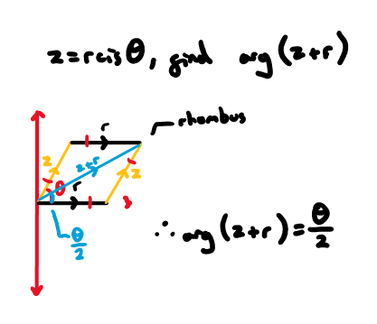
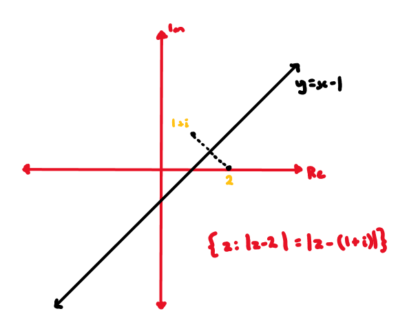
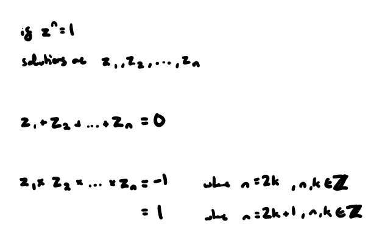

-----
# **forms:**
### *cartesian*:
  - $$z=a+bi$$
### *polar:*
  - $$z=r\mathrm{cis}\mathit{\theta}$$
  - the principal argument $\theta $ occupies the domain $$-\mathit{\pi}<\mathit{\theta}\le \mathit{\pi}$$
  - *multiplying and dividing:*
    - 
  - *de moivre's theorem:*
    - 
    - *proving triple-angle identities:*
      - 

# **argand plane:**
### *geometric question:*
  - 
### *loci:*
  - 
  
  - 
  
  - 
  
  - 

# **roots:**
### *roots of unity:*
  - i.e. determine all 3 solutions to $${\mathrm{z}}^{3}=1$$
    - 
  - *sum and product:*
    - 
    - i.e. for solutions of $${\mathrm{z}}^{\mathrm{n}}=1$$:
      - $$\sum_{k=0}^{n-1} z_k = 0$$
      - $$\prod_{k=0}^{n-1} z_k = (-1)^{n-1}$$
- *complex n**^th^** roots:*
  - *i.e.* a solution to $${z}^{5}=-4+4i$$ is $$z=1-i$$. find all solutions.
    - 

# **polynomials:**
### *factor theorem:*
  - if $$f\left(a\right)=0$$, then $$\left(x-a\right)$$ is a factor $$f\left(x\right)$$
### *remainder theorem:*
  - if $$f\left(x\right)$$ is divided by $$(x-a)$$, the remainder will be $$f\left(a\right)$$
-----
