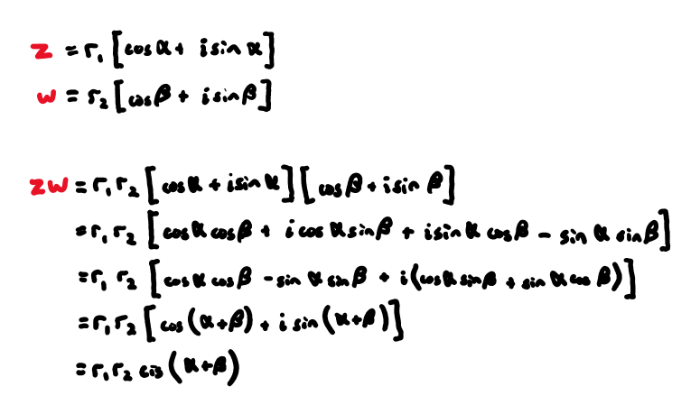
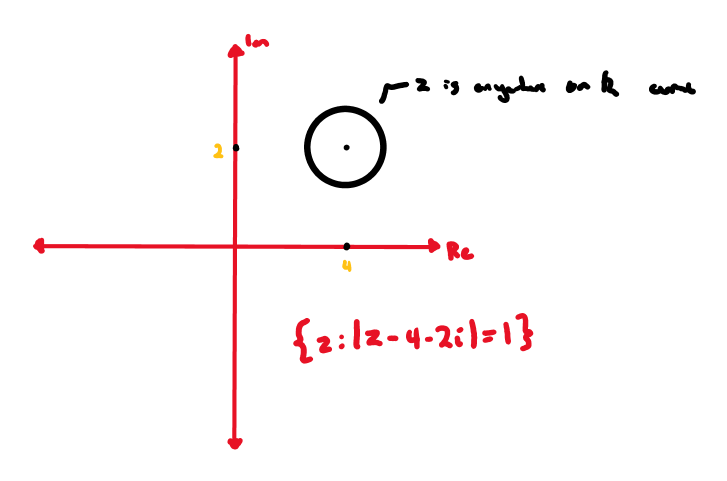
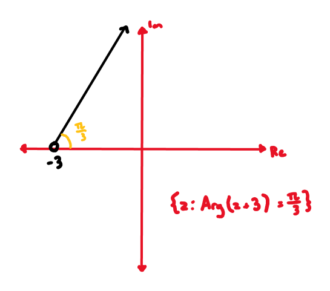
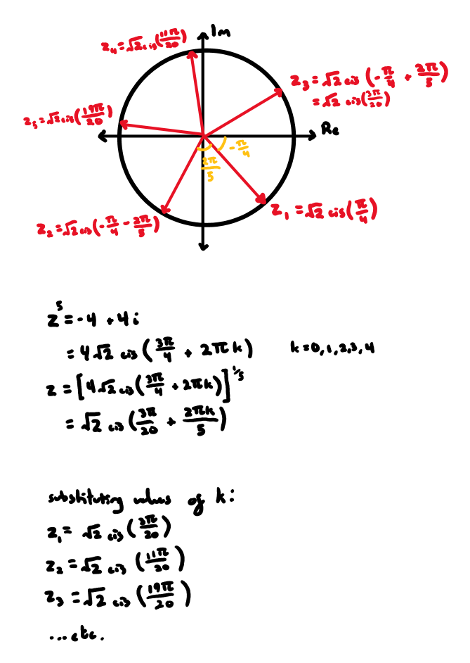

# complex numbers

***

## **forms:**

#### _cartesian_:

* $$z=a+bi$$

#### _polar:_

* $$z=r\mathrm{cis}\mathit{\theta}$$
* the principal argument $$\theta$$ occupies the domain $$-\mathit{\pi}<\mathit{\theta}\le \mathit{\pi}$$
* _multiplying and dividing:_
  * 
* _de moivre's theorem:_
  * $$[r \operatorname{cis} \theta]^n = r^n \operatorname{cis} (n \theta), \quad n \in \mathbb{Z}$$
  * _proving triple-angle identities:_
    * 

## **argand plane:**

#### _geometric question:_

* 

#### _loci:_

*

    
*

    
*

    
*

    

## **roots:**

#### _roots of unity:_

* i.e. determine all 3 solutions to $${\mathrm{z}}^{3}=1$$
  * 
* _sum and product:_
  * 
  * i.e. for solutions of $${\mathrm{z}}^{\mathrm{n}}=1$$:
    * $$\sum_{k=0}^{n-1} z_k = 0$$
    * $$\prod_{k=0}^{n-1} z_k = (-1)^{n-1}$$
* _complex n_\*^th^\*\* roots:\*
  * _i.e._ a solution to $${z}^{5}=-4+4i$$ is $$z=1-i$$. find all solutions.
    * 

## **polynomials:**

#### _factor theorem:_

* if $$f\left(a\right)=0$$, then $$\left(x-a\right)$$ is a factor $$f\left(x\right)$$

#### _remainder theorem:_

* if $$f\left(x\right)$$ is divided by $$(x-a)$$, the remainder will be $$f\left(a\right)$$

***
