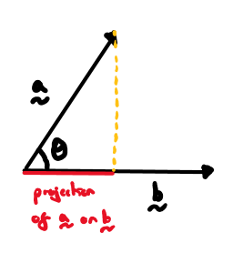
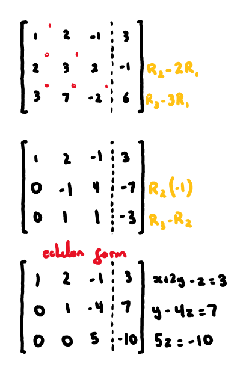
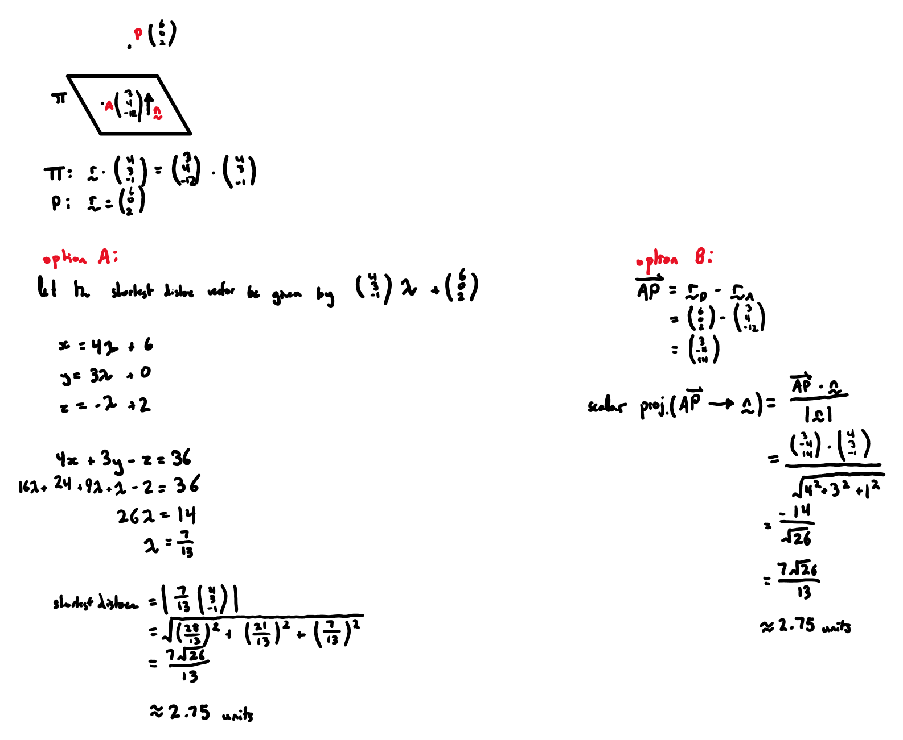

# vectors

***

## **basics**
- $$d = \sqrt{(x_2 - x_1)^2 + (y_2 - y_1)^2 + (z_2 - z_1)^2}$$
- $$\text{midpoint} = \left(\frac{x_1+x_2}{2}, \frac{y_1+y_2}{2}, \frac{z_1+z_2}{2}\right)$$
- $$\mathrm{vector\:proj}_{\underset{\sim}{b}}\underset{\sim}{a} = (\underset{\sim}{a} \cdot \hat{\underset{\sim}{b}})\,\hat{\underset{\sim}{b}}$$

## **cross product**

for vectors $$\underset{\sim}{{a}}$$ and $$\underset{\sim}{{b}}$$, the cross product $$\underset{\sim}{{a}}\times \underset{\sim}{{b}}$$ is a vector perpendicular to $$\underset{\sim}{{a}}$$ and $$\underset{\sim}{{b}}$$
  * _i.e._ it is normal to the plane containing $$\underset{\sim}{{a}}$$ and $$\underset{\sim}{{b}}$$
$$\left|\underset{\sim}{{a}}\times \underset{\sim}{{b}}\right|=\left|\underset{\sim}{{a}}\right|\left|\underset{\sim}{{b}}\right|\mathrm{sin}\mathit{\theta}$$, where $$\theta$$is the angle between $$\underset{\sim}{{a}}$$ and $$\underset{\sim}{{b}}$$
  * this also gives the area bounded by the parallelogram formed from $$\underset{\sim}{{a}}$$ and $$\underset{\sim}{{b}}$$

#### _manually calculating cross product_

## **lines**

consider a line passing through $$\left(\begin{array}{c}2\\ -1\\ 3\end{array}\right)$$ and parallel to $$\left(\begin{array}{c}1\\ 2\\ 3\end{array}\right)$$

#### _vector equation:_
  $$
  \underset{\sim}{{r}} = \left(\begin{array}{c}2\\ -1\\ 3\end{array}\right) + \lambda \left(\begin{array}{c}1\\ 2\\ 3\end{array}\right)
  $$

#### _parametric equation:_
  $$
  \begin{aligned}
  x &= 2 + \lambda \\
  y &= -1 + 2\lambda \\
  z &= 3 + 3\lambda
  \end{aligned}
  $$

#### _cartesian equation:_
  $$
  \frac{x-2}{1} = \frac{y+1}{2} = \frac{z-3}{3}
  $$

## **planes**

consider a plane passing through position vector $$\underset{\sim}{{a}}$$ and containing two non-parallel vectors $$\underset{\sim}{{b}}$$ and $$\underset{\sim}{{c}}$$

#### _vector equation:_
  $$\underset{\sim}{{r}} = \underset{\sim}{{a}} + \lambda \underset{\sim}{{b}} + \mu \underset{\sim}{{c}}$$

  

#### _cartesian equation:_
  $$\begin{aligned} (\underset{\sim}{{r}} - \underset{\sim}{{a}})\cdot \underset{\sim}{{n}} &= 0 \\ \Rightarrow \underset{\sim}{{r}} \cdot \underset{\sim}{{n}} &= \underset{\sim}{{a}} \cdot \underset{\sim}{{n}} \\ n_1 x + n_2 y + n_3 z &= k \end{aligned} $$

  

## **spheres**

#### _vector equation:_
  $$|\underset{\sim}{{r}} - \underset{\sim}{{c}}| = r$$
  
  where:
  * $$r$$ is the radius
  * $$\underset{\sim}{{c}}$$ is the position vector of the centre

  

#### _cartesian equation:_
  $$(x-a)^2 + (y-b)^2 + (z-c)^2 = r^2$$

  where:
  * $$r$$ is the radius
  * $$\left(\begin{array}{c}a\\ b\\ c\end{array}\right)$$ is the position vector of the centre

## **systems of linear equations**

#### * _gaussian elimination_
  1. form an augmented matrix from equations
  
  
  
  2. conduct forward elimination
  * choose a pivot entry and eliminate all entries below the pivot by replacing rows
  * repeat for each column until the matrix is in row echelon form

  

  3. conduct back-substitution to solve for variables

  
  
  - note that cases 1,2, and 3 have no simultaneous solution as no point lies on all three planes at once

#### *_intersecting planes_*
1. three parallel planes
    * all 3 normals are parallel (multiples of each other)
    * the constants at the end of the cartesian equation distinguish the planes

2. two planes parallel and one intersecting
    * two normals are parallel while one isn’t

3. planes intersecting in pairs of parallel lines
    * all 3 normals are non-parallel
    * one normal is a linear combination of the other two

4. planes intersecting in a line
    * one plane is a linear combination of the other planes
    * all 3 normals are non-parallel

5. planes intersecting at a point
    * if the triple scalar product of the normals does not equal zero, there is a single point of intersection
    * *i.e.* $${\underset{\sim}{n}}_{1}\cdot \left({\underset{\sim}{n}}_{2}\times {{\underset{\sim}{n}}_{3}}\right)\ne 0$$
    * note that cases 1,2, and 3 have no simultaneous solution as no point lies on all three planes at once

## **closest distance**
#### _line to point:_

  
#### _plane to point:_

  
#### _line to line:_

  
