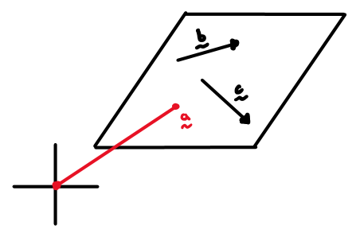
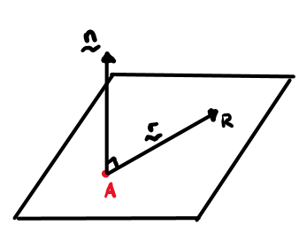
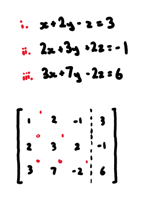
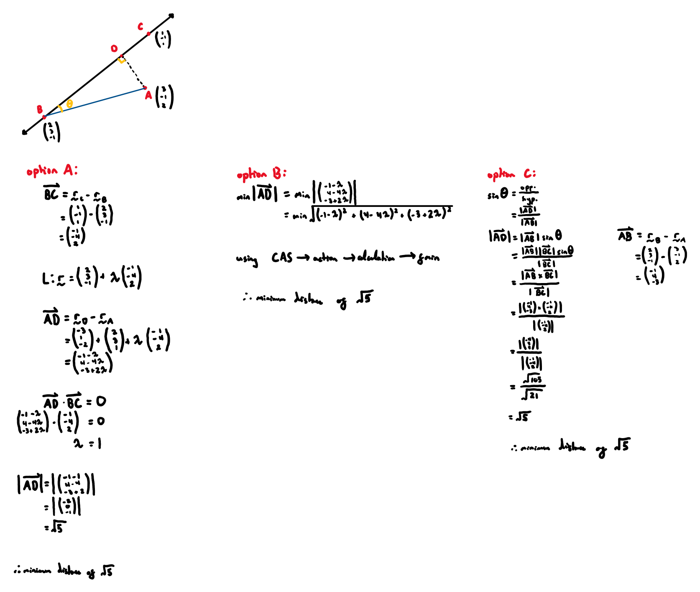
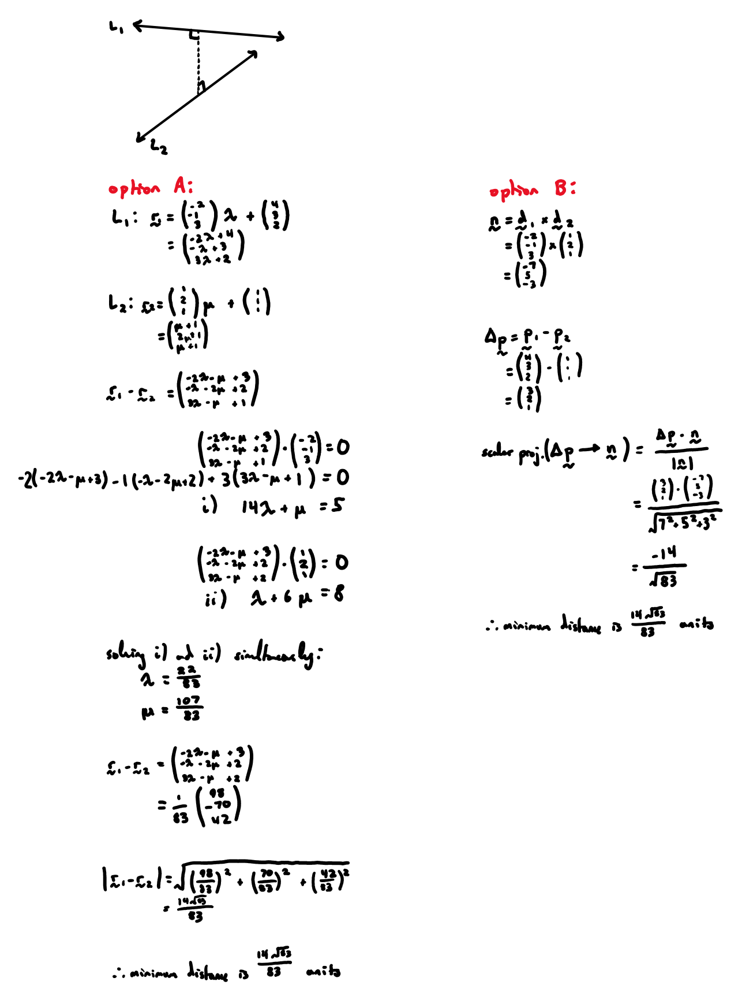

**basics:**
- 
- 
- *vector projection:*
  - 
  - 

**cross product:**
- for vectors $$\underset{\sim}{\bm{a}}$$ and $$\underset{\sim}{\bm{b}}$$, the cross product $$\underset{\sim}{\bm{a}}\times \underset{\sim}{\bm{b}}$$ is a vector perpendicular to $$\underset{\sim}{\bm{a}}$$ and $$\underset{\sim}{\bm{b}}$$
  - *i.e.* it is normal to the plane containing $$\underset{\sim}{\bm{a}}$$ and $$\underset{\sim}{\bm{b}}$$
- $$\left|\underset{\sim}{\bm{a}}\times \underset{\sim}{\bm{b}}\right|=\left|\underset{\sim}{\bm{a}}\right|\left|\underset{\sim}{\bm{b}}\right|\mathrm{sin}\mathit{\theta}$$, where $$\theta $$ is the angle between $$\underset{\sim}{\bm{a}}$$ and $$\underset{\sim}{\bm{b}}$$
  - this also gives the area bounded by the parallelogram formed from $$\underset{\sim}{\bm{a}}$$ and $$\underset{\sim}{\bm{b}}$$
- *manually calculating cross product:*
  - 

**lines:**
- consider a line passing through $$\left(\begin{array}{c}2\\ -1\\ 3\end{array}\right)$$ and parallel to $$\left(\begin{array}{c}1\\ 2\\ 3\end{array}\right)$$
- *vector equation:*
  - $$
    \underset{\sim}{\bm{r}} = \left(\begin{array}{c}2\\ -1\\ 3\end{array}\right) + \lambda \left(\begin{array}{c}1\\ 2\\ 3\end{array}\right)
    $$
- *parametric equation:*
  - $$
    \begin{aligned}
    x &= 2 + \lambda \\
    y &= -1 + 2\lambda \\
    z &= 3 + 3\lambda
    \end{aligned}
    $$
- *cartesian equation:*
  - $$
    \frac{x-2}{1} = \frac{y+1}{2} = \frac{z-3}{3}
    $$

**planes:**
- consider a plane passing through position vector $$\underset{\sim}{\bm{a}}$$ and containing two non-parallel vectors $$\underset{\sim}{\bm{b}}$$ and $$\underset{\sim}{\bm{c}}$$
- *vector equation:*
  - $$\underset{\sim}{\bm{r}} = \underset{\sim}{\bm{a}} + \lambda \underset{\sim}{\bm{b}} + \mu \underset{\sim}{\bm{c}}$$
  - 
- *cartesian equation:*
  - 
  - $$
    \begin{aligned}
    (\underset{\sim}{\bm{r}} - \underset{\sim}{\bm{a}})\cdot \underset{\sim}{\bm{n}} &= 0 \\
    \Rightarrow \underset{\sim}{\bm{r}} \cdot \underset{\sim}{\bm{n}} &= \underset{\sim}{\bm{a}} \cdot \underset{\sim}{\bm{n}} \\
    n_1 x + n_2 y + n_3 z &= k
    \end{aligned}
    $$

**spheres:**
- *vector equation:*
  - $$|\underset{\sim}{\bm{r}} - \underset{\sim}{\bm{c}}| = r$$
  - where:
    -  $$r$$ is the radius
    -  $$\underset{\sim}{\bm{c}}$$ is the position vector of the centre
  - 
- *cartesian equation:*
  - $$(x-a)^2 + (y-b)^2 + (z-c)^2 = r^2$$
  - where:
    -  $$r$$ is the radius
    -  $$\left(\begin{array}{c}a\\ b\\ c\end{array}\right)$$ is the position vector of the centre

**systems of linear equations:**
- *gaussian elimination:*
  1. form an augmented matrix from equations
    - 
  2. conduct forward elimination
    - choose a pivot entry and eliminate all entries below the pivot by replacing rows
    - repeat for each column until the matrix is in row echelon form
    - 
  3. conduct back-substitution to solve for variables
    - 
note that cases 1,2, and 3 have no simultaneous solution as no point lies on all three planes at once
1. three parallel planes
  - all 3 normals are parallel (multiples of each other)
  - the constants at the end of the cartesian equation distinguish the planes
2. two planes parallel and one intersecting
  - two normals are parallel while one isn’t
3. planes intersecting in pairs of parallel lines
  - all 3 normals are non-parallel
  - one normal is a linear combination of the other two
4. planes intersecting in a line
  - one plane is a linear combination of the other planes
  - all 3 normals are non-parallel
5. planes intersecting at a point
  - if the triple scalar product of the normals does not equal zero, there is a single point of intersection
  - *i.e. *$${\stackrel{~}{n}}_{1}\cdot \left({\stackrel{~}{n}}_{2}\times {\stackrel{~}{n}}_{3}\right)\ne 0$$
- note that cases 1,2, and 3 have no simultaneous solution as no point lies on all three planes at once
**closest distance:**
- *line to point:*
  - 
- *plane to point:*
  - 
- *line to line:*
  - 

-----
